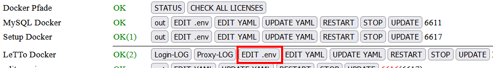
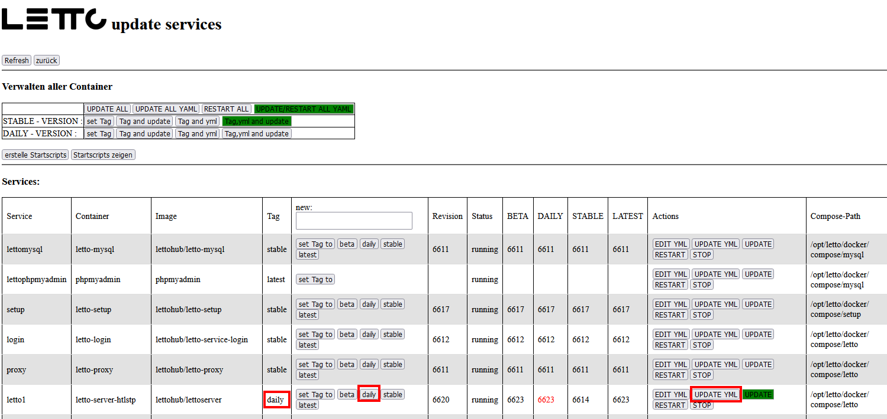

# Active-Directory und LDAP
LeTTo kann die Authentifikation eines Users auch an einen LDAP oder AD-Server weitergeben.

## Konfiguration am Setup (/config)
* mindestens rev6617 des Setup-Services
* Eintragen in der .env-Datei  bei der Schule:
  <pre class="config">LETTO_1_USE_AD_SERVER=true</pre>
* Update der yml der Schule und Update-Plan auf "daily" mit dem Setup ab rev6617 
* Restart der Schule

## Konfiguration am LeTTo-Server
* keine Änderung gegenüber der älteren Versionsn
* siehe [wiki LDAP](https://wiki.letto.at/wiki/index.php/AD-check)
