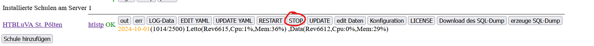
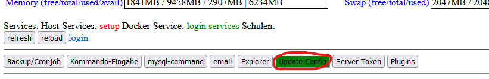
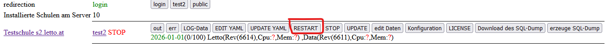
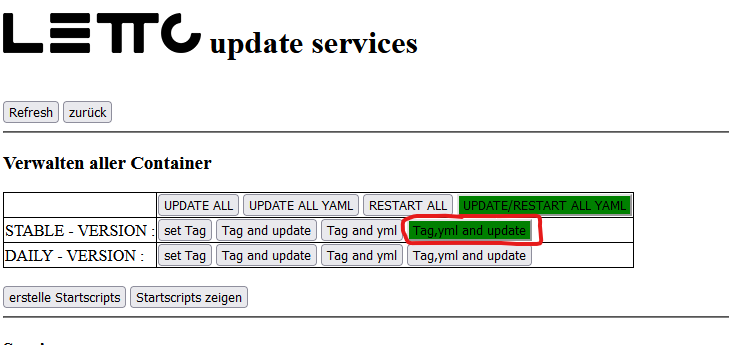

# Migration einer bestehenden Docker-Installation auf einen neuen Server

* Bei dieser Variante werden sämtliche Konfigurationen des alten Servers auf den neuen Server übernommen. 
* die DNS-Adresse des neuen Servers muss der Adresse des alten Servers entprechen 

## Sicherung der Daten des bestehenden Servers
1. LeTTo-Server der Schule stoppen im Setup-Service  
2. Datenbanksicherung erstellen
   <pre>docker exec -it letto-mysql export letto-schulkürzel</pre>
   Bitte statt letto-schulkürzel den wirklichen Namen der Datenbank verwenden.
   Die Sicherung wird dann in der Datei /opt/letto/docker/storage/database-dump/letto-schulkürzel.sql  
   erscheinen - bitte Datum und Dateigröße kontrollieren.
   <pre>ls /opt/letto/docker/storage/database-dump -al</pre>
3. Verzeichnis /opt/letto/docker in eine Datei packen 
   <pre>tar -czf lettodocker.tgz -C /opt/letto docker</pre>
4. Die erstellte Datei lettodocker.tgz enthält nun alle Daten die am neuen Server benötigt werden!

## Den neuen Server mit Ubuntu 22.04 server installieren
Bei einem virtuellen Server ist folgendes zu beachten.
* Unter Linux nur vollvirtualisierte Systeme verwenden, keine LXC-Container-Virtualisierungen verwenden
* Bei der Linux-Installation nicht die Docker-Version aus den Ubuntu oder Debian-Quellen verwenden
* Installation des Linux-Host-Systems wie bei einer Neuinstallation 

## Kopieren der gesicherten Daten auf den neuen Server
1. kopiere die am alten Server erstellte Datei lettodocker.tgz nach /opt/letto
2. verschiebe oder lösche den neu installierten docker-Ordner
   * entweder löschen 
     <pre>rm /opt/letto/docker -rf</pre>
   * oder verschieben und später löschen 
     <pre>mv /opt/letto/docker /opt/dockernew</pre>
3. entpacke die Sicherung 
   <pre>tar -xzf /opt/letto/lettodocker.tgz -C /opt/letto</pre>

## Initialisiere die Datenbank komplett neu (Wird zukünftig mal das Setup-Service übernehmen)
Wenn das root-Passwort der neuen Installation mit dem root-Passwort der alten Installation nicht übereinstimmt initialisiert
man am besten die komplette Datenbank neu.
* komplette MySQL-Datebank löschen
  <pre>cd /opt/letto/docker/compose/mysql
  docker compose down
  docker volume rm lettomysql
  docker volume create lettomysql
  docker compose up -d
  docker exec -it letto-mysql /init-db.sh
  </pre>
* Anlegen der Datenbank-Benutzer (Die Passwörter findet man in /opt/letto/docker/compose/letto/.env)
  <pre>docker exec -it letto-mysql cua letto passwort_von_letto_aus_der_env_datei
  docker exec -it letto-mysql cua lettolti passwort_von_lettolti_aus_der_env_datei
  </pre>
* Einspielen der Schuldatenbank einer Schule (für alle Schulen machen!) 
  <pre>docker exec -it letto-mysql import letto_schulkuerzel</pre>
* Einspielen der LTI-Datenbank
  <pre>docker exec -it letto-mysql import lettolti</pre>

## Restart aller Container und Start der Schulen
Im Setup-Service https://rechnername/config oder https://ip-adresse:9096/config
* Im Punkt Update-Config :  
* RESTART ALL
* nach dem Restart ist nun wieder das admin-Passwort der alten Installation im Setup-Service gültig
* Alle Schule aus dem Setup-Service heraus starten (RESTART)  
* Warten bis alle Schulen hochgefahren sind.

## Restart aller Container und aktualisiere das komplette System auf die aktuelle Stable-Version
Im Setup-Service https://rechnername/config oder https://ip-adresse:9096/config
* Im Punkt Update-Config :  
* aktualisere auf Stable-Version (STABLE-Tag,yml and update)  

## Zertifikat für https
* Die Einstellungen des Zertifikates werden nicht automatisch von der alten Installation übernommen und müssen demnach wie bei einer Neuinstallation noch konfiguriert werden

