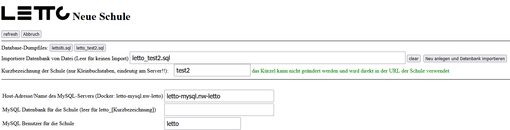

# Migration einer bestehenden Docker-Installation einer Schule auf einen neuen Server

* Bei dieser Variante wird ein neuer Server installiert und nur die Schule importiert
* spezielle Schul-Einstellungen werden dabei nicht übernommen, Daten und Bilder natürlich schon.
* andere Services wie download etc. müssen separat nachinstalliert werden
* serverbezogene Einstellungen wie Datensicherung, Zertifikat werden nicht übernommen

## Sicherung der Daten des bestehenden Servers
1. LeTTo-Server der Schule stoppen im Setup-Service  
2. Datenbanksicherung erstellen
   <pre>docker exec -it letto-mysql export letto-schulkürzel</pre>
   Bitte statt letto-schulkürzel den wirklichen Namen der Datenbank verwenden.
   Die Sicherung wird dann in der Datei /opt/letto/docker/storage/database-dump/letto-schulkürzel.sql  
   erscheinen - bitte Datum und Dateigröße kontrollieren.
   <pre>ls /opt/letto/docker/storage/database-dump -al</pre>
3. Verzeichnis /opt/letto/docker/storage in eine Datei packen 
   <pre>tar -czf lettostorage.tgz -C /opt/letto/docker storage</pre>
4. Die erstellte Datei lettostorage.tgz enthält nun alle Daten die am neuen Server benötigt werden!
5. Zum Vergleich der neuen mit der alten Installation kann man noch die Verzeichniss compose, proxy und public ebenfalls packen
   <pre>tar -czf lettocpp.tgz -C /opt/letto/docker compose proxy public</pre>

## Den neuen Server mit Ubuntu 22.04 server installieren
Bei einem virtuellen Server ist folgendes zu beachten.
* Unter Linux nur vollvirtualisierte Systeme verwenden, keine LXC-Container-Virtualisierungen verwenden
* Bei der Linux-Installation nicht die Docker-Version aus den Ubuntu oder Debian-Quellen verwenden
* Installation des Linux-Host-Systems wie bei einer [Neuinstallation](/howto/admin/install)
* Den Restkey noch NICHT setzen, er wird beim Import der Schule mit dem alten Wert gesetzt.

## Kopieren der gesicherten Daten auf den neuen Server
1. kopiere die am alten Server erstellte Datei lettostorage.tgz nach /opt/letto/docker
2. entpacke die Sicherung 
   <pre>tar -xzf /opt/letto/docker/lettostorage.tgz -C /opt/letto/docker</pre>

## anlegen der Schule mit gleichzeitigem Import der Daten
* Im Setup-Server "Schule hinzufügen"  
* Auswählen der Datenbankdump-Datei  
* Button "Neu anlegen und Datenbank importieren"
* Warten bis "FINISHED"  

## wenn LTI verwendet wurde und am neuen Server noch nicht konfiguriert wurde 
* rücksichern der LTI-Datenbank
  <pre>docker exec -it letto-mysql import lettolti</pre> 
