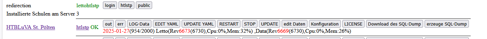
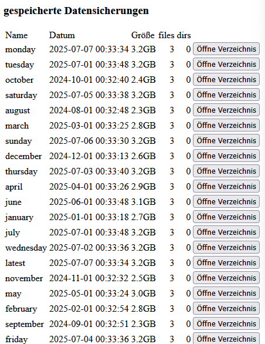
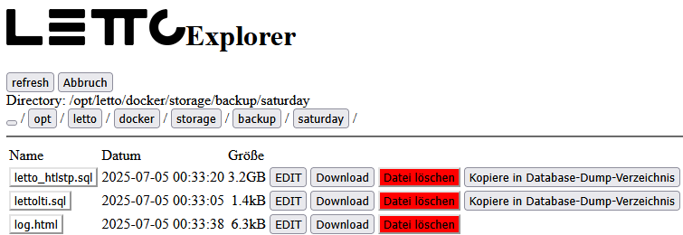
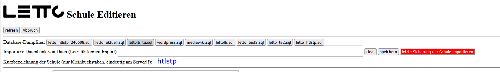

# Restore einer LeTTo-Sicherung

### siehe auch 
* [Datensicherung-Docker](../../../wiki/Datensicherung-Docker/index.md)
* [Administration](../../../wiki/Administration/index.md)

## normaler Restore einer Datensicherung
* Vorsicht! Der normale Restore einer Datensicherung löscht alle Daten in der Datenbank und ersetzt sie mit den Daten der Sicherung.
* Gegebenenfalls sollte man vor der Rücksicherung eine Sicherung der aktuellen Datenbank machen, um diese später wiederherstellen zu können.
* Die Sicherung muss im Verzeichnis /opt/letto/docker/storage/database-dump liegen.
* Die Sicherung kann über das Setup-Service rückgesichert werden.

### Sicherung der aktuellen Datenbank einer Schule
* Melden Sie sich am Setup-Service an.
* Gehen sie zurück ins Setup-Hauptmenü und wählen sie bei der Schule den Button "erzeuge SQL-Dump" aus.
   
* Der SQL-Dump wird im Verzeichnis /opt/letto/docker/storage/database-dump in der Datei "letto_schulname.sql" gespeichert.

### Vorgangsweise der Rücksicherung

* Melden Sie sich am Setup-Service an.
* Klicken Sie auf den Button "Backup/Cronjob".
* suchen sie die gewünschte Sicherung bei den "gespeicherten Datensicherungen" - und wählen sie den Butten "Öffne Verzeichnis" daneben aus.
   
* Suchen sie die Sicherung der Schule "letto_schulname.sql" und wählen sie daneben den Butten "Kopiere in das Database-Dump-Verzeichnis".
   
* Gehen sie zurück ins Setup-Hauptmenü und wählen sie bei der Schule den Button "edit Daten" aus.
   
* Nun können sie mit dem Button "letzte Sicherung der Schule importieren" die Sicherung rücksichern.
   
* Die Rücksicherung dauert je nach Größe der Sicherung einige Minuten. Am Ende der Rücksicherung wird die Schule neu gestartet und kann 
  dann wieder verwendet werden.
