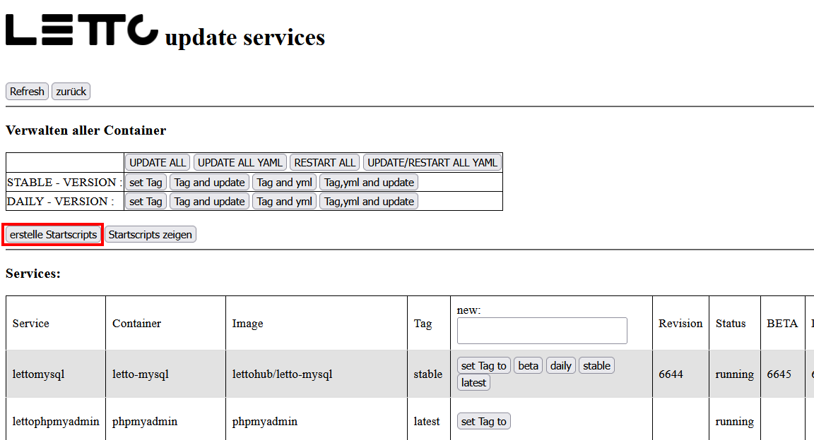

# IP-Adresse im Docker-Netzwerk konfigurieren
* Standardmäßig werden die Adressbereich 172.17.0.0/16, 172.18.0.0/16 und 172.19.0.0/16 für die Docker-Container verwendet.
* Wenn diese Adressbereiche in ihrem Netzwerk bereits verwendet werden, kann es zu Problemen kommen.
* In diesem Fall können sie einen anderen Adressbereich für die Docker-Container konfigurieren.

## Konfiguration des Basis-Docker-Netzwerks
* Dazu müssen sie die Datei `/etc/docker/daemon.json` anlegen oder bearbeiten und den gewünschten Adressbereich eintragen.
* Beispiel für die Datei `/etc/docker/daemon.json`:
```json
{
  "bip": "10.50.3.1/24"
}
```
* Danach müssen sie den Docker-Dienst neu starten:
```bash
systemctl restart docker
```

## Konfiguration der einzelnen Docker-Netzwerke von LeTTo
* Erstelle alle Startscripts mit dem Button im Update-Bereich - liegen dann in /opt/letto/docker/scripts/linux
  <br>

* In der Ubuntu-Kommandline - stoppe alle Docker-Container mit
```bash
/opt/letto/docker/scripts/linux/stop_all.sh
/opt/letto/docker/scripts/linux/stop_mysql.sh
```
* check ob wirklich alle Docker-Container gestoppt sind mit
  > docker ps

* Lösche die bestehenden 2 Dockernetze
```bash
docker network rm nw-letto
docker network rm nw-proxy
```
* Erzeuge die 2 Netzwerk neu mit einer fixen Konfiguration
```bash
docker network create --subnet 10.50.0.0/24 --gateway 10.50.0.1 nw-letto
docker network create --subnet 10.50.1.0/24 --gateway 10.50.1.1 nw-proxy
```
* Check ob die Docker-Netzwerk umgestellt sind:
  > ip addr

* Starte wieder alle Container (zuerste mysql)
```bash
/opt/letto/docker/scripts/linux/start_mysql.sh
/opt/letto/docker/scripts/linux/start_all.sh
```

* Kontrolle ob wieder alle Container laufen:
  > docker ps

* Wenn bei docker ps keine "health:starting"-Einträge mehr sind ist der Server wieder verwendbar.
