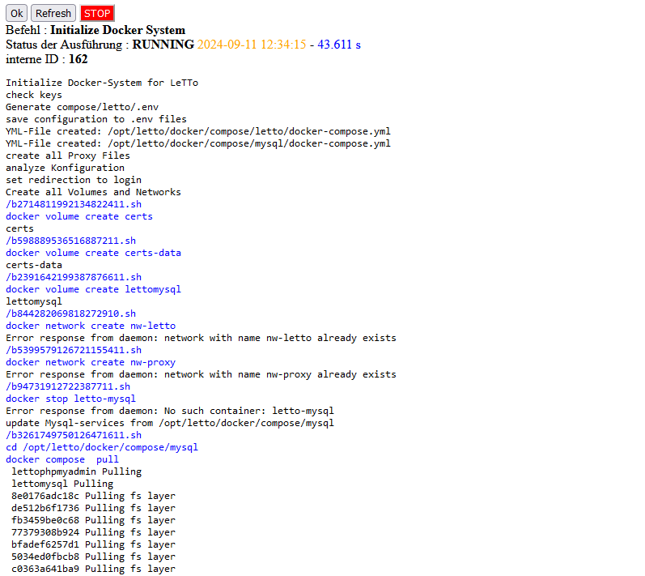

# Install Debian 13 trixie
* download von https://debian.anexia.at/debian-cd/13.0.0/amd64/iso-cd/debian-13.0.0-amd64-netinst.iso
* starte Debian von Debian-13.x ISO-Image
    * Graphical install
    * Sprache - Deutsch oder wie gewünscht
    * Location - Österreich oder wie gewünscht
    * Keyboard: Deutsch
    * root-Passwort setzen
    * Benutzer letto mit Passwort anlegen
    * Festplattenpartitionierung - Geführt - gesamte Platte verwenden - alle Dateien in einer Partition
    * Netzwerkspiegel für die Installation auswählen
    * HTTP-Proxy leer lassen
    * Softwareauswahl - "Standard-System-Utilities" und "SSH-Server" auswählen, keine weiteren Pakete auswählen
    * Installation abschließen und neu starten
    * Wenn der Server die IP-Konfiguration nicht über DHCP erhalten soll muss dies jetzt in der Datei /etc/network/interfaces konfiguriert werden   
    * Dann Netzwerk neu starten mit: <pre>systemctl restart networking</pre> oder den Server neu starten

## Konfiguration
als root
<pre>apt-get update -y
apt-get upgrade -y
apt-get dist-upgrade -y
apt-get autoremove -y
</pre>

## Installation von LeTTo
als root
<pre>cd /opt
wget https://build.letto.at/download/install/scripts/debian-ubuntu/install-letto-ubuntu-docker.sh
bash ./install-letto-ubuntu-docker.sh
</pre>
* setzte das Passwort welches dann im LetTo-Setup für den Benutzer admin verwendet wird
* wenn das Script mit einer Lines-Meldung  hängen bleibt ein paar mal Leertaste und dann q drücken bis das Script weiter läuft

## Erstkonfiguration im Setup-Service
* Verbinden sie sich über den Browser mit '''https://ipadresse:3096/config''' und füllen sie das Formular mit ihren Daten aus.  
    * Der Server muss mit https über den angegebnen DNS-Namen von Schülern und Lehrern erreichbar sein
    * Wird später ein Lets-Encrypt-Zertifikat verwendet muss der Server auch vom Internet über http und https auf dem DNS-Namen erreichbar sein!
* Danach sollten alle notwendigen Docker-Container automatisch heruntergeladen und installiert werden  
* Warten sie bis die Zeit nicht mehr nach oben zählt und drücken sie dann auf "Refresh"
* Nun sollte ein weiterer Login angefordert werden und dann das Setup in etwa so aussehen:  
* Ab jetzt ist das Setup-Service direkt über https://dns-name-des-servers/config erreichbar

# Installation einer Schule
weiter zur [Installation einer Schule](../schulinstallation/index.md)
