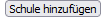
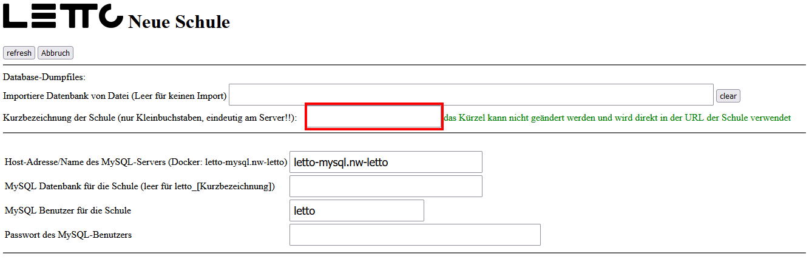
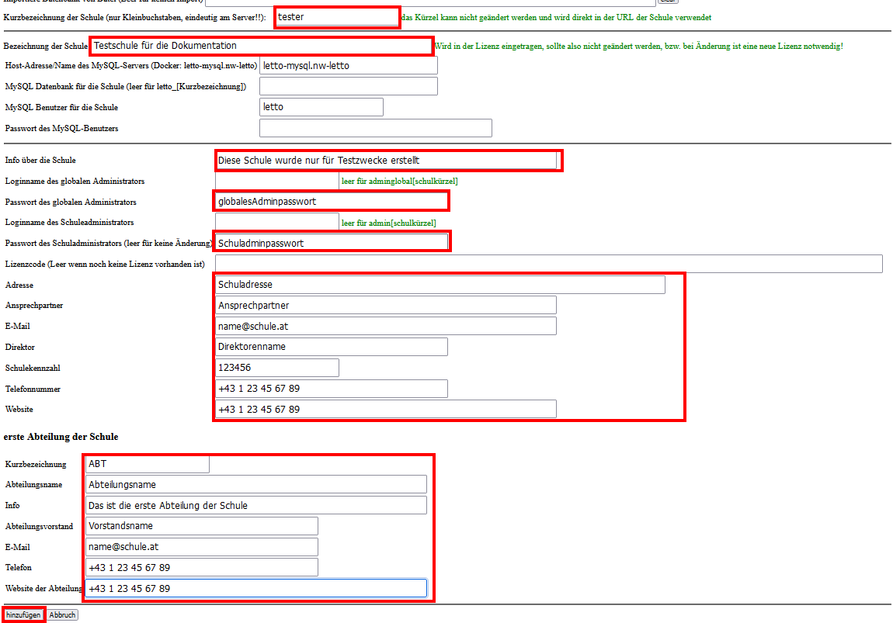

# Installation einer neuen Schule
* melden sie sich am Setup-Service (https://dns-name-des-servers/config) als admin an.
* Wählen sie den Button  aus dem unterern Bereich des Setup-Services.
* Im folgenden Dialog muss die Schule konfiguriert werden.  
  Hierbei kann auch eine bestehende Datenbank beim Anlegen der Schule import werden (siehe [Schule migrieren](./schulemigrieren.md))
  * Im ersten Schritt muss ein Schulkürzel für die Schule definiert werden 
    * kein Umlaute
    * nur Kleinbuchstaben
    * nur das Minus ist als Sonderzeichen erlaubt
    * das Schulkürzel wird in späterer Folge für Verzeichnisnamen, Datenbanknamen, Url und Schulidentifikation verwendet
    * das Schulkürzel muss auf Servern mit mehreren Schulen eindeutig sein
    * das Schulkürzel kann später nicht mehr geändert werden !
    * 
  * Nachdem das Schulkürzel eingegeben ist ändert sich der Dialog und man sollte alle weiteren Stammdaten der Schule anlegen 
    
  * mit "hinzufügen" wird der Initialisierungsvorgang der Schule gestartet. Je nach Serverhardware
    und Internetverbindung kann das mehrere Minuten dauern. Sobald oben in der Protkollseite ein
    FINISHED erscheint ist der Vorgang abgschlossen und man kann das Protkollfenster mit ok schließen.
* Nach einem erfolgreichen Start der Schule ist sie über die Url
  <pre class="config">https://dnsnameDesServers/lettoSchulkuerzel</pre> erreichbar.  
  zB. ist die Schule mit DNS-Name "letto.xx.at" und Schulname "tester" über die Url 
  <pre class="config">https://letto.xx.at/lettotester</pre> erreichbar.
* Auf dem LeTTo-Server der Schule kann man sich mit den zwei angelegten Benutzern 
  (aus den obigen Formular) am Server anmelden. 
* Alle Weiteren Konfiguration für die Schule werden dann direkt im LeTTo-Server der Schule erledigt. 
  siehe dazu [Konfiguration einer Schule am LeTTo-Server](../schulkonfiguration/index.md)

