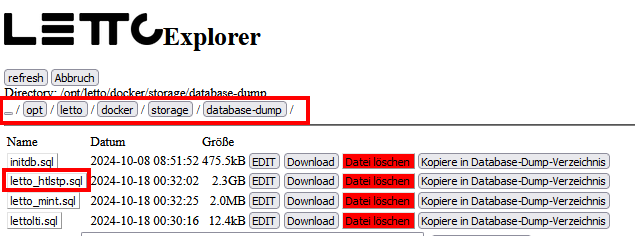

# Bestehende Datenbank in eine neue Schule übernehmen
* Falls die Schule schon auf einem anderen Server vorhanden war und jetzt auf den
  diesen Server umgezogen werden soll, kann die Datenbank dieser Schule direkt beim 
  Anlegen einer Schule importiert werden. 
* Beim Import werden alle Einstellungen der Schule aus dem Datenbank-Dump übernommen weshalb wesentlich 
  weniger Daten eingegeben werden müssen als beim Anlegen einer neuen Schule.
* melden sie sich am Setup-Service (https://dns-name-des-servers/config) als admin an.
* Kopieren sie zuerst den Datenbank-Dump der Schule in das Verzeichnis <pre class="config">/opt/letto/docker/storage/database-dump/</pre>
  wobei das Dumpfile letto_kuerzel.sql benannt sein sollte (zB letto_htlstp.sql für das Schulkürzel htlstp).
   
* Wählen sie den Button  aus dem unterern Bereich des Setup-Services.
* Im folgenden Dialog muss der Datebank-Dump der Schule ausgewählt werden.