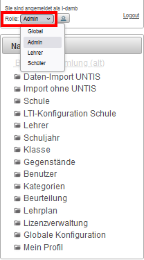

# Schulkonfiguration im LeTTo-Server
## Konfigurationen welche der Schuladmin vornehmen kann
* Für diese Konfigurationen muss man als Schuladmin am LeTTo-Server angemeldet sein und die Rolle "admin" eingestellt haben. 
  

  In Arbeit!!

## Konfigurationen welche der globale Admin vornehmen kann
* Für diese Konfigurationen muss man als globaler Admin am LeTTo-Server angemeldet sein und die Rolle "global" eingestellt haben. 
  

  In Arbeit!!