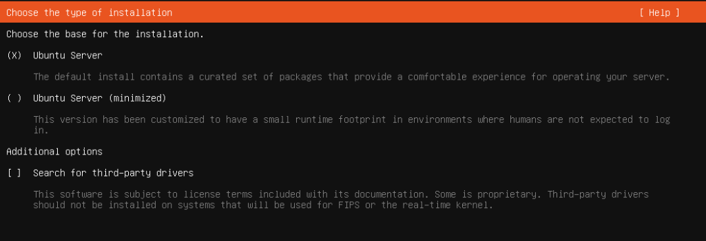
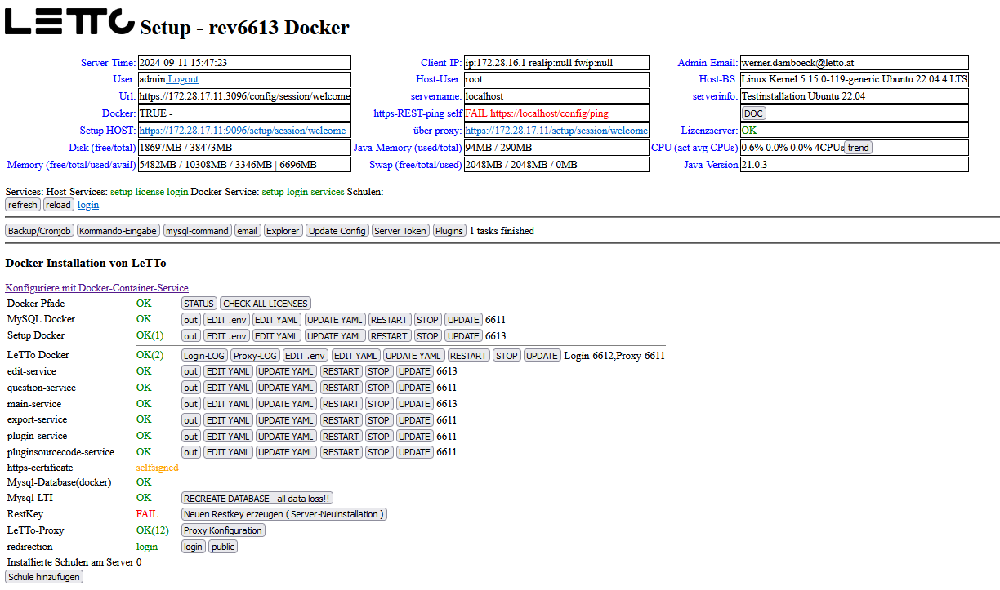

# Install Ubuntu 22.04
## Grundinstallation
* download Iso-Image von https://ubuntu.com/download/server
* starte Ubuntu von Ubuntu-Server 22.04.4 ISO-Image
* Sprache - Deutsch
* Aktualisieren auf neuen Installer
* Keyboard: German(Austria) - No dead keys  
  * Ubuntu Server  
* Netzwerkkonfiguration einstellen
* kein Proxy
* Mirror belassen
* use entire disk
* Benutzer letto mit Passwort anlegen
* ohne Ubuntu-pro
* Install OpenSSH server  
* kein weiteren Packages installieren (Vor allem nicht docker)
* Nach Installation den Rechner neu starten
## Konfiguration
als root
<pre>apt-get update -y
apt-get upgrade -y
apt-get dist-upgrade -y
apt-get autoremove -y
</pre>
## Installation von LeTTo
als root
<pre>cd /opt
wget https://build.letto.at/download/install/scripts/debian-ubuntu/install-letto-ubuntu-docker.sh
bash ./install-letto-ubuntu-docker.sh
</pre>
* setzte das Passwort welches dann im LetTo-Setup für den Benutzer admin verwendet wird
## Erstkonfiguration im Setup-Service
* Verbinden sie sich über den Browser mit '''https://ipadresse:3096/config''' und füllen sie das Formular mit ihren Daten aus.  
  * Der Server muss mit https über den angegebnen DNS-Namen von Schülern und Lehrern erreichbar sein
  * Wird später ein Lets-Encrypt-Zertifikat verwendet muss der Server auch vom Internet über http und https auf dem DNS-Namen erreichbar sein!
* Danach sollten alle notwendigen Docker-Container automatisch heruntergeladen und installiert werden  
* Warten sie bis die Zeit nicht mehr nach oben zählt und drücken sie dann auf "Refresh"
* Nun sollte ein weiterer Login angefordert werden und dann das Setup in etwa so aussehen:  
* Ab jetzt ist das Setup-Service direkt über https://dns-name-des-servers/config erreichbar

# Installation einer Schule
weiter zur [Installation einer Schule](../schulinstallation/index.md)