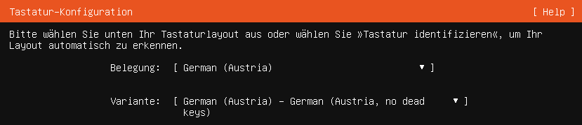
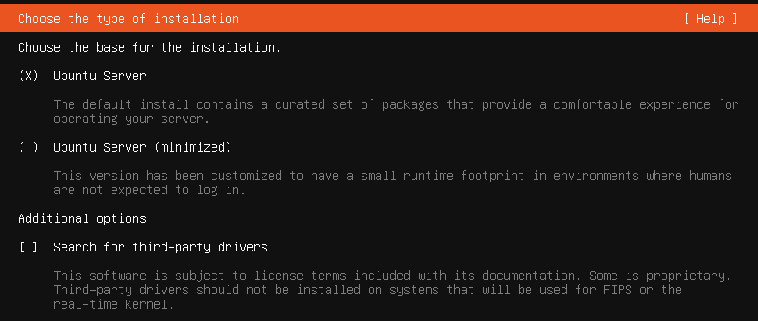
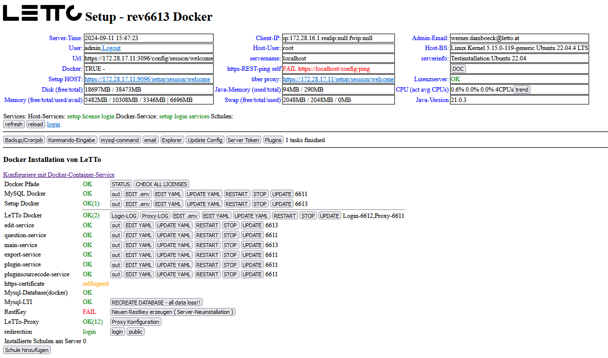

# Install Ubuntu 24.04
## Grundinstallation
* download Iso-Image von https://ubuntu.com/download/server zB. ubuntu-24.04.3-live-server-amd64.iso
* starte Ubuntu von Ubuntu-Server 24.04.x ISO-Image
  * Try or Install Ubuntu Server
  * Sprache - Deutsch oder wie gewünscht
* Sprache - Deutsch
* Keyboard: German (Austria) - No dead keys 
    * Ubuntu Server 
* Netzwerkkonfiguration einstellen
* kein Proxy
* Mirror belassen
* Eine ganze Festplatte verwenden
* Benutzer letto mit Passwort anlegen
* ohne Ubuntu-pro
* Install OpenSSH server
* kein weiteren Packages installieren (Vor allem nicht docker)
* Nach Installation den Rechner neu starten

## Konfiguration
als root
<pre>apt-get update -y
apt-get upgrade -y
apt-get dist-upgrade -y
apt-get autoremove -y
</pre>

## Installation von LeTTo
als root
<pre>cd /opt
wget https://build.letto.at/download/install/scripts/debian-ubuntu/install-letto-ubuntu-docker.sh
bash ./install-letto-ubuntu-docker.sh
</pre>
## Erstkonfiguration im Setup-Service
* Verbinden sie sich über den Browser mit '''https://ipadresse:3096/config''' und füllen sie das Formular mit ihren Daten aus.  
    * Der Server muss mit https über den angegebnen DNS-Namen von Schülern und Lehrern erreichbar sein
    * Wird später ein Lets-Encrypt-Zertifikat verwendet muss der Server auch vom Internet über http und https auf dem DNS-Namen erreichbar sein!
* Danach sollten alle notwendigen Docker-Container automatisch heruntergeladen und installiert werden  
* Warten sie bis die Zeit nicht mehr nach oben zählt und drücken sie dann auf "Refresh"
* Nun sollte ein weiterer Login angefordert werden und dann das Setup in etwa so aussehen:  
* Ab jetzt ist das Setup-Service direkt über https://dns-name-des-servers/config erreichbar

# Installation einer Schule
weiter zur [Installation einer Schule](../schulinstallation/index.md)
