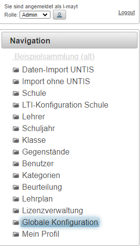
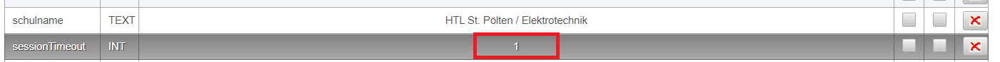

# Konfiguration Session-Timeout
Die Default-Einstellung für eine Session beträgt standardmäßig 30 min.

Um die Session-Timeout-Zeit zu verändern, wählen Sie als Administrator den Link "Globale Konfiguration":

Dort suchen Sie nach dem Parameter **SessionTimeout** und ändern diesen auf den gewünschten Wert in Minuten!

Nach dem nächsten Login-Vorgang wird diese Zeit als Standardwert für alle Benutzer dieser Schulinstanz übernommen.
