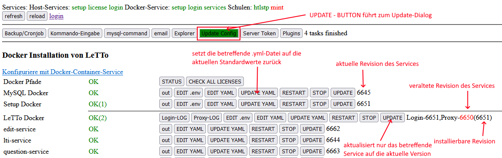
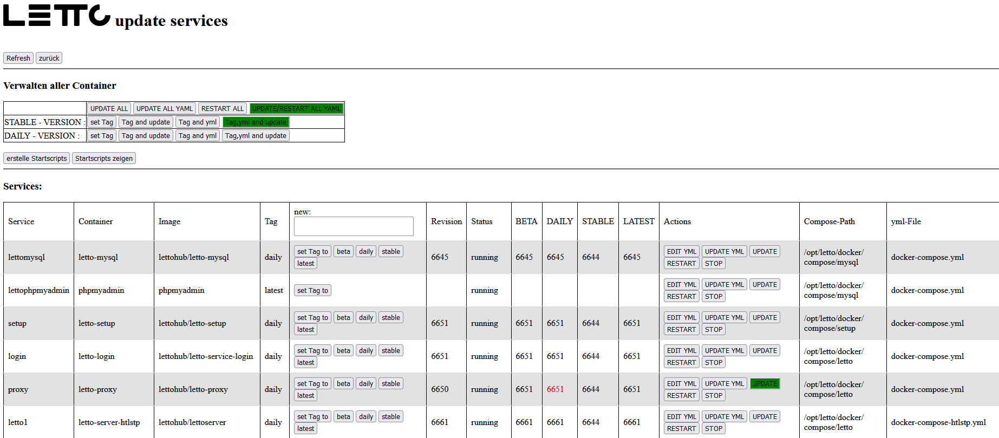

# Update einer Docker-Installation von LeTTo
- Grundsätzlich erfolgt das Update über das Setupservice welches mit https://serveradresse/config erreichbar ist

## Information über die laufenden Versionen

* "UPDATE CONFIG" führt zum eingentlichen Update-Dialog und ist die **empfohlene** Variante für Updates!
* "Update" betrifft immer nur das Service in der gleichen Zeile. 
  Aktualisiert man nur ein Service so kann dies zu einer Mischung von Revisionen führen
  wodurch möglicherweise Services nicht mehr korrekt miteinander kommunizieren können. 
  Man sollte deshalb bei einem Update eines einzelnen Services die alte Revisionsnummer notieren
  um ggf. darauch zurück stellen zu können.
* "UPDATE YAML" setzt die yml.-Konfigurationsdatei des betreffenden Services auf den aktuellen Standardwert zurück.

## Update Dialog

#### Update aller Services (mit Ausnahme des MySQL-Server)

Vor jedem Update von mehreren Services sollte das **Setup-Service auf die aktuelle Version** aktualisiert werden!

* "UPDATE/RESTART ALL YAML": aktualisiert alle Services auf den eingestellten Tag(Update-Plan) ohne den Tag zu ändern.
* STABLE-VERSION "Tag,yml and update": aktualisiert den Tag aller Services auf "stable" und aktualisiert danach alle Services.
* DAILY-VERSION "Tag,yml and update": aktualisiert den Tag aller Services auf "daily" und aktualisiert danach alle Services.

