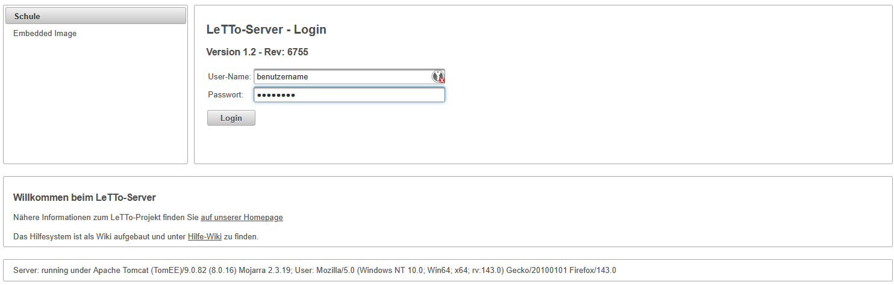
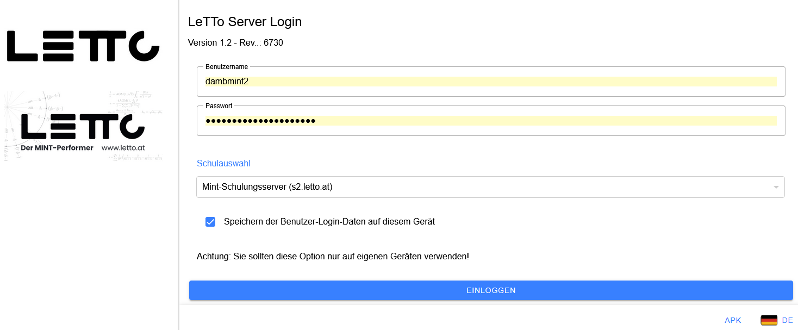
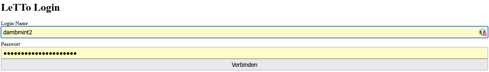
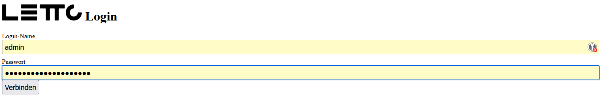
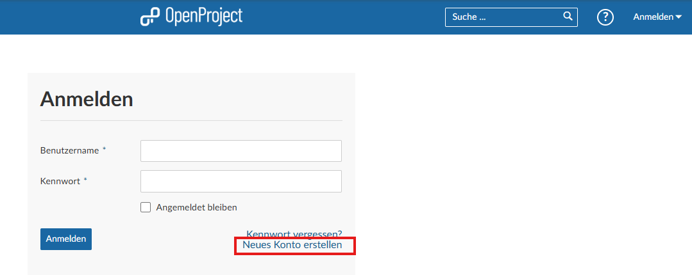

# Login

* Lehrer und Schüler können sich auf verschiedene Arten am LeTTo-Server anmelden.
* Lehrer dürfen sich gleichzeitig von mehreren Geräten anmelden.
* **Schüler** dürfen sich immer nur **von einem Gerät** anmelden. Bevor ein Schüler sich an 
  einem anderen Gerät anmelden kann, muss er sich am ersten Gerät wieder abmelden.
  * Je nach Servereinstellung gibt es zwei Möglichkeiten wenn der Schüler bereits an einem anderen Gerät angemeldet ist:
    1. Der Schüler kann sich nicht anmelden solange er am ersten Gerät angemeldet ist.
    2. Der Schüler wird automatisch am ersten Gerät abgemeldet wenn er sich an einem anderen Gerät anmeldet.
  * Diese Einstellung kann nur vom Administrator geändert werden (siehe [Login-Konfiguration](../../wiki/LeTToEnvironment/index.md#login-konfiguration))
* Bei der Anmeldung wird immer die Schule, der Benutzername und das Passwort benötigt.
* Jeder Lehrer einer Schule kann den Schülern das [Passwort für LeTTo zurücksetzen](../../wiki/Schülerpasswortsetzen/index.md) und auch vom Server abmelden.
* Das Passwort kann auch vom Administrator zurückgesetzt werden.
* Jeder Schüler kann in seinem Profil am LeTTo-Server sein Passwort selbst ändern.
* Hat die Schule einen **AD- oder LDAP-Server** angebunden, so können sich die Benutzer mit dem gleichen Passwort anmelden wie am AD/LDAP-Server.
  * VORSICHT: Bei einer AD/LDAP Konfiguration muss sich der Benutzer mindestens einmal erfolgreich am lettoserver (https://domainname/lettoXXX) anmelden damit der Login auf App,Main oder am Login-Service funktionieren kann.
  * Hat bei einer AD/LDAP-Anbindung ein Lehrer/Admin das Passwort eines Schülers zurückgesetzt kann dieser dieses Passwort so lange verwenden bis er sich einmal mit seinem korrekten AD/LDAP Passwort eingeloggt hat. Danach gilt nur mehr das AD/LDAP-Passwort.

## Login am LeTTo-Server
* Standard-Einstieg für Schüler und Lehrer
* Server: https://serveradresse/letto[Schulkürzel] 
  zB: https://letto.htlstp.ac.at/lettohtlstp , https://s2.letto.at/lettomint2 , https://s1.letto.at/lettoexchange  
  

## Login in der LeTTo-App
* Neuerdings ist es möglich, sich auch über die LeTTo-App mit dem Benutzernamen und Passwort anzumelden.
* Die App wird in Zukunft auch für Android im Playstore verfügbar sein.
* Start der App am Browser: https://serveradresse/app 
  zB: https://letto.htlstp.ac.at/app , https://s2.letto.at/app , https://s1.letto.at/app  
    
* Die Schulauswahl steht nur zur Verfügung wenn der Server mehrere Schulen verwaltet.
* Die App kann auch als [Android-App-APK](https://download.letto.at/download/app/stable) installiert werden. 

## Login mit dem Login-Service
* Der Login direkt am Login-Service ist nur für spezielle Anwendungen gedacht
* bei Servern mit AD oder LDAP Anbindung kann man sich hier nur anmelden wenn man sich mit dem gleichen Passwort auch schon am LeTTo-Server angemeldet hat.
* Diese Login-Seite sollte nur in Ausnahmefällen verwendet werden.
* Server: https://serveradresse/login 
  zB: https://letto.htlstp.ac.at/login , https://s2.letto.at/login , https://s1.letto.at/login  
   

## Login im Setup-Service
* Der Login im Setup-Service ist nur für Administratoren gedacht
* Hier können sich nur Administratoren anmelden um den Server zu konfigurieren
* Server: https://serveradresse/config 
  zB: https://letto.htlstp.ac.at/config , https://s2.letto.at/config , https://s1.letto.at/config  
  

## Login in OpenProject [https://project.letto.at](https://project.letto.at)
* Die Logins am OpenProject-Server sind unabhängig von den LeTTo-Logins
* Jeder Benutzer muss sich separat am OpenProject-Server anmelden.  
   
* Bitte immer mit der Schul-Email-Adresse anmelden.
* Server: https://project.letto.at 
* Lehrer werden für die Benutzung freigeschaltet wenn sie nach der Registrierung eine Email an <mailto:werner.damboeck@letto.at> senden.
  - Bitte um Angabe der Schule und der Email-Adresse. 
  - Bitte um Geduld, die Freischaltung erfolgt manuell.
  - Bitte im Verständis dass wir keine Benutzer freischalten können die keine Schul-Email-Adresse verwenden, oder wo wir die Schulzugehörigkeit nicht nachvollziehen können.
* Der Project-Server dient zur Meldung von Fehlern, zur Dokumentation und für die Verwaltung von Aufgaben.
* Weiters befindet sich darauf ein Forum für Fragen und Antworten rund um LeTTo.
* Schüler sollten sich nicht am Project-Server anmelden.
* 