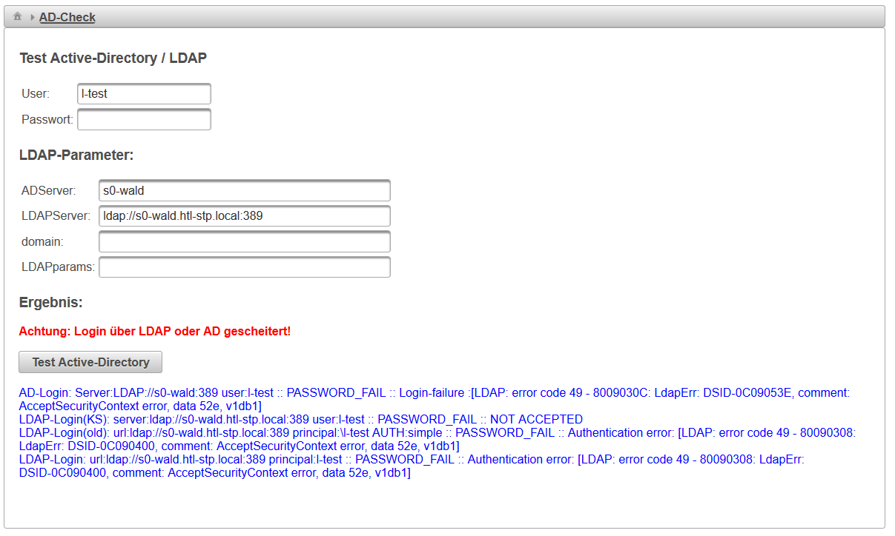
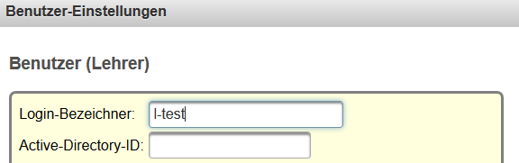
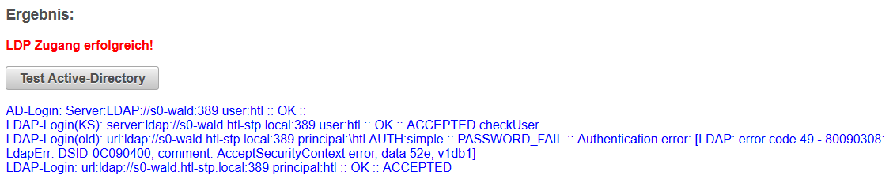
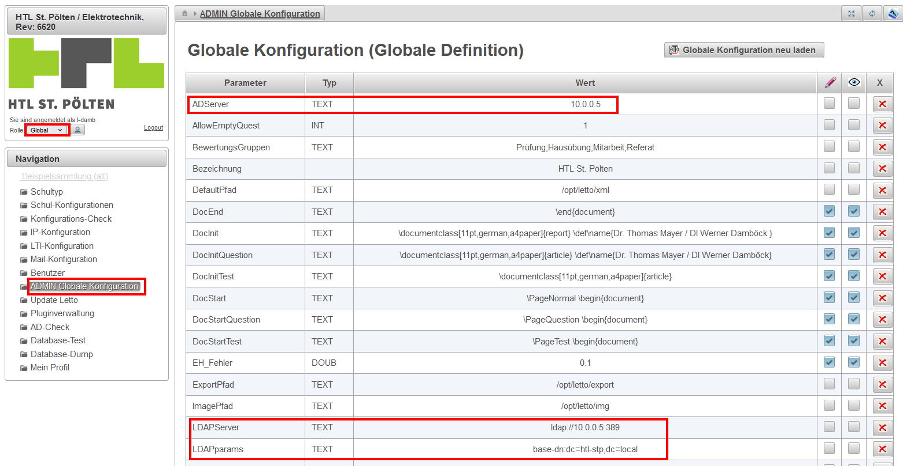

# AD-check
zurück zur [Konfiguration von AD/LDAP im Setup-Service]("../../../../howto/admin/active-directory-ldap/index.md)
## Allgemeines
Hiermit kann die Authentifikation an einem Active-Directory oder an einem LDAP-Server konfiguriert und getestet werden.

 

###  Folgende Daten müssen für die Authentifikation eingestellt und bekannt sein 
* Ist die Active-Directory-ID bei einem Benutzer nicht gesetzt muss der **Login-Bezeichner von Letto als Benutzername am LDAP** existieren.
 
* Sind Login-Bezeichner von Letto und Benutzername am LDAP unterschiedlich, so muss der **Benutzername von LDAP als Active-Directory-ID** beim Benutzer angegeben werden. Dies kann beim [Datenimport](../Datenimport/index.md) über den Button "AD-User" für alle Lehrer automatisch importiert werden oder in der [Benutzer](../Benutzer/index.md)einstellung eingestellt werden.
* IP-Adresse oder DNS-Name des LDAP/AD-Servers
* ldap URL, gegebenenfalls mit verwendetem Port
* Domain-Bezeichnung der lokalen Domain
* notwendige Parameter für die Konfiguration des LDAP-Strings

###  Prüfen der Einstellungen 
Durch den Button "Test Active-Directory" wird die Authentifikation des Benutzers "User" mit den angegebenen Konfigurationseinstellungen geprüft. 
Hierzu muss als "**User**" ein Benutzer angegeben werden, welcher am **LDAP/AD-Server** existiert. 
Es ist für diese Prüfung nicht notwendig, dass der Benutzer auch als Letto-User existiert.

Ob die Prüfung erfolgreich war wird rot und fett angegeben.

Unterhalb werden die Logmeldungen zu dem Login angegeben, um die Fehlersuche zu erleichtern.

Aktuell werden **4 verschieden Varianten des Login-Vorgangs** (AD-Login, LDAP-Login(KS), LDAP-Login(old), LDAP-Login) durchprobiert. 
Die Login-Varianten AD-Login, LDAP-Login(KS) und LDAP-Login(old) werden in zukünftigen Versionen entfernt werden, 
da sie nur noch aus Kompatibilitätsgründen vorhanden sind. Für aktuelle und neue Installationen sollte die vierte Variante **LDAP-Login** 
einen korrekten Login liefern.
  
Nach einem erfolgreichen Login im AD-Test wird das erfolgreiche Login-Verfahren für alle weiteren 
Logins gespeichert.

Die Konfiguration welche eingestellt wurde muss anschließend noch in der globalen Konfiguration 
gespeichert werden.

### Speichern der Konfiguration in der globalen Konfiguration
* Am LeTTo-Server als globaler Administrator(Rolle "global")
* Im Menüpunkt "ADMIN globale Konfiguration"
* Die 4 Parameter welche beim AD-Check (oben beschrieben) gesetzt worden sind, sind dort dementsprechend einzutragen.
 
 

 

