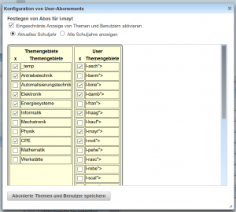
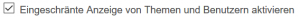
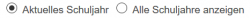
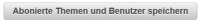

# Abos
Der Dialog zur Definition der angezeigten Kategorien kann in der 
[Beispielsammlung](../Beispielsammlung/index.md) über den 
[Toolbar](../Toolbar/index.md) mit dem Konfigurations-Button

    

geöffnet werden.

Auf dem ersten Reiter des Konfigurations-Dialoges befinden sich die Einstellungen 
für die Auswahl der angezeigten Ordner. 

## Festlegung von angezeigten Themen und Benutzern

 

Mit diesem Dialog können Sie festlegen, wie die Informationen in der [Ordner-Struktur](../Ordnerverwaltung/index.md) angezeigt werden. 
Sie können definieren, welche Hauptkategorien angezeigt werden sollen,  welche Daten von anderen Benutzern dargestellt werden, und ob Sie nur das aktuelle Schuljahr im Bereich der Online-Tests angezeigt bekommen oder alle Schuljahre, die in der Datenbank verfügbar sind.

Zur Aktivierung der eingeschränkten Darstellung wählen Sie bitte: 
  
Nur wenn diese Checkbox gewählt wurde, erfolgt eine Einschränkung in der Darstellung der Ordner

Zur Unterscheidung, ob alle Schuljahr oder nur das aktuelle eingeblendet werden, wählen Sie bitte:
  

In der Liste der Themengebiete und der User können Sie durch entsprechende Auswahl die nicht gewünschten Themengebiete / Benutzer ein- oder ausblenden lassen.

Bestätigung der Abo-Definitionen durch Klicken des Buttons 
  

Kategorie: [Dialoge](../Dialoge/index.md)

