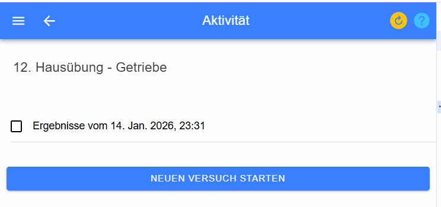

# Starten einer Aktivität

Mit dieser Seite können Sie eine Aktiviät starten, forsetzten oder 
die Ergebnisse einer abgegebenen Einheit einsehen. 

In der Titelzeile sehen Sie die Bezeichnung der Aktivität.
Darunter sind folgende Auswahlmöglichleiten möglich:

* **Neuen Versuch starten**
* **Versuch fortsetzen vom ...**
* **Ergebnisse vom ...**

Mit **Neuen Versuch starten** wird für diese Aktivität ein neuer Versuch angelegt,
es werden die Beispiele zugewiesen und die Angabewerte definiert. Danach können 
Sie mit der Bearbetung der beispiele beginnen.

Nach einer Unterbrechung können Sie mit **Versuch fortsetzen vom ...** die Arbeit wieder aufnehmen.

Mit **Ergebnisse vom ...** können Sie eine bereits abgeschlossene Aktivität wieder einsehen
und bekommen auch die korrekten Ergebnisse präsentiert, wenn diese vom Lehrer freigegeben wurden.
