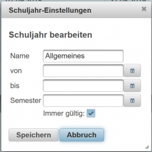
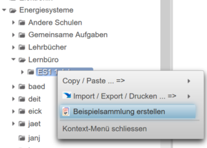
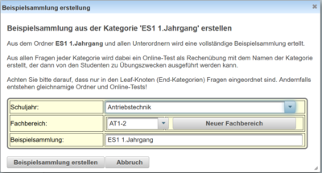
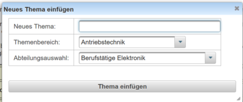
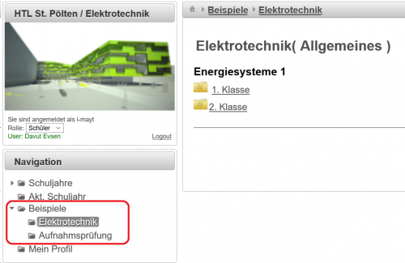
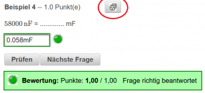
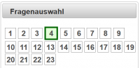

# Allgemein gültige Beispielsammlungen
Die Fragen aus der [Beispielsammlung](../Beispielsammlung/index.md) können auch für die Schüler oder für [externe Benutzer](../ExterneBenutzer/index.md) in allgemein-gültigen Beispielsammlungen zusammengefasst und verwendet werden.

 

###  Vorbereitungen durch den Administrator 
Dazu müssen vom Administator folgende Vorbereitungen getroffen werden:
* Anlegen eines Schuljahr, in dem das Attribut **immer gültig** gesetzt ist [siehe auch Anlegen eines Schuljahres](/notimplemented/index.md) und nebenstehende Abbildung.

###  Anlegen von einer Fragesammlung durch einen Lehrer 

Alle Fragen einer ganzen Kategorie mit allen Unterordnern kann in einer Beispielsammlung über das Kontext-Menü angelegt werden:
 
Im folgenden Dialog muss die Beispielsammlung einem Themenbereich (Schuljahr) und einem Fachbereich zugeordnet werden.
 
Der Fachbereich kann aus der Auswahlliste gewählt werden oder neu angelegt werden:
 
Bitte jedenfalls Themenbereich und Abteilung korrekt auswählen!

Aus jeder Kategorie wird beim Erstellen der Beispielsammlung ein Test gemacht, in den die Fragen der aktuellen Kategorie automatisch eingefügt werden. Tests entsprechen dann der kleinsten Einheit der Beispielsammlung, die quasi ein Kapitel oder Unterkapitel abbilden. [Online-Tests](../Online-Tests/index.md) in immer-gültigen Schuljahren werden bei der Bearbeitung durch Schüler oder externe Benutzer zwar in der Datenbank gespeichert, fliessen aber nicht in die Beurteilungen für den Schüler ein. Diese Tests laufen immer im Rechenübungs-Modus, sodass Schüler üben können und dann die gerechneten oder beantworteten Aufgabenstellungen kontrolliert werden können. Der Start eines Tests über **Test starten** und das **Test beendent** entfällt im Übungsmodus.

### Sichtweise für Schüler
Für jeden Schüler sind die angelegten Themenbereiche und die darin angelegten Gegenstände und Beispiele über die [Navigation](../LeTTo-Hauptansicht/index.md#navigation) unter **Beispiele** zu finden:

 

Nach dem Click auf einen Ordner werden die entsprechenden Online-Tests angezeigt, die die Fragen enthalten. Beim Auswählen der Online-Test in diesem Übungsmodus wird der Test sofort mit den Fragen geöffnet und Sie könenn mit der Beantwortung der Fragen beginnen.

 
Über den Button  können die Angabewerte geändert werden und Sie bekommen neue Zahewerte zugewiesen. Diese Funktion ist vor allem bei Beispielen, die die Rechenfertigkeit trainieren sollen, sehr hilfreich.

 

Über die Fragenauswahl können nun die einzelnen Fragen angewählt werden, die farbliche Markierung zur Kennzeichnung der falschen und richtigen Antworten ist wie gewohnt verfügbar. Die Ergebnisse werden nicht in der Datenbank gespeichert und sind nach 30 Minuten nicht mehr verfügbar (Session-Timeout).

