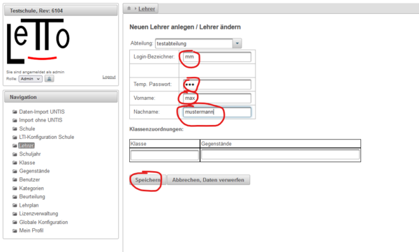
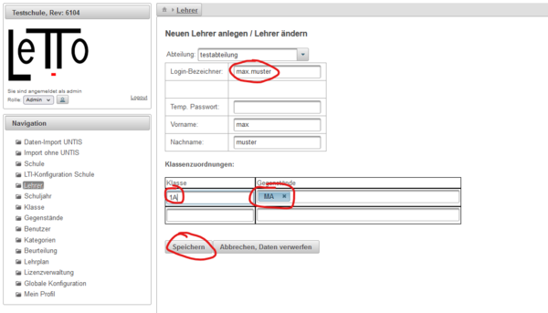

# Anlegen von einzelnen Lehrern mit Gegenständen
Im Menüpunkt **Lehrer** kann ein Lehrer mit seinen Klassen und Gegenständen direkt angelegt werden.
###  Lehrer anlegen 
 
* Das Passwort muss beim ersten Login des Lehrers neu gesetzt werden.
* Die Klassenzuordnung sollte erst nach der Anlage des Lehrers eingetragen werden.
* Die Abteilung sollte dem Lehrer korrekt zugeordnet werden

###  Klasse und Gegenstand zuordnen 
 
* Login-Bezeichner des Lehrers angeben
* Klasse eintragen - Diese wird automatisch angelegt wenn sie nicht vorhanden ist
* Gegenstand eintragen - Dieser wird neu angelegt wenn er nicht vorhanden ist
* Erst durch **speichern** wird der Eintrag übernommen

###  siehe auch 
* [Hauptseite administration](../Hauptseite/index.md#administration-)
* [Datenimport aus Untis und Sokrates](../Datenimport/index.md)
* [Datenimport ohne Untis-Daten](../DatenimportohneUntis-Daten/index.md) mit Hilfe von CSV-Dateien

