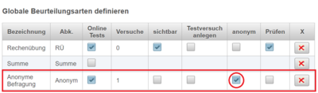

# Anonyme Befragung
Mit **Anonymen Befragungen** können Umfragen und Auswertungen in Form von Online-Tests durchgeführt werden. Diese sind nach Abgabe des Tests nicht mit dem Benutzer verbunden und rein für statistische Auswertungen verwendbar.

### Konfiguration von Anonymen Testmodis (für Administratoren)

Damit anonyme Befragungen durchgeführt werden können, muss der Administrator unter **Beurteilungen** im Bereich der **Globale Beurteilungsarten definieren** durch Klicken mit der rechten Maustaste folgenden Eintrag setzen:
 
Wesentlich ist dabei das Häkchen in der Spalte **anonym**, denn dadurch wird diese Befragung anonymisiert und alle Ergebnisse nur mehr statistisch ausgewertet. Natürlich sind auch andere Bezeichnungen als '_Anonyme Befragung_ dafür möglich.

### Fragetypen für Anonyme Befragungen
Folgende Fragetypen stehen bei diesen Befragungen zur Verfügung:
* Multiple-Choice-Fragen
* Freitextfragen
* Mehrfach-Berechnungsfragen mit folgenden Typen der Teilfragen:
  * Freitext
  * Multiple-Choice
  * Schieber

Die Frageart **Schieber** wurde speziell/auch für Umfragen entwickelt und stellt einen Schieber mit Minimal- und Maximalwert dar.
#### Erstellung von Fragen mit Schiebern

Die folgende Abbildung zeigt Teilfragen eine Mehrfachberechnungsfrage mit mehreren Schieber-Definitionen.
 
Wenn die Frageart Schieber gewählt wird, kann in der Spalte Lösung der Text **min:0;max:100** eingefügt werden. Damit kann der Schieber und die angezeigten Texte links und rechts davon konfiguriert werden. Wird in der Spalte kein Eintrag gemacht, dann werden Defaultwerte verwendet.
* Der erste Text wird links vom Schieber dargestellt, der Zahlenwert nach dem Doppelpunkt definiert den Minimalwert des Schiebers.
* Der zweite Text wird links vom Schieber dargestellt, der Zahlenwert nach dem 2. Doppelpunkt definiert den Maximalwert

#### Vorschau von Fragen mit Schiebern

Die folgende Abbildung zeigt die Vorschau der oben definierten Frage:
 
Alle Schieber sind zu Beginn grau und werden erst nach Betätigung grün hinterlegt. Erst wenn alle Schieber vom Benutzer betätigt wurden, kann die Frage gespeichert und verlassen werden!

 

Multiple-Choice-Fragen und Freitextfragen verhalten sich wie in normalen Online-Tests.

### Abgabe von Anonymen Tests
Solange eine solche Befragung vom Benutzer ausgeführt wird, gibt es in der Datenbank noch eine Verbindung zum aktuellen Benutzer, damit im Fall eines unerwarteten Systemabsturzes der User die Befragung fertigstellen kann. Es gibt aber keine Möglichkeit, von der Oberfläche auf diese Daten zuzugreifen!
Nach Abgabe eines anonymen Tests wird vermerkt, dass dieser Benutzer an der Befragung teilgenommen hat und wird somit von einem weiteren Versuch ausgeschlossen. Die Verbindung zum Benutzer von der einegebenen Daten wird endgültig getrennt.

### Ergebnisauswertung

#### Numerische Ergebnisse
Fragen unter Verwendung des Schiebers werden statistisch ausgewertet:
 
Neben der Verteilung der Bewertungen wird auch der Maximalwert, der Minimalwert, der Mittelwert sowie die Standardabweichung berechnet.

#### Ergebnisse von Multiple-Choice-Fragen
Bei Multiple-Choice-Fragen wird die Summer der gewählten Möglichkeiten direkt neben der Auswahlmöglichkeit dargestellt.
 
3/5 bedeutet, dass 2 von 5 Benutzern diese Auswahlmöglichkeit gewählt haben.

#### Ergebnisse von Freitextfragen
Alle eingebenen Texte werden gesammelt am Bildschirm ausgegeben.

