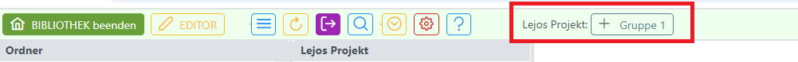
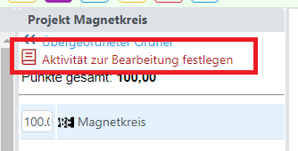
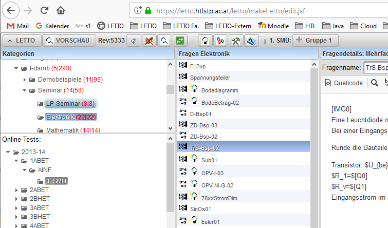
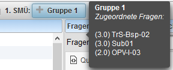
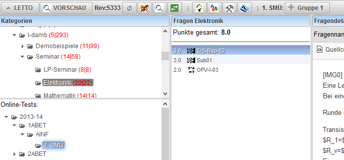

# Beispiele zu Test hinzufügen
###  Voraussetzungen 
* Um zu einem Test weitere Beispiele hinzufügen zu können muss sich der Test im Zustand "Testbearbeitung" befinden. Dies erkennt man an dem Button "Gruppe 1" in der Symbolleiste im Modus "Beispiele Editieren" oder "Beispielsammlung":
 
* In den Modus "Testbearbeitung" kann man durch [Test anlegen](../Testanlegen/index.md) oder [Testbearbeitung fortsetzen](../Testbearbeitungfortsetzen/index.md) gelangen
* Neu: Ein Test kann auch nach Auswahl eines Tests durch den Link "Aktivität zur Bearbeitung festlegen" aktiviert werden: 
* Weiters können Fragen auch über Copy und Paste (Ctrl-C, CTRL-V) in einen Test eingefügt werden.

###  Beispiele hinzufügen 
* Auswahl des gewünschten Beispiels aus Kategrie und Frageliste (auch mehrere Beispiele können seletiert werden)
 
* Durch einen **Klick auf den Button "Gruppe 1"** werden die selektierten Fragen zum Test hinzugefügt
 
* Zieht man mit dem Mauscursor über den Butten "Gruppe 1", so werden die Beispiele angezeigt, die der Test bereits enthält
 
* Klickt man in den Bereich "Online-Tests:" und wählt den Test aus, so werden alle Beispiele des Tests in der Frageliste angezeigt
 

