# Konfigurations-Dialog

## User-Abos, Festlegung von angezeigten Themen und Benutzern
Der Dialog zur Definition der angezeigten Kategorien kann in der 
[Beispielsammlung](../../Beispielsammlung/index.md) über den
[Toolbar](../Toolbar/index.md) mit dem Konfigurations-Button

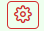

geöffnet werden.
Auf dem ersten Reiter des Konfigurations-Dialoges befinden sich die Einstellungen
für die Auswahl der angezeigten Ordner.
 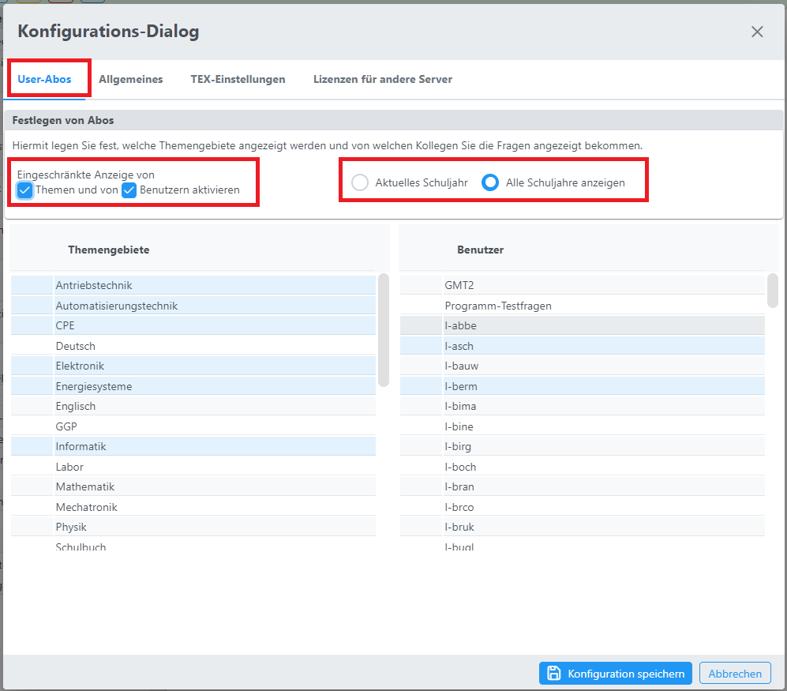

Sie können festlegen, wie die Informationen in der [Ordner-Struktur](../Ordnerverwaltung/index.md) der Beispielsammlung angezeigt werden.
Sie können definieren, welche Hauptkategorien angezeigt werden sollen,  
welche Daten von anderen Benutzern dargestellt werden und 
ob Sie nur das aktuelle Schuljahr im Bereich der Online-Aktivitäten angezeigt bekommen 
oder alle Schuljahre, die in der Datenbank verfügbar sind.

Zur Aktivierung der eingeschränkten Darstellung wählen Sie bitte:
 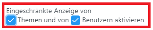 
Nur wenn eine dieser Checkboxen gewählt wurde, erfolgt eine Einschränkung 
in der Darstellung der Ordner

Zur Unterscheidung, ob alle Schuljahr oder nur das aktuelle eingeblendet werden, wählen Sie bitte:
  

In der Liste der Themengebiete und der User können Sie durch entsprechende Auswahl die nicht gewünschten Themengebiete / Benutzer ein- oder ausblenden lassen.

Bestätigung der Abo-Definitionen durch Klicken des Buttons
 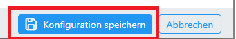 

## Allgemeines
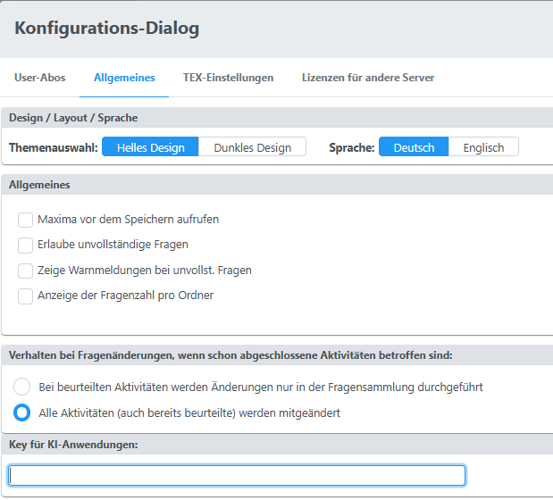
### Design / Layout / Sprache
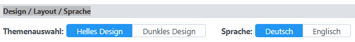
* Themenauswahl: Dunkles und helles Layout sind möglich
* Sprachauswahl: Im Moment sind Deutsch und Englisch für die Fragesammlung verfügbar

### Allgemeines
Konfigurationen für das Verhalten beim Speichern der Frage bzw. zur Anzeoge der Fragezahl/Ordner. 
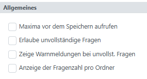
* ***Maxima vor Speichern aufrufen***: Veraltet, passiert im Moment schon automatisch
* ***Erlaube unvollständige Fragen***: Speichern einer Frage ist nur möglich, wenn die Frage korrekt und vollständig ist. Das Wechseln zwischen Fragenist im Fehlerfall nicht erlaubt!
* ***Zeige Warnmeldungen bei unvollst. Fragen***: Bei unvollständigen Fragen kommt beim Speichern eine Warn-Meldung.
* ***Anzeige der Fragenzahl pro Ordner***: Ein/Ausschalten der Anzahl der Fragen pro Ordner.
 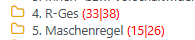 Die erste Zahl gibt die Anzahl an Fragen im angezeigten Ordner an, die zweite Zahl die Gesamt-Anzahl an Fragen in allen Unterordnern.

### Verhalten bei Fragenänderungen, wenn schon abgeschlossene Aktivitäten betroffen sind:

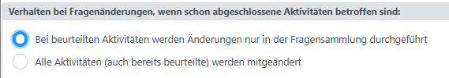 
Das Speichern von Fragen, die auch in bereits beantworteten Aktivitäten verwendet werden, 
führt zu einer ***Änderung*** auch von ***bereits abgegebenen und beurteilten Aktivitäten***.
Da dies auch rechtlich bedenklich ist, ist die Default-Einstellung ***Bei beurteilten Aktivitäten werden Änderungen nur in der Fragensammlung durchgeführt***!

#### Bei beurteilten Aktivitäten werden Änderungen nur in der Fragensammlung durchgeführt:
Dies bedeutet, dass bei einer Änderung einer Frage in allen bereits begonnenen Aktivitäten 
diese Änderung nicht übernommen wird und diese Frage in diesen Aktivitäten von der Fragesammlung getrennt wird.
 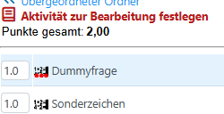 
Die drei roten Punkte unterhalb des Typ-Icons zeigen dies an. Die Frage ist weiterhin änderbar, 
muss aber dafür aus dem aktuellen Test heraus bearbeitet werden. 
(Aktivität in der Liste der Online-Aktivitäten auswählen, zu ändernde Frage auswählen und Änderung durchführen!)

Ist die Frage, die als Testfrage bearbeit wird,  
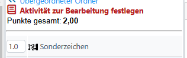 
über die Liste der Testfragen ausgewählt worden und noch nicht von der Fragesammlung getrennt, 
dann wird bei einer Änderung dieser Testfrage die Änderung auch in die Fragesammlung übernommen.

Achtung: Wird diese Frage auch noch in anderen Aktivitäten verwendet, dann werden in diesen Aktivitäten 
eine Kopie der Frage angelegt und damit diese Kopie von der Fragesammlung getrennt. 

#### Alle Aktivitäten (auch bereits beurteilte) werden mitgeändert
***ACHTUNG: Gefahr von unkontrollierten Änderungen in bestehenden Aktivitäten!***
Wenn diese Checkbox ausgewäht wird, dann wird die Frage ohne Kontrollen gespeichert und
alle Aktivitäten, die diese Frage verwenden, werden automatisch nachgezogen.

Proble, die dabei entstehen können:
* Es werden damit auch eventull Aktivitäten von Kollegen, die diese Frage verwendet haben,
mitgeändert.
* Wenn die Mathematik stark geändert wurde, dann ist das Beispiel in vielen Aktivitäten 
nicht mehr nachrechenbar
* Bei der Änderung der Angabe passt die Lösung von Schülern nicht mehr zu der Angabe
* ...
Deswegen bitte nur in Ausnahmefällen behandeln.

#### Zusammenfassung
* Wenn Sie mit der Default-Einstellung Fragen in der Fragesammlung bearbeiten, dann werden diese 
in Tests, die bereits begonnen wurden, nicht aktualisiert! 
* Wenn Sie eine Änderung einer Frage in einer laufenden (bereits gestarteten) Aktivität 
machen wollen, dann aktivieren Sie die Testfrage (Aktivität auswählen und dann die Frage, 
die Sie bearbeiten wollen) und führen von dort aus die Änderung durch. 
* Damit wird die Testfrage und auch die Frage in der Fragesammlung geändert! 

## TEX-Einstellungen
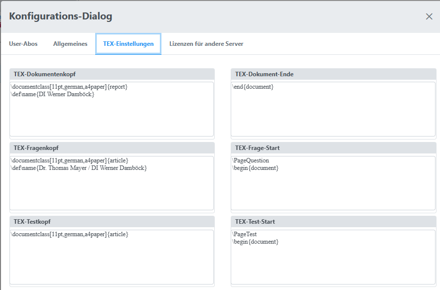 
In diesem Bereich können Sie die Druckparameter für die Erstellung von PDFs festlegen:
### TEX-Dokumentenkopf
Festlegung vor allem für Autor einer Fragesammlung wesentlich.
#### TEX-Dokument-Ende
Optionale TEX-Befehle, die am Ende eines Ausdrucks einer Beisielsammlung eingefügt werden.
#### TEX-Fragenkopf
Festlegung des Autors bei Ausdruck einer Frage.
#### TEX-Frage-Start
#### TEX-Testkopf
#### TEX-Test-Start

### Key für KI-Anwendungen:
In Entwicklung: Lizenzkey für Anbindung an Tools für die Nutzung von künstlicher Intelligenz. 

## Lizenzen für andere Server
Über einen Tokenaustausch kann man sich auch auf andere Server verbinden, um von dort Fragen zu beziehen.
Dieser Bereich dient im Moment nur für die Entwicklung von neuen Zugriffsformen. ...

