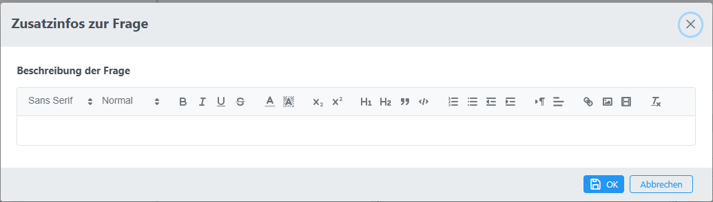

# Zusatzinfos zur Frage

In diesem Dialog können Sie zusätzliche Informationen zu der Frage speichern:

Mögliche Optionen:
* Detailierte Beschreibung der Frage, die nicht für den Schüler gedacht ist
* Dokumente zur Berechnung der Frage
* Beschreibung der Mathematik der Frage
* ...
