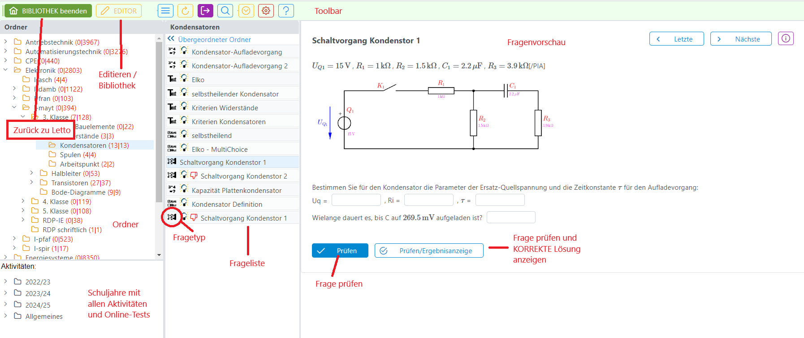
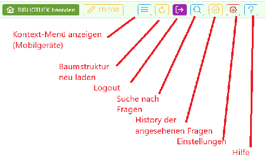

# Beispielsammlung
In der Beispielsammlung kann auf alle Beispiele, die auf dem Server gespeichert sind, zugegriffen werden. Die Organisation der Beispiele erfolgt über eine Ordnerstruktur im [Tree](../Ordnerverwaltung/index.md). In der [Fragenliste](../Fragenliste/index.md) kann eine Frage zur Ansicht ausgewählt werden, daneben sieht man die Vorschau der Frage.

### Editor / Bibliothek
Dieser Teil der Anwendung besteht aus zwei Teilen:
* Der **Bibliothek** zum Ansehen der fertigen Beispiele bzw. zur Auswahl von Beispielen für Online-Aktivitäten. Die ehemalige Feedback-Ansicht entfällt in der neuen Version und wurde durch den Button **Prüfen/Ergebnisanzeige** ersetzt. 
* Dem **Editor** zum Bearbeiten der Beispiele

### Toolbar
In beiden Modis sind im Toolbar die folgenden Buttons sichtbar: 

###  siehe auch 
* [LeTTo](/notimplemented/index.md)
* [LeTTo-Hauptansicht](../LeTTo-Hauptansicht/index.md)
* [Tree](../Ordnerverwaltung/index.md)
* [Liste aller Fragen](../Fragenliste/index.md)
* [Beispielsammlung Editieren](../BeispielsammlungEditieren/index.md)

