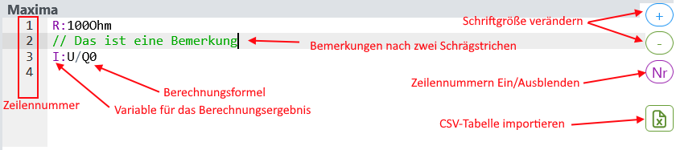

# CSV-Tabellen importieren (Kennlinien importieren)

Kurzanleitung zum Importieren von Kennlinien siehe [Video](https://www.youtube.com/watch?v=ngNw3Uu8Zyk): https://www.youtube.com/watch?v=ngNw3Uu8Zyk

## Maxima-Feld
Im Maxima-Feld des Frageeditors können externe CSV-Dateien (wie bspw. Kennlinien) als Tabellen in LeTTo importiert werden. 
 

## Importvorgang
* Nach dem Klick auf den (CSV-Importieren)-Button    - siehe oben, rechter Bildschirmrand im Maximafenster-  erscheint der Dialog für den Kennlinienimport:
   

### Aufbau einer importierbaren CSV-Datei **mit** Einheitenzeile
<pre>
Spalte1;U;I;B
°C;mV;kA;T
-2;13;-0.2;0.4
0;24;0,4;0.9
</pre>
### Aufbau einer importierbaren CSV-Datei **ohne** Einheitenzeile
<pre>
Zeit;Spannung;Strom
0ms;1V;2.4A
1ms;1.3V;2.6A
</pre>
### Beispiel CSV-Datei einer Magnetisierungskennlinie
[Magnetisierungslinie](/assets/download/Magnetisierungslinie.csv)

### Import einer neuen Kennlinie aus einer CSV-Datei nur in eine Frage
Die importierte Kennlinie steht nach dem erfolgreichem Import in LeTTo bei dieser Importmethode nur innerhalb einer Frage zur Verfügung.
* Button "Kennlinie hochladen"
* hochzuladende CSV-Datei auswählen
* Nun erscheint eine Vorschau des Imports in der die Importparameter verändert werden. Nach erfolgreichem Import werden die Daten auch als Grafik-Plot dargestellt.
   
   
* Button **"Kennlinie NUR in Frage übernehmen"** drücken
* Es muss nun eine Variable definiert werden über die die Kennlinie im Maxima-Feld ansprechbar sein soll:
   
* Nun erscheint die importierte Tabelle im Tabellen-Dialog: 
   
* Ab sofort kann die Kennlinie im Maxima-Feld verwendet werden
   
* Berechnungsfunktionen siehe [Berechnungen](../../Berechnungen/index.md#funktionen-für-importierte-tabellen)

### Import einer neuen Kennlinie und speichern als globale Tabelle
* Wie zuvor die Kennlinie hochladen
* Im Vorschaudialog **"Kennlinie GLOBAL speichern"** auswählen
* Nun muss eine globale Kategorie gewählt werden der die importierte Kennlinie themenmäßig zugeordnet werden kann
   
* Nun erscheint die Frage in der Liste der gewählten Kategorie
   
* Soll die Tabelle auch in der Frage verfügbar sein - siehe nächster Punkt (Import einer bestehenden globalen Tabelle in eine Frage)

### Import einer bestehenden globalen Tabelle in eine Frage
* Auswahl der Kategorie in der die globale Tabelle zu finden ist
* Auswahl der korrekten Tabelle (Kennlinie)
   
* Kennlinie **"Zur Frage"** hinzufügen
* Es muss nun die **Variable** definiert werden über die die Kennlinie im Maxima-Feld ansprechbar ist:
   
* Nun erscheint die importierte Tabelle im Tabellen-Dialog:
   
* Ab sofort kann die Kennlinie im Maxima-Feld verwendet werden
   
* Berechnungsfunktionen siehe [Berechnungen](../../Berechnungen/index.md#funktionen-für-importierte-tabellen)

