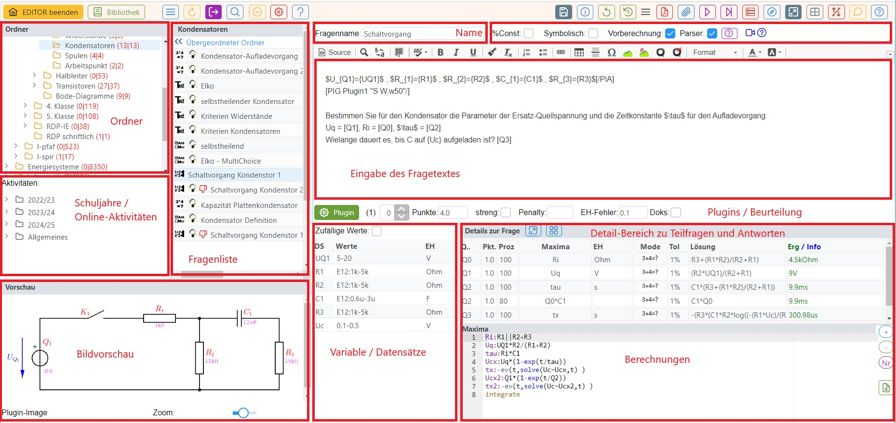
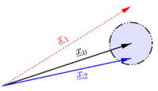

# Editor (Beispielsammlung editieren)
In der Edit-Ansicht können Beispiele verändert, geprüft und neu erstellt werden. 

Zurück zu [LeTTo](/notimplemented/index.md), [Beispielsammlung](../Beispielsammlung/index.md)

## Übersicht
Im Modus **Editor**  (ehemals Beispielsammlung editieren) ist oben eine [Symbolleiste](../Toolbar/index.md) zur Steuerung der Anwendung angeordnet. Nähere Beschreibung der jeweiligen Buttons finden Sie unter [Toolbar](../Toolbar/index.md).

Im Bereich der Ordner (siehe obige Abbildung) finden Sie eine [Ordnerstruktur](../Ordnerverwaltung/index.md) ähnlich einem Dateimanager zur Sortierung und Speicherung der Fragen. Weiters finden Sie in diesem Bereich unten die Definition von [Online-Aktivitäten](../Online-Tests/index.md). 

Die [Fragenliste](../Fragenliste/index.md) enthält alle Fragen eines Ordners sowie Möglichkeiten zum Hinzufügen, Ändern und Klonen ... von Fragen. 

Darunter finden sie die [Bildvorschau](/notimplemented/index.md), die immer das zuletzt im [Editor](../EditorfürdenAngabetext/index.md) angewählte Bild (Image, IMG) anzeigt.

Der rechte Bereich des Editiermodus enthält alle Infos zur aktuell ausgewählten und gerade bearbeiteten Frage. Der obere Teil der Eingabemaske für Fragen ist für alle [Fragetypen](../Fragetypen/index.md) gleich.

## Name der Frage
  
Der Fragename bezeichnet die Frage und sollte Information über den Frageninhalt bringen. Alle Fragen einer [Kategorie oder Ordners](../Ordnerverwaltung/index.md) werden mit ihrem Fragennamen in der [Fragenliste](../Fragenliste/index.md) angezeigt. Der Name sollte sprechend aber nicht zu lange sein, damit die Übersicht in der Fragenliste erhalten bleibt.

Oberhalb des Fragennamens finden Sie noch den Fragetyp, den diese Frage hat.

## Dokumente zu dieser Frage hochladen
 
Ist die Checkbox **Doks:** ausgewählt, dann kann der Schüler bei der Beantwortung der Fragen auch Dokumente zur Testfrage auf den Server hochladen. 

Die folgende Abbildung zeigt die Buttons zum Testen der Lösung und den zusätzlichen Button 
**Datei zur Frage hochladen**, der dann eingeblendet wird, 
wenn bei der Fragedefinition die Option **Doks:** ausgewählt wurde.
  
Solange der Testversuch aktiv ist, können die Dokumnete vom Schüler wieder über den 
**X**-Button gelöscht werden oder weitere Dokumente zu dieser Testfrage hochgeladen werden.

Nach Beendigung des Testversuchs können die Dokumente nicht mehr geändert, sondern nur mehr heruntergeladen und angesehen werden.

## Eingabe des Fragetextes
Siehe [Editor für den Angabetext](../EditorfürdenAngabetext/index.md).

## Plugins
Im Bereich Plugins finden Sie einen Button **Plugins** zur Definition der Plugins der Frage. 
Dadurch wird der [Dialog zur Plugindefinition](../DefinitionvonPlugins/index.md) geöffnet.

Die Plugindefinition bildet immer einen Text-String. Dieser wird nach dem Schliessen des Dialogs 
im nebenstehenden Feld angezeigt und kann theoretisch auch verändert werden. 
Diese Option sollten aber nur erfahrene Benutzer verwenden, die sich mit der Syntax der 
Plugin-Definition auskennen.

<!--
[//]: # (Der Scroller ![40px-ClipCapIt-180831-204926.PNG]&#40;40px-ClipCapIt-180831-204926.PNG&#41; neben dem Eingabefeld dient zum Durchlaufen von allen definierten [Datensätzen]&#40;../Datensätze/index.md&#41; und zeigt die Änderungen der Grafiken an, wenn der Cursor auf einem [Plugin-Grafik-Tag#spezielle-tags-im-fragentext-]&#40;../EditorfürdenAngabetext#spezielle-tags-im-fragentext-/index.md#spezielle-tags-im-fragentext-&#41; [PIG...]&#40;PIG...&#41; im [Editor für den Angabetext]&#40;../EditorfürdenAngabetext/index.md&#41; steht.)
-->

## Beurteilungsbereich
#### Punkte ####
Punkte, die bei richtiger Beantwortung der Frage für die gesamte Frage maximal vergeben werden können. 
Bei Mehrfachberechnungsfragen ist dieses Feld gesperrt und die Punkteanzahl wird automatisch als 
Gesamtpunktezahl aus allen Teilfragen berechnet.

#### Penalty ####
Abzug, der bei einer falschen Beantwortung im [Rechenübungs- oder Hausübungmodus](../Online-Tests/index.md#testart) pro Versuch 
abgezogen wird.

#### EinheitenFehler ####
Im Feld "EH-Fehler" wird ein Faktor angeben, der von den Punkten der richtigen Lösung abgezogen wird, 
wenn die Einheit falsch angegeben wurde.

Der Wert von EH-Fehler muss zwischen 0 und 1 liegen!

Erreichte Punkte = Maximalpunkte * (1 - EHFehler)

z.B: 
Das Beispiel hat 4 Punkte, der EH-Faktor ist 0.1.
Gibt nun der Schüler statt 0.2A den Wert 0.2V an, so erhält er 4*(1-0.1) = 3.6 Punkte.
Gibt der Schüler einen falschen Einheitenvorsatz wie 0.2mA an, so erhält er keine Punkte, da der Wert falsch ist!

Siehe auch [Einheiten](../Einheit/index.md), [Einheiteneinstellungen](../Online-Tests/index.md#einheiteneinstellungen)!

#### Checkbox Parser ####
Ist diese Checkbox ausgewählt, dann wird beim Berechnen der symbolischen Lösung für das Ergebnis der Frage und 
allen Teilfragen nicht [Maxima](../Berechnungen#berechnung-mit-maxima-/index.md#berechnung-mit-maxima-), sondern der [Interne Parser](../Berechnungen#berechnung-mit-dem-internen-parser-/index.md#berechnung-mit-dem-internen-parser-) verwendet.

Siehe auch [Berechnungen](../Berechnungen/index.md)!

#### Checkbox Symbolisch ####
Ist diese Checkbox ausgewählt, dann werden beim Berechnen der Lösung mathematische Konstanten nur dann eingesetzt, wenn sie mit einer Gleitkommazahl verrechnet werden. Weiters werden Berechnungen mit Ganzzahlen nur dann als Gleitkommazahl ausgerechnet, wenn sie mit einer Gleitkommazahl verrechnet werden. 
Auch mathematische Funktionen werden dann nicht ausgewertet und bleiben als Formel bestehen,
wenn eine Ganzzahl als Parameter vorkommt und das Ergebnis keine Ganzzahl ist.

Beispiel:
* sqrt(13) bleibt als Funktion sqrt(13) bestehen
* sqrt(16) wird zu 4 ausgewertet.

## Variable / Datensätze
Siehe [Variable / Datensätze definieren](../Datensätzedefinieren/index.md#erstellung---änderung-über-den-datensatz-bereich)

<!--
[//]: # (## Kompetenzen zuordnen)
[//]: # (Mit dem Button ![20px-ClipCapIt-180901-220702.PNG]&#40;20px-ClipCapIt-180901-220702.PNG&#41; aus dem [Toolbar]&#40;../Toolbar/index.md&#41; kann man zwischen der Datensatz- und der Kompetenz-Ansicht umschalten.)
[//]: # (Siehe auch [Kompetenzzuordnung]&#40;/notimplemented/index.md&#41;.)
-->

## Maxima-Feld

Das Maximafeld wird für die Berechnung der Ergebnisformel verwendet. Für die Berechnung des Maxima-Feldes wird der Inhalt des Feldes mit einem Präprozessor vorbearbeitet und dann an Maxima gesendet, oder der Inhalt wird direkt mit dem internen Parser von Letto verarbeitet. Da einige Funktionen des internen Parsers von Maxima nicht unterstützt werden und umgekehrt der interne Parser nicht den vollen Funktionsumfang von Maxima unterstützt, ist je nach Aufgabenstellung die eine oder andere Variante zu verwenden.

Siehe auch [Berechnungen](../Berechnungen/index.md)!

#### Aufbau des Maximafeldes

#### CSV-Tabelle importieren
Hier können bestehende Tabellen welche zuvor gespeichert wurden und externe Tabellen
aus [CSV-Dateien importiert](csv-tabellen_importieren/index.md) werden. Die Tabellen können dann über eine zu 
konfigurierende Variable im Maxima-Feld verwendet werden.

#### Maxima Berechnung
Siehe [Maxima-Berechnungen](../Berechnungen/index.md)

* Zahlenwerte mit Einheiten werden, bevor das Feld an Maxima geschickt wird, durch interne Variablen ersetzt, die bei der Berechnung des Ergebnisses dann wieder mit Einheiten eingesetzt werden. Die Maxima-Berechnung erfolgt dadurch wie in Maxima üblich ohne Einheiten.
* graphische Elemente von Maxima wie plot etc. können nicht verwendet werden
* Jeder Durchlauf des Maximafeldes beginnt mit einer neuen leeren Maxima-Umgebung in der die Datei letto.mac geladen wird. Die Datei moodle.mac kann in der globalen Einstellungen des Servers für alle Benutzer gemeinsam vom Administrator konfiguriert werden. Unter anderem wird hier der Operator || definiert, der für die Parallelschaltung von Widerständen und Impedanzen verwendet werden kann.
* Es können auch alle Funktionen des internen Parsers, die Maxima nicht kennt verwendet werden. Jedoch kann Maxima diese Funktionen weder vereinfachen noch berechnen, dies muss dann Online beim Berechnen des Lösungsfeldes durch Letto direkt erfolgen. Dementsprechend kann auch der Befehl **solve** von Maxima keine Funktionen auflösen, die nur vom internen Parser untersützt werden.

#### Interner Parser von Letto
Siehe [Interner Parser](../Berechnungen/index.md#berechnung-mit-dem-internen-parser)

* unterstützt Einheiten
* unterstützt Dualzahlen und Hexadezimalzahlen
* unterstützt einige Funktionen, die für technische Berechnungen vorteilhaft verwendet werden können. Die Liste der möglichen Funktionen ist in der Hilfe direkt nachzulesen.
* Der interne Parser von Letto wird immer für die Berechnung des Lösungsfeldes einer Berechnungs- oder Mehrfachberechnungsfrage verwendet.

#### Einheiten
Zahlenwerte mit Einheit können auf mehrere Arten im Maximafeld verwendet werden:
* Als Datensatz mit Einheit durch Verwendung des Datensatzbezeichners: Dies ist die einfachste Variante, bei der gleichzeitig auch für jeden Schüler ein anderer Zahlenwert definiert werden kann
* Als Direkteingabe im Maxima-Feld mit Zahlenwert, gefolgt von der Einheit in einfachen Hochkomma ( x:13'A/m' oder y:x*56'VA-1' )
* Wenn die Einheit keine Rechenoperatoren enthält kann die Einheit direkt am Zahlenwert angehängt werden: zB.: U:23V oder I:U/2Ohm

Der Präprozessor, der das Maximafeld vor der Berechnung durchläuft hat folgende Aufgaben:

* Bei Maxima-Berechnungsmodi werden alle Zahlenwerte welche eine Einheit haben durch Variable ersetzt welche bei der späteren Berechnung wieder eingesetzt werden können
* jede Zeile wird automatisch abgeschlossen, man benötigt daher kein ; oder $ am Zeilenende und es sind dadurch keine mehrzeiligen Befehle möglich
* Bezeichner dürfen nur die Zeichen a-zA-Z0-9 enthalten (zB. der Unterstrich ist verboten)
* Bemerkungen werden wie in C oder Java übliche am Zeilenanfang mit einem doppelten Schrägstrich eingefügt

#### Wichtige Funktionen

| Funktion                                                                                                                     | Beschreibung                                  | Beispiel      | Ergebnis |
|------------------------------------------------------------------------------------------------------------------------------|-----------------------------------------------|---------------|----------|
| floor(x)                                                                                                                     | Kommazahl auf die nächste Ganzzahl abrunden   |               |          |
| round(x)                                                                                                                     | Kommazahl auf Ganzzahl runden                 |               |          |
| pi()                                                                                                                         | die Zahl Pi                                   |               |          |
| exp(1)                                                                                                                       | die eulersche Zahl e                          |               |          |
| exp(x)                                                                                                                       | Exponentialfunktion e hoch x                  |               |          |
| abs(x)                                                                                                                       | Absolutbetrag                                 | abs(-2)       | 2        |
| acos(x), acosh(x), asin(x),   asinh(x), atan2(y,x), atan(x),   atanh(x), cos(x), cosh(x),   sin(x), sinh(x), tan(x), tanh(x) | Winkelfunktionen                              |               |          |
| deg2rad(x)                                                                                                                   | Grad in Radianten umwandeln                   |               |          |
| rad2deg(x)                                                                                                                   | Radianten in Grad umwandeln                   |               |          |
| max(x,y,z)                                                                                                                   | Liefert das Maximum der angegebenen Parameter | max(2,5,3)    | 5        |
| min(x,y,z)                                                                                                                   | Liefert das Minimum der angegebenen Parameter | min(3,2,6,34) | 2        |
| log10(x)                                                                                                                     | 10er Logarithmus                              | log10(100)    | 2        |
| log(x)                                                                                                                       | natürlicher Logarithmus                       |               |          |
| pow(x,y)                                                                                                                     | berechnet die Potenz x hoch y                 | pow(2,3)      | 8        |

#### Tipps für Maxima-Newcomer

| Befehl                                                                       | Beschreibung                                                                                                                                                             |                                                                                                                                                                          
|------------------------------------------------------------------------------|--------------------------------------------------------------------------------------------------------------------------------------------------------------------------|
| a:5                                                                          | Der Variablen a den Wert5 zuweisen                                                                                                                                       |
| g1:x+y=5  g2:x-y=3  L:solve([g1,g2](g1,g2),[x,y](x,y))  x:ev(x,L)  y:ev(y,L) | Gleichungssystem lösen mit den Gleichungen g1 und g2  solve löst das Gleichungssystem und liefert den Ergebnisvektor L  ev berechnet aus dem Lösungsvektor die Variablen |
| c:4+5*%i                                                                     | komplexe Zahl                                                                                                                                                            |
| e:ratsimp(c*(2+3*%i))                                                        | komplexes Ergebnis auswerten                                                                                                                                             |

## Eingabemasken für die unterschiedlichen [Fragetypen](../Fragetypen/index.md)

### Mehrfachberechnungsfrage

* Fragen dieses Typs sind sehr flexibel.
* Die Frage kann mehrere Teilantworten beinhalten. Jede Teilfrage wird im Fragetext durch einen [Qx](Qx)-Tag (x..Fragenummer) positioniert. Bei der Schülereingabe wird der Tag durch ein Eingabefeld für die Ergebniseingabe ersetzt.
* Die Angabewerte sind wie bei Berechnungsfragen mittels [Datensätzen](../Datensätze/index.md) definierbar und variieren von Schüler zu Schüler.
* Alle verwendeten [Variablen](../Datensätze/index.md) müssen im Angabtext in geschwungene Klammern gesetzt werden. Im [Maximafeld](../Berechnungen/index.md) und im Lösungsfeld ist die Klammer nicht notwendig.
* Für jede Variable wird ein Dataset mit möglichen Werten angelegt. Diese Datasets können über einen [Formatierungsstring](../Datensätzedefinieren/index.md#definition-der-werte) definiert werden und danach auch direkt in einer Liste bearbeitet werden.

  

**Übersicht über alle Spalten der Detail-Ansicht:**
##### Q....
Spalte mit der Kurzbezeichnung für die Teilfrage. Unter diesem Namen wird im Editor für die Angabe die Teilfrage mit [Qx](Qx) referenziert. An dieser Position steht dann bei der Testausführung das Eingabeelement für diese Teilfrage.

##### Prozent für die Antwort einer Teilfrage

Wenn der Schüler die Antwort gibt, die in der Zeile dieser Teilantwort steht, bekommt er den prozentuellen Anteil der Gesamtpunkt der Teilfrage.

Je nach Antwort-Modus muss sichergestellt sein, dass der Schüler durch die richtige Eingabe der Antwort 100 Prozent erreichen kann.

##### Punkte einer Teilfrage
Punkteanzahl für die richtige Beantwortung einer Teilfrage.

Die Gesamtpunktanzahl einer Mehrfachberechnungsfrage ergibt sich immer aus der Summe der Punkte der Teilfragen.

##### Maximafeld für die Antwort einer Teilfrage
Siehe auch [Berechnungen](../Berechnungen/index.md)!

Dieses Feld wird nach dem Durchlaufen des globalen Maxima-Feldes der Frage mit Maxima aufgerufen und liefert als Lösung den Ausdruck, der im Lösungsfeld eingesetzt wird.

Es wird nur im Antwort-MODE "calculated","boolsch","text","plugin","regexp" und "freitext" berechnet.

* Beginnt das Feld mit einem **Doppelpunkt**, so wird die Berechnung mit dem internen Parser durchgeführt. Steht nach dem Doppelpunkt nur eine Variable, so wird nur der Inhalt ohne Berechnung verwendet, andernfalls wird eingesetzt und berechnet.
* Beginnt das Feld mit **zwei Doppelpunkten**, so wird die Berechnung vom Parser ohne jegliche Optimierung durchgeführt.

##### Ziel-Einheit der Antwort einer Teilfrage:
Siehe unter [ZielEinheit](../ZielEinheit/index.md)!

##### Antwortmode
Art der Antwort:

* Single-Choice: Es gibt mehrere Lösungen, die dem Schüler vorgeschlagen werden. Der Schüler muss nun von diesen Lösungen genau eine Antwort auswählen. Die Lösungen stehen als String im Lösungsfeld. Es sind bei Single-Choice-Fragen keine TEX-Formeln zulässig.
* Text: Die Lösung welche im Lösungsfeld steht ist eine Zeichenkette die vom Schüler genau so eingegeben werden muss
* Regexp: Im Lösungsfeld wird ein regulärer Ausdruck angeben, mit dem überprüft wird, ob die Antwort des Schülers richtig ist.
* Multichoice: Es gibt mehrere Lösungen, die dem Schüler vorgeschlagen werden. Der Schüler muss nun von diesen Lösungen eine oder mehrere Auswählen. Die Lösungen stehen als String in Lösungsfeld.
* Calculated: Im Lösungsfeld steht ein symbolischer Ausdruck, der aus dem Maxima-Feld errechnet wurde. Zur Laufzeit wird daraus mit dem Parser die Lösung berechnet.
* Boolsch: Dieser Fragemode kann nur sinnvoll bei einer Mehrfachberechnungsfrage verwendet werden. In diesem Modus kann man die Schülereingaben anderer Teilfragen nach Eingabe durch den Parser auswerten lassen und damit Punkte vergeben. Es lassen sich somit Folgefehler von Schülern berücksichtigen und bei der Dimensionierung können Angabe-Bedingungen geprüft werden, die über die Lösung einer Teilfrage nicht eindeutig wären. Der Zugriff auf die Schülereingabe einer anderen Teilfrage erfolgt im Lösungsfeld mit der Variablen Q gefolgt von der Teilfragenummer (zB. Q1 für die Teilfrage 1)

##### Toleranz der Antwort einer Teilfrage
Die [Toleranz](./toleranz/index.md), wie genau ein Schüler seine Antwort angeben muss:
* Die Toleranz ist im Normalfall eine **relative Angabe** und wird in **Prozent** angegeben
* Wird bei der Toleranz kein Prozent angegeben, so muss der Wert zwischen 0 und 1 liegen und entspricht dann dem Prozentwert durch 100
* Wird bei der Toleranz vor oder nach dem Wert ohne Prozentzeichen ein **a** angegeben, so wird dieser Wert als **absolute Toleranz** der Größe in SI-Einheiten interpretiert. ( z.B.: 0.1a bei einem eletrischen Strom in Ampere entspricht einer absoluten Toleranz von 0.1A ) Absolute Toleranzen sind vor allem bei Ergebnissen welche Null sind notwendig, da die Berechnung statt 0 meist eine sehr kleine Zahl berechnet, welche dann mit einer relativen Toleranz auch extrem genau eingegeben werden muss und 0 dadurch nicht im Toleranzbereich liegen kann!
* Behandlung von komplexen Zahlen bei relativer Toleranzangabe: Aus dem Betrag der komplexen Lösung wird mittels dem angegeben Prozentwert der Radius eines Toleranzkreises definiert. Der Mittelpunkt dieses Kreises wird von der korrekten Lösung bestimmt. Liegt die Schülereingabe innerhalb dieses Kreises wird diese als korrekt gewertet.
* Behandlung von komplexen Zahlen bei absoluter Toleranzangabe: Die absolute Toleranzangabe definiert den Radius eines Toleranzkreises. Der Mittelpunkt dieses Kreises wird von der korrekten Lösung bestimmt. Liegt die Schülereingabe innerhalb dieses Kreises wird diese als korrekt gewertet - siehe Bsp.: roter Zeiger wird nicht, blauer Zeiger wird als Lösung zugelassen.
 

##### Lösung der Antwort einer Teilfrage
In der Lösungsformel steht die richtige Antwort der Frage, je nach Fragemode hat das Lösungsfeld verschiedene Funktionalität!

| Fragemode                                          | Demovideo                                                                  | Bedeutung des Lösungsfeldes                                                                                              | Inhalt                                     |
|----------------------------------------------------|----------------------------------------------------------------------------|--------------------------------------------------------------------------------------------------------------------------|--------------------------------------------|
| Auswahl aus einer Listbox(Single-Choice)           | [Video](https://youtu.be/xdQCwnmOP1E)                                      | Lösung wie sie am Browser ausgegeben wird                                                                                | Eingabe                                    |
| Kurze Textantwort                                  | [Video](https://youtu.be/Hd44htzvh24)                                      | Lösung wie sie der Schüler eingeben sollte                                                                               | Eingabe                                    |
| Textantwort, Bewertung über regulären Ausdruck     | [ XXX Video]( XXX Video)                                                   | Regulärer Ausdruck (in Java Syntax) welcher für die richtige Lösung treffen muss                                         | Eingabe                                    |
| Multiple-Choice-Frage                              | [Video](https://youtu.be/MZMDNdg0jO0)                                      | Lösung wie sie am Browser ausgegeben wird.                                                                               | Eingabe                                    |
| Berechnung                                         | [Video](https://youtu.be/KUhgZ620kEI)                                      | Berechnungsformel, mit der zur Testzeit die richtige Lösung berechnet wird, die mit der Schülereingaben verglichen wird. | automatische Berechnung aus dem Maximafeld |
| Plugin Beurteilung durch Plugin                    | [https://youtu.be/ZhGxH5TcOCc Video ](https://youtu.be/ZhGxH5TcOCc Video ) | Plugin abhängig                                                                                                          |                                            |
| Freitextfrage großes Eingabefeld                   | [Video](https://youtu.be/XJCerPYhHLk)                                      | Feld bleibt leer                                                                                                         |                                            |
| Zuordnungsfrage                                    | [ XXX Video]( XXX Video)                                                   | Feld bleibt leer                                                                                                         |                                            |
| Abgabe durch Foto oder aus Zwischenablage          | [Video](https://youtu.be/HrsodAm9-eY)                                      | Feld bleibt leer                                                                                                         |                                            |
| Schieber-Eingabe für Befragung                     | [Video](https://youtu.be/oqaiSU11oxA)                                      | minimaler und maximaler Schieberendwert(min:0;max:100)                                                                   |                                            |
| Berechnung für mit Eingabefeldern für jede Antwort |                                                                            |                                                                                                                          |                                            |
| Texteingabe mit Eingabefeldern für jede Antwort    |                                                                            |                                                                                                                          |                                            |

##### Infofeld der Antwort einer Teilfrage
* Bei Berechnungsfragen die Antwort des ersten Datensatzes, das Feld ist dann schreibgeschützt
* Bei Boolschen Fragen kann hier eine Information erfolgen, wie die Frage bewertet wurde.

#### Ansicht umschalten auf Eingabe pro Teilfrage
Mit dem Button ***Ansicht für Definition der Mehrfachberechnungsfrage ...***  können Sie auf eine Ansicht umschalten,
in der Sie jede Teilfrage getrennt bearbeiten können. Diese Ansicht ist vor allem bei Mehrfachberechnungsfragen mit Multiple-Choice 
oder Zuordnungsfragen vorteilhaft.
  

<!--
### Berechnungsfrage

 ;

Die Berechnungsfrage ist ähnlich aufgebaut wie eine Mehrfachberechnungsfrage mit nur einer Berechnung. Diese Frage kann aber mehrere unterschiedliche Lösungen bereitstellen, um zB. typische Berechnungsfehler mit Punkteabzügen zu beurteilen. Es können also zusätzliche Reiter mit mehreren Antwortmöglichkeiten über das Kontextmenü erzeugt bzw. wieder gelöscht werden.
 ;
 ;

* Berechnende Fragen sind wie Mehrfachberechnungsfragen mit nur einer Teilfrage bei dem das Antwortfeld automatisch erscheint.
* Jeder Schüler bekommt eine eigene Angabe
* Für den Druck kann die Frage auch für Projektangaben verwendet werden.
* Berechnungen erfolgen mit Maxima
* Alle verwendeten Variablen müssen im Angabtext in geschwungene Klammern gesetzt werden. Im Maximafeld und im Lösungsfeld ist die Klammer nicht notwendig.
* Für jede Variable wird ein Dataset mit möglichen Werten angelegt. Diese Datasets können über einen Formatierungsstring definiert werden und danach auch direkt in einer Liste bearbeitet werden.

Wenn mehrer Antwortmöglichkeiten definiert wurden, wird links ein zusätzliches Eingabefeld **Antwort Maxima:** angezeigt. Damit können Sie unterschiedliche Ergebnisse der Maxima-Berechnungen den unterschiedlichen Antworten zuordnen.

| Feld              | Beschreibung                                                                                                             |                                                                                                                            
|-------------------|--------------------------------------------------------------------------------------------------------------------------|
| '''Antwort Maxima | [Lösung_der_Antwort_einer_Teilfrage](#lösung-der-antwort-einer-teilfrage) siehe [Berechnungen](../Berechnungen/index.md) |
| **Einheit:**      | [Definition der Einheit oder sonstiges Frageerhalten](../ZielEinheit/index.md)                                           |
| **Prozent:**      | [Prozent_für_die_Antwort_einer_Teilfrage](#prozent-für-die-antwort-einer-teilfrage)                                      |
| **Toleranz:**     | [Toleranz_der_Antwort_einer_Teilfrage](#toleranz-der-antwort-einer-teilfrage)                                            |
| **Mode:**         | [Antwortmode](#antwortmode)                                                                                         |
Die Zeile 'Lösung für 1. Datenstatz' zeigt das Ergebnis an, wenn der Werte des 1. Datensatzes in die Lösungsformel eingesetzt werden. Diese Zeile dient der Kontrolle, ob die Lösung mit Zahlenwerten auch Sinn macht und ob die Einheiten zusammenpassen.
Das Eingabefeld **Lösung** ist schreibgeschützt und kann nur durch die [Maxima-Berechnung](../Berechnungen/index.md#berechnung-mit-maxima) oder
den [internen Parser](../Berechnungen/index.md#berechnung-mit-dem-internen-parser) bestimmt werden.
-->

### Lückentextfrage
Ein Lückentext enthält Lücken innerhalb eines Fragetextes, die durch den Schüler mit dem korrekten Inhalt gefüllt werden sollen.

Folgende Modi sind dabei für die Lücken möglich:
* Texteingabe: Der Schüler muss das fehlende Wort je nach Fragemodus in die Lücke über die Tastatur eingeben oder per Drag&amp;Drop auf die Lücke ziehen
* Multiple-Choice: Der Schüler kann aus mehreren Antwortmöglichkeiten eine oder mehrere richtige Elemente selektieren
* Single-Choice: Der Schüler kann mit einem Drop-Down-Auswahlfeld aus mehreren Antwortmöglichkeiten genau ein richtiges Element selektieren

Da es bei Lückentextfragen um Texte geht, gibt es hier keine Datensätze oder Maxima-Berechnungen.

**Fragemodus:**
 

Der Fragemodus gibt an, wie Texteingabe-Lücken verarbeitet werden

* Normal: Der Schüler muss den Text über die Tastatur in die Lücke eintragen.
* Drag-and-Drop: Der Schüler muss aus einer Liste von möglichen Antworten die richtigen Antworten auf die Lücken ziehen.

**Funktionstasten:**
F8: aktuelles Wort, bei dem der Cursor steht, als Textlücke definieren (Vorsicht: Wort nicht markieren!), siche auch  [alle Funktionstasten](../EditorfürdenAngabetext/index.md#schnelleingabe--tastatur-shortcuts)

##### Erstellung der Frage:

Im [Textbereich des Editors](../EditorfürdenAngabetext/index.md) werden die Lücken durch Antwortformulierungen in eckigen Klammern realisiert. Mit **F8** kann das aktuelle Wort, bei dem der Cursor steht, als Textlücke definiert werden.

 

* **Texteingabe:**
  * Im Fragemodus "Normal" muss der Schüler den Text in der Lücke eingeben
  * Im Fragemodus "Drag and Drop" muss der Schüler aus einer Liste von Antworttexten den richtigen Text über die Lücke ziehen. Hierbei wird die Liste der Antworttexte aus allen richtigen und falschen Antworten der Texteingabe-Felder zusammengesetzt.
  * Syntax:

| &#91;text&#93;                     | Das Wort "text" als Lücke mit 1 Punkt für die richtige Antwort                                                                |
|------------------------------------|-------------------------------------------------------------------------------------------------------------------------------|
| &#91;2&#124;text&#93;              | Das Wort "text" mit 2 Punkten für die richtige Antwort                                                                        |
| &#91;2&#124;text,50:alt,0:nix&#93; | 2 Punkte für die richtige Antwort "text", 50%von zwei Punkten für "alt", "nix" als falsche Antwort für "Drag and Drop"-Fragen |

* **Multiple-Choice:**
  *      unabhängig vom Fragemodus
  *      mindestens eine Antwort muss richtig sein
  *      Syntax:

| &#91;M&#124;x:richtig,falsch1,falsch2&#93; | Die richtigen Antwortfelder sind mit x: markiert |
|----------------------------------|--------------------------------------------------|
| &#91;M&#124;x:rot,x:grün,blau,gelb&#93;    | rot und grün sind richtig                        |

* **Single-Choice:**
  *      unabhängig vom Fragemodus
  *      der Schüler muss eine Antwort aus mehreren wählen
  *      Syntax:

| &#91;S&#124;x:richtig,falsch,falsch&#93;   | x kennzeichnet eine richtige Antwort                                           |
|----------------------------------|--------------------------------------------------------------------------------|
| &#91;S&#124;x:rot,x:grün,50:blau,gelb&#93; | bei rot und grün alle Punkte, bei blau 50 Prozent der Punkt, bei gelb 0 Punkte |

* **Sonderzeichen** innerhalb einer Lücke 

| Bezeichnung        | Zeichen | Ersatzzeichen |
|--------------------|---------|---------------|
| Komma(Beistrich)   | ,       | ,,            |
| Komma(Beistrich)   | ,       | &#92;,           |
| eckige Klammer auf | &#91;      | &#92;&#91;         |
| eckige Klammer zu  | &#93;      | &#92;&#93;          |

* **Sonderzeichen** im Fragetext, welche nicht in einer Lücke sind:

| Bezeichnung        | Zeichen | Ersatzzeichen |
|--------------------|---------|---------------|
| eckige Klammer auf | &#91;      | &#92;&#91;          |
| eckige Klammer zu  | &#93;      | &#92;&#93;          |

##### Schülereingabe der Frage:
Die oben in der Abbildung definierte Lückentextfrage führt zu der links abgebildeten Aufgabenstellung während eines [Online-Tests](../Online-Tests/index.md).
 

### Multiple-Choice-Frage
Der Schüler kann eine oder mehrere vorgegebene Antworten als richtig ankreuzen.

Die Definition der Antworten erfolgt über folgende Eingabemaske:
  
Die korrekten Antworten werden über die Checkboxen ausgewählt. Auch Formeln im TEX-Format sind möglich. 
Das Einfügen von Bildern über `[IMGx]`-Tags sowie Plugins über `[PI...]`-Tags wird ebenfalls unterstützt.

#### Sortierung
 
Wenn die Auswahl ****Mischen**** ausgewählt wurde, dann werden die Antworten bei jedem Schüler in einer anderen Reihenfolge angezeigt.
Vorraussetzung dafür ist, dass bei den Testeinstellungen ****Antworten mischen**** ausgewählt wurde.

<!--
[//]: # (* Es gibt zwei mögliche Eingabeansichten)

[//]: # (  *        automatische Prozentvergabe: Alle richtigen Antworten bekommen einen Haken. Der Computer teilt dann die Prozentwerte gleichmäßig auf alle richtigen Antworten auf.)

[//]: # (  *        explizite Definition der Prozentwerte: Neben jeder Antwort kann ein Prozentwert angegeben werden, welcher zugewiesen wird wenn die Antwort angekreuzt ist. Die Summe der Prozentwerte aller richtigen Antworten muss dabei 100 ergeben!)

[//]: # ()
[//]: # (##### Beispiele für eine Multiple-Choice-Frage in unterschiedlichen Ansichten)

[//]: # (**CheckboxFeedback: **)

[//]: # (Eingabe der Antworten der Multiple-Choice-Frage durch Checkboxen: Die richtigen Antworten bekommen links davon in der Checkbox ein Häckchen. Neben den Antworten können Sie ein Feedback angeben, warum Antworten falsch oder richtig sind.)

[//]: # ( ![400px-ClipCapIt-180901-214517.PNG]&#40;400px-ClipCapIt-180901-214517.PNG&#41;)

[//]: # ()
[//]: # (**Checkbox: **)

[//]: # (Eingabe der Antworten der Multiple-Choice-Frage durch Checkboxen: Die richtigen Antworten bekommen ein Häckchen. Feedback-Eingaben sind nicht möglich.)

[//]: # ( ![400px-ClipCapIt-180901-214538.PNG]&#40;400px-ClipCapIt-180901-214538.PNG&#41;)
-->

#### Beurteilung: 
Es sind 4 Beurteilungsmöglichkeiten implementiert.
  

| Normal      | Werden die korrekten Antworten teilweise markiert, gibt es Teilpunkte auf die Frage. Schüler kann mit richtigen Antworten Punkte sammeln. Eine falsche selektierte Antwort führt zu Null Prozent auf die ganze Frage. |
|-------------|-----------------------------------------------------------------------------------------------------------------------------------------------------------------------------------------------------------------------|
| Streng      | Das Lösungsmuster muss **exakt** getroffen werden. Wird eine korrekte Antwort nicht selektiert bzw. eine falsche Antwort selektiert führt das zu Null Prozent auf die ganze Frage.                                    |
| mild        | Treffer werdern gegen Nieten gegengerechnet. Alle korrekten Antworten führen zur Summation der Teilpunkte und alle nicht korrekten Antworten zur Punktereduktion.                                                     |
| HundertProz | Unabhängig von der Antwort gibt es immer 100 Prozent - TIPP: Kann interessant sein, wenn man SchülerInnenmeinungen abfragen möchte. BSP: War die Frage schwer?                                                        |

Das Maxima-Feld kann auch für Multiple-Choice-Fragen für Berechnungen und für die Definition von Formeln verwendet werden. In den Antworten für die Multiple-Choice-Frage können Sie sich über {= ...} auf die Ergebnisse beziehen.

### Zuordnungsfrage

Die Antwort auf jede der Unterfragen muss aus einer Liste von Möglichkeiten ausgewählt werden.
Im Prinzip hat der Schüler 2 Listen mit Antworten und Fragen, die er richtig zuordnen muss.
  
Mit der Auswahlliste für das Anzeigeverhalten (***Sortierung:***) kann gesteuert werden, ob und wie die Zuordnungen bei einem Test gemischt werden.
_Nur links mischen_ bedeutet, dass die Antwortmöglichkeiten auf der linken Seite der Zuordnungsfrage bei jedem Öffnen der Frage anders dargestellt werden.

Folgende Einstellungen sind möglich:

| Nicht mischen      | Die Reihenfolge wird so, wie sie in der Frage definiert ist, gewählt                         |
|--------------------|----------------------------------------------------------------------------------------------|
| Mischen            | Auf der linken und auf der rechten Seite werden die Antwortmöglichkeiten zufällig angeordnet |
| Nur links mischen  | Nur auf der linken Seite werden die Antwortmöglichkeiten zufällig angeordnet                 |
| Nur rechts mischen | Nur auf der rechten Seite werden die Antwortmöglichkeiten zufällig angeordnet                |

Pro Zeile werden die zusammengehörenden Begriffe in die Tabelle eingetragen.
Um Zuordnungsfragen zu erschweren, können auf der rechten Seite auch falsche Begrife angeführt werden, die nicht eine Entsprechung auf der linken Seite haben.

Weiters können auf der linken und rechten Seite auch mehrere gleichnamige Begriffe verwendet werden, um Zuordnungen zu Themengruppen zu ermöglichen.
#### Beurteilung
| Beurteilung |                                                                                                              |
|-------------|--------------------------------------------------------------------------------------------------------------|
| Normal      | Pro richtiger Zuordnung werden Punkte vergeben, bei falschen Antworten werden entsprechende Punkte abgezogen |
| Streng      | Alle Zuordnungen müssen treffen                                                                              |
| Mild        | Nur die richtigen Zuordnungen werden beurteilt                                                               |
| HundertProz | Die ganze Frage (die aus mehreren Teilfragen besteht) muss richtig sein (RDP-Modus)                          |

### Freitextfrage
Der Schüler erhält zur Fragebeantwortung ein Textfeld, in dem die Antwort eingetragen werden kann. Diese Fragen müssen aber manuell korrigiert werden!
Bei der Frageerstellung kann nur das Feedbackfeld ausgefüllt werden. Dieses kann eine mögliche Lösung der Aufgabenstellung enthalten und wird dem Schüler nach der Testausführung (Test wurde bereits beendet) angezeigt.

* Eine Freitextfrage hat keine automatische Korrekturmöglichkeit!
* Verwendung für:
  *        Fragen, die online über die Tastatur beantwortet werden und vom Lehrer über den Letto-Server händisch beurteilt werden.
  *        Fragen, die nur als Angabe für Projekte, Laborübungen usw. dienen.
  *        Fragen, die auf Papier beantwortet werden.
* Das Ergebnis kann im Feedback-Feld angegeben werden
  *        und beim Online-Test dem Schüler als Feedback nach dem Test bekanntgegeben werden.
  *        Bei Beispielsammlungen kann der Schüler das Feedbackfeld nie einsehen!
  *        Bei Hausübungen kann der Schüler das Feedbackfeld erst nach Ablauf der Abgabefrist einsehen!
* Sowohl Feedbackfeld als auch das Fragefeld kann Bilder, Tabellen, externe Dateien und Sourcode-Listings enthalten.

