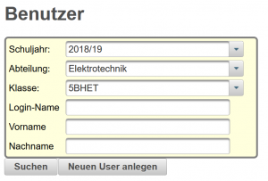
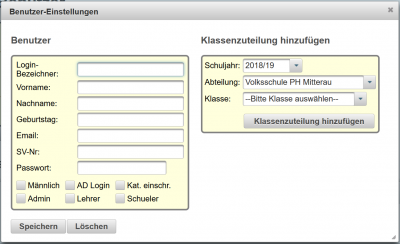
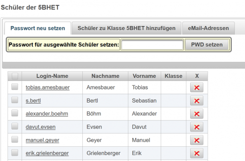
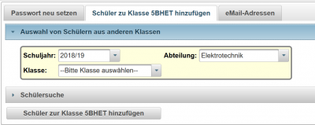
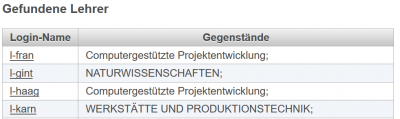

# Benutzer
 
Aufruf der Benutzereinstellungen über [Letto-Hauptansicht#navigation-für-lehrer-](/notimplemented/index.md).
## Neuen Benutzer anlegen
Neue Benutzer können nur von Administratoren angelegt werden. Dazu den Button **Neuen User anlegen** clicken und es wird ein Dialog zum Neuanlegen / Ändern von Benutzerdaten geöffnet.
 
Auf der linken Seite befinden sich alle Eingabefelder, die einen Benutzer beschreiben. Das Feld **Login-Bezeichner** muss ausgefüllt sein, die Felder **Nachname**, **Vorname** werden empfohlen, alle anderen EIngabefleder sind optional. Beachten Sie bitte die geltende Datenschutz-Grundverordnung!

Die Checkboxen im unteren Bereich:
* Männlich: Häckchen setzten, wenn Benutzer männlich und diese Information für das System relevant ist.
* AD Login: Beim Login-Vorgang wird versucht, das Passwort über Active-Directory oder LDAP zu verifizieren
* Kat. einschr.: Kategorien einschränken: Der Benutzer kann bestehende Themen-Abos in der Beispielsammlung nicht mehr verändern. Diese Option kann zB. verwendet werden, um Schülern in der Fragesammlung in ganz bestimmten Bereichen den Zugriff zu geben, aber alle andern Fragen und Themen zu verbergen.

* Global: [Globaler Administrator](../GlobalerAdministrator/index.md) für die System-Administration
* Admin: [Schul-Administrator](../Schul-Administrator/index.md), kann alle Daten für eine Schule verwalten
* Lehrer: Benutzer ist Lehrer dieser Schule und kann die Beispielsammlungen einsehen, Tests verwalten, Noten eingeben,...
* Schüler: Benutzer ist Schüler einer Klasse und kann im Klassenzimmer Test ausführen
* Ext. Benutzer; [Externe Benutzer](../ExterneBenutzer/index.md) können bei entsprechender Serverfreigabe die Beispielsammlungen, die dafür freigegeben wurden, benutzen.

Nach dem **Speichern** wird der Benutzer in der Datenbank gespeichert und kann für Schüler- oder Lehrerzuordnungen verwendet werden.

## Suche nach Benutzern

Sie können Benutzer über Abteilungs- und Klassenauswahl suchen oder über Benutzernamen, Vornamen oder Nachnamen.
Nach dem Click auf **Suchen** bekommen Sie die Ergebnisse in drei Bereichen angezeigt:
### Schüler
Wurde nur nach einzelnen Schülern über den Namen gesucht, dann können Sie jetzt die [Passwörter der Schüler](../Schülerpasswortzurücksetzen/index.md) ändern.

Wenn Sie nach einer Klasse gesucht haben, dann erhalten Sie folgende Auswahlmöglichkeiten:
 
* [Passwort neu setzen](../Schülerpasswortzurücksetzen/index.md)
* Schüler zur Klasse hinzufügen
* eMail-Adressen

#### [Passwörter zurücksetzen](../Schülerpasswortzurücksetzen/index.md)

#### Schüler zur Klasse hinzufügen
Als Lehrer können Sie Schüler dieser Klasse zuweisen oder Schüler aus der Klasse entfernen. Die Schüler, die sie der Klasse zuweisen wollen, müssen allerdings schon im System angelegt sein. Zur Neuanlage eines Schülers wenden Sie sich bitte an den Administrator
 
Zum Suchen nach Schülern haben Sie zwei Möglichkeiten:
* Suche über andere Klassen, in denen der Schüler bisher gemeldet war: Dies erfolgt über den Reiter **Auswahl von Schülern aus anderen Klassen** und Auswahl von Schuljahr, Abteilung und Klasse.
* Suche über Benutzernamen, Vor- und Nachnamen.

Alle gefundenen Schüler werden in der untenstehenden Ergebnisliste angezeigt und können über die Checkboxen zum Hinzufügen zur Klasse ausgewählt werden und über den Button **Schüler zur Klasse ... hinzufügen** dann in die Klasse eingefügt werden.

#### eMail-Adressen
Alle eMail-Adressen der Schüler einer Klasse oder von gefundenen Schülern können als Liste mit dem Strichpunkt als Trennzeichen exportiert werden. Dieses Feature ist vor allem für das Anlegen von Schülern in OneNote-Classroom hilfreich.

### Gefundene Lehrer
 
Unter gefundene Lehrer finden Sie die Lehrerkürzel und die in der ausgewähten Klasse unterrichteten Fächer. Änderung in der Lehrfächerverteilung ist nur für Administratoren möglich.

### Sonstige Benutzer
Für den normal Benutzer nicht relevant.

[Administration](../Administration/index.md)

