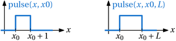

# pulse

[Zurück zu Berechnungen](../../../index.md) · [Weitere Funktionen dieser Gruppe](../index.md)

## Name

`pulse` – erweiterte arithmetische Funktionen.

## Detaillierte Beschreibung

Rechteckfunktion mit Höhe 1, frei wählbarem Startpunkt und frei wählbarer Länge. Außerhalb des Pulsintervalls ist das Ergebnis 0.

### Anwendung und Besonderheiten

Die Implementierung schließt beide Randpunkte ein: Das Ergebnis ist 1 für `x0 <= x <= x0 + L`, sonst 0. Ohne Startwert gilt `x0 = 0`, ohne Länge `L = 1`. Bei negativer Länge wird das Intervall umgekehrt und die Länge positiv gemacht. Beispiel: `pulse(2,2,4) = 1` und `pulse(6,2,4) = 1`.

Die Implementierung erwartet 1 bis 3 Argumente.

## Syntax

```text
pulse(x)
pulse(x, x0)
pulse(x, x0, L)
```

## Parameterbeschreibung

| Parameter | Beschreibung | Möglicher Datentyp | Optional |
| --- | --- | --- | --- |
| x | Auswertungsstelle. | Zahl | nein |
| x0 | Linker Rand des Pulses; Vorgabe 0. | Zahl | ja |
| L | Länge des Pulses; Vorgabe 1. | Zahl | ja |

## Beispiele

**Beispiel:** `pulse(x,2,4)`  
**Ergebnis:** !100px-pulse_x_2_4.png

| Ausdruck | Ergebnis |
| --- | --- |
| pulse(x,2,4) |  |

## Demobeispiele

[DEMO-Beispiel](../../../../../demobsp.html?id=3269)

## Bildschirmhardcopys




## Programmrevision

**Verfügbar seit Revision:** Nicht aus den bereitgestellten Unterlagen ermittelbar.

## Datum der letzten Änderung

**Diese Dokumentationsseite:** 06.10.2026.

Das Datum der letzten Änderung der Implementierung ist aus den bereitgestellten Dateien nicht ermittelbar.

## Grundlage

Parameterreferenz und Übersicht „Berechnungen“; Java-Implementierung `CalculateArithmeticFunctions.java`, Klasse `Pulse`.

[Zurück zu Berechnungen](../../../index.md)
