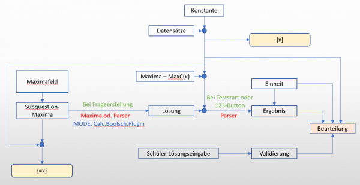
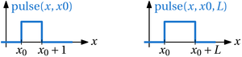
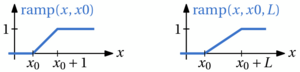
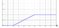
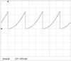
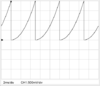
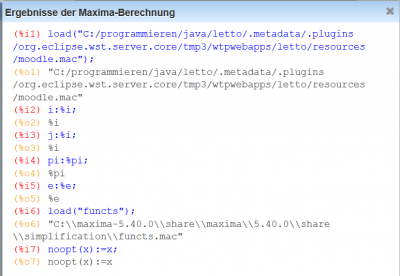

# Berechnungen

<!-- Inhaltsverzeichnis -->

##  Allgemeines 
Berechnungen werden in mehreren Bereichen der Frageerstellung verwendet und bilden die Basis für [Berechnungsfrage](../Fragetypen/index.md#berechnungsfrage-) und [Mehrfachberechnungsfrage](../Fragetypen/index.md#mehfachberechnungsfrage).

Alle Berechnungen unterstützen [Einheiten](../Einheit/index.md) und symbolische Auswertung.

## Grundsätzlicher Aufbau der Ergebnis-Berechnung bei Fragen mit Berechnungen

Die Berechnung und die Beurteilung einer Frage teilt sich in 3 grundsätzliche Schritte:
* Berechnnug der geschlossenen Lösung (Formel) aus den Maxima-Feldern 
* Berechnung des Ergebnisses einer Frage durch Einsetzen der Zahlenwerte aus den Datensätzen in die geschlossene Lösung
* Beurteilung der Schülereingabe durch Vergleich mit dem Ergebnis

## Konstante
Alle Konstante welche in Letto definiert sind beginnen mit einem Prozentzeichen. Verwendet man den Variablennamen ohne Prozenzzeichen, so wird die Konstante wie eine Variable mit dem Wert der Konstanten verwendet.

Liste der definierten Konstanten:

| Name      | Wert                                                       | Beschreibung                                                                                                            |
|-----------|------------------------------------------------------------|-------------------------------------------------------------------------------------------------------------------------|
| %i        | i                                                          | komplexer Parameter als Lösung der Gleichung x^2=-1                                                                     |
| %j        | i                                                          | komplexer Parameter als Lösung der Gleichung x^2=-1 <b>Wichtig:</b> Wir nur vom Parser unterstützt, nicht von Maxima |
| %e        | 2.718281828459045                                          | Eulersche Zahl                                                                                                          |
| %pi       | 3.141592653589793                                          | Kreiszahl                                                                                                               |
| %mu0      | magnetische Feldkonstante                                  | 4*%pi*1E-7'Vs/Am'                                                                                                       |
| %m0       | magnetische Feldkonstante (alt, wird bald entfernt werden) | 4*%pi*1E-7'Vs/Am'                                                                                                       |
| %epsilon0 | elektrische Feldkonstante                                  | 8.85418781762039E-12'As/Vm'                                                                                             |
| %e0       | elektrische Feldkonstante (alt, wird bald entfernt werden) | 8.85418781762039E-12'As/Vm'                                                                                             |
| %c0       | Lichtgeschwindigkeit                                       | 299792458'm/s'                                                                                                          |
| %Qe       | Elementarladung                                            | 1.602176620898E-19As                                                                                                    |
| %g        | Erdbeschleunigung                                          | 9.81'm/s^2'                                                                                                             |
| %NA       | Avogadro Konstante                                         | 6.02214085774E23/mol                                                                                                    |
| %k        | Stefan Bolzman Konstante                                   | 1.3806485279E-23'J/K'                                                                                                   |
| %R0       | Universelle Gaskonstante                                   | 8.314459848'J/Kmol'                                                                                                     |
| %h        | planksches Wirkungsquantum                                 | 6.6260704081E-34Js                                                                                                      |

## Berechnung mit Maxima
* Maxima wird **nur für symbolische Berechnungen** bei der Erstellung von Beispielen verwendet. Hierbei wird, wie schon oberhalb im Schema angegeben, zuerst die Moodle.mac geladen, dann das [Maxima-Feld](../BeispielsammlungEditieren/index.md#maxima-feld) berechnet und anschließend die Maxima-Felder aller Teilfragen. Das Ergebnis der Berechnung wird dann als symbolischer Ausdruck im Lösungfeld eingetragen.
* Da zum Zeitpunkt der **Maxima-Berechnung keine Datensätze** vorhanden sind, kann keine numerische Berechnung in Maxima durchgeführt werden, welche die [Datensätze](../Datensätze/index.md) benötigt. Dies muss der interne Parser zum Zeitpunkt des Online-Test-Laufes erledigen. Numerische Berechnungen, welche der interne Parser nicht kann können deshalb auch nicht mit Maxima berechnet werden.
* Da das Lösungsfeld, welches mit Maxima berechnet wird symbolisch ausgewertet wird, können in Maxima sämtliche symbolischen Berechnungsverfahren angewendet werden, welche ein symbolisches Ergebnis liefern und keine numerischen Werte der Datensätze benötigen.
* Reicht im Maximafeld die Zeilenlänge nicht aus ist es möglich einen defninierten Zeilenumbruch zu realisieren. Schreiben Sie dazu "&#92;" (einfacher Backslash) am Ende der Zeile.  
* **Funktionsdeklarationen** wie **f(x):=**x^2 mit Doppelpunkt-Ist-Gleich sind im Maxima-Feld nur eingeschränkt bis gar **nicht verwendbar**, da sie vom Parser nicht unterstützt werden.
* **Mengen von Maxima** sind in LeTTo n**icht verwendbar**. LeTTo verwender hierzu eigene Funktionen des Parsers welche mit "set" beginnen und auf Vektoren basieren.

###  Berechnungen mit "Vorberechnung" und Maxima (Parser nicht angehakt) 
* Es werden die Datensätze ohne Einheiten vor der Durchrechnung des Maxima-Feldes an Maxima gesendet
* Im Maxima-Feld werden durch den Preprozessor alle Einheiten von allen konstanten Werten entfernt
* Die Ergebnisse nach der Maxima-Durchrechnung sind somit alle ohne Einheit
* Der Postpozesser fügt an alle Ergebnisse der Maxima-Berechnung die definierten Einheiten an

####  Einheitendfinition für den Postprozessor (nur bei Berechnung mit Vorberechnung ohne Parser wirksam!) 
* Definition einer Einheit mit der Funktion unit in einem Kommentar
* Setzen der Einheit Volt (V) für alle Variablen die mit U beginnen  
  <pre>//unit(U*)=V</pre>
* Setzen der Einheit Ampere(A) für alle Variablen die mit I oder ix beginnen
  <pre>//unit(I*,ix*)=A</pre>

## Berechnung mit dem internen Parser 
* Der interne Parser kann durch Wahl der Checkbox "Parser" anstatt von Maxima für die Berechnung des Maxima-Feldes verwendet werden. 
* Jedenfalls wird der Parser zur Test-Laufzeit für die Berechnung des Ergebnisses einer Frage aus Lösung und Datensätzen und zum Berechnen der Schülereingabe verwendet.

### Operatoren
####  VORSICHT mit MAXIMA 
* Einige Operatoren sind in **Maxima anders**, oder **nicht definiert**. Möchte man im Maximafeld die Operatoren des Parsers-verwenden, so muss das gesamte Maxima-Feld **mit dem Parser gerechnet** werden. Man verliert dadurch jedoch die Vorteile der Maxima-Berechnung.
* Alternativ kann man statt der Operatoren auch **Funktionen verwenden** (zB: ne() statt != ). Diese werden dann von Maxima zwar nicht ausgewertet, die Berechnung bleibt aber trotzdem korrekt und kann mit Maxima durchgeführt werden.
* Es gibt einige Funktionen welche in **Maxima existieren** aber im **Parser nicht, oder mit anderem Syntax**.
  * Wenn diese von Maxima nicht ausgewertet werden können, da sie **Datensätze** enthalten welche zum Auswertezeitpunkt von Maxima 
    noch **nicht mit Werten belegt** sind muss **"Vorberechnung"** in der Frage angehakt werden damit die Datensätze schon vor dem 
    Durchlauf von Maxima eingesetzt werden.
  * Manche Funktionen sind syntaktisch nicht funktional aufgebaut und können deshalb nicht vom Parser ausgewertet werden - in diesem 
    Fall darf in der Frage das Hackerl "Parser" nicht angehakt werden oder es muss eine andere Funktion verwendet werden (wie etwa wenn statt if)
* Wenn "Parser" nicht angehakt ist bleiben alle Funktionen welche von Maxima nicht unterstützt werden von Maxima unberechnet und werden dann bei der Lösungsberechnung vom Parser ausgewertet.
* Wenn "Parser" angehakt ist werden nur ausgewählte Funktionen (siehe weiter unten) von Maxima ausgewertet. Alle anderen Funktionen werden vom Parser ausgewertet.

Liste der problematischen Funktionen:

| Funktion in Maxima                 | Funktion im Parser          | Beschreibung  |
|------------------------------------|-----------------------------|---------------|
| if bedingung then wahr else falsch | if(bedingung,wahr,falsch)   | Wenn-Funktion |
|                                    | wenn(bedingung,wahr,falsch) | Wenn-Funktion |

#### Infix Operatoren
##### arithmetische Operatoren

| Operator              | Priorität | Beschreibung                                                                 | Beispiel             | Ergebnis  |
|-----------------------|-----------|------------------------------------------------------------------------------|----------------------|-----------|
| +                     | 40        | Addition                                                                     | 4+5                  | 9         |
| -                     | 40        | Subtraktion                                                                  | 6-2                  | 4         |
| *                     | 50        | Multiplikation                                                               | 4*5                  | 20        |
| /                     | 51        | Division                                                                     | 20/4                 | 5         |
| %                     | 51        | Divisionsrest                                                                | 104%20               | 4         |
| &#124; &#124; | 60        | Parallelschaltung                                                            | x &#124; &#124; y    | x*y/(x+y) |
| ^                     | 90        | Potenz                                                                       | 2^3                  | 8         |
| .*.                   | 200       | Operator der intern für eine fehlende bindende Multiplikation verwendet wird | 4x                   | 4*x       |

##### Bitoperatoren

| Operator | Priorität | Beschreibung                              | Beispiel       | Ergebnis    |
|----------|-----------|-------------------------------------------|----------------|-------------|
| &#124;   | 20        | Bitweise oder logisches ODER              |  9&#124;5   true&#124;false | 13  true |
| or       | 20        | Bitweise oder logisches ODER              | 9 or 5         | 13          |
| &amp;    | 21        | Bitweise oder logisches UND               | 13&amp;10      | 8           |
| and      | 21        | Bitweise oder logisches UND               | 13 and 10      | 8           |
| xor      | 22        | Bitweise oder logisches exklusiv oder XOR | 13 xor 10      | 7           |
| imp      | 23        | Bitweise oder logisches impliziert IMP    | 13 imp 10      | 8           |
| &lt;&lt; | 35        | Bitweise links schieben                   | 5&lt;&lt;2     | 20          |
| &gt;&gt; | 35        | Bitweise rechts schieben                  | 8&gt;&gt;2     | 2           |

##### Vergleichsoperatoren

| Operator | Priorität | Beschreibung         | Beispiel |
|----------|-----------|----------------------|----------|
| =        | 3         | Gleichungsoperator   | x=y      |
| ==       | 30        | Gleichungsoperator   | x==y     |
| !=       | 30        | Ungleichungsoperator | x!=y     |
| &lt;     | 32        | Kleiner              | x&lt;y   |
| &lt;=    | 32        | Kleiner gleich       | x&lt;=y  |
| &gt;     | 32        | größer               | x&gt;y   |
| &gt;=    | 32        | größer gleich        | x&gt;=y  |

##### Organisative Operatoren

| Operator | Priorität | Beschreibung                                                                        | Beispiel | Ergebnis |
|----------|-----------|-------------------------------------------------------------------------------------|----------|----------|
| ,        | 0         | Listen-Trennzeichen                                                                 | x,y      |          |
| $        | 1         | Trennzeichen zwischen mehreren Berechnungen                                         |          |          |
| ;        | 1         | Trennzeichen zwischen mehreren Berechnungen                                         |          |          |
| :        | 2         | Zuweisung an eine Variable auf der linken Seite                                     | x:4/12   | 1/3      |
| ::       | 2         | Zuweisung an eine Variable auf der linken Seite ohne die rechte Seite zu optimieren | x::4/12  | 4/12     |

#### Prefix Operatoren

| Operator | Priorität | Beschreibung                                          | Beispiel  | Ergebnis                                                                |
|----------|-----------|-------------------------------------------------------|-----------|-------------------------------------------------------------------------|
| +        | 45        | positives Vorzeichen                                  | +5        | 5                                                                       |
| -        | 45        | negatives Vorzeichen                                  | -(-5)     | 5                                                                       |
| ~        | 95        | bitweise Inversion einer 64bit-Ganzzahl               | ~0x0F0F   | 0xFFFFFFFFFFFFF0F0                                                      |
| !        | 120       | logisches NOT                                         | !(3&lt;4) | false                                                                   |
| ++       | 130       | Inkrement von Ganzzahlen                              | ++x       | erhöht x um eins und gibt das Ergebnis nach der Erhöhung zurück         |
| --       | 130       | Dekrement von Ganzzahlen                              | --x       | vermindert x um eins und gibt das Ergebnis nach der Verminderung zurück |
| %        | 200       | Prefix für Namen, welche als Konstante definiert sind | %pi       | 3.141592653589793                                                       |

#### Suffix Operatoren

| Operator | Priorität | Beschreibung             | Beispiel | Ergebnis                                                                    |
|----------|-----------|--------------------------|----------|-----------------------------------------------------------------------------|
| ++       | 135       | Inkrement von Ganzzahlen | x++      | erhöht x um eins und gibt den Variablenwert vor der Erhöhung zurück         |
| --       | 135       | Dekrement von Ganzzahlen | x--      | vermindert x um eins und gibt den Variablenwert vor der Verminderung zurück |

### Klammern
* ( ) runde Klammern werden für mathematische Ausdrücke zur Klammerung verwendet
* { } geschwungene Klammer werden im Angabetext für die Namen der Datensätze verwendet
* &#91; &#93; eckige Klammern werden für Vektoren und Matrizen verwendet

### Funktionen
#### Funktionen für Ganzzahlen

| Funktion                                | Beschreibung                                                                                                                                                   | Beispiel                    | Ergebnis             |
|-----------------------------------------|----------------------------------------------------------------------------------------------------------------------------------------------------------------|-----------------------------|----------------------|
| band                                    | bitweises UND                                                                                                                                                  | band(4,12)                  | 4                    |
| bor                                     | bitweises ODER                                                                                                                                                 | bor(4,1)                    | 5                    |
| bxor                                    | bitweises EXKLUSIV ODER                                                                                                                                        | band(4,5)                   | 1                    |
| bimp                                    | bitweises Parameter1 impliziert Parameter2                                                                                                                     | bimp(13,10)                 | 8                    |
| binv                                    | bitweises NICHT mit 8 bit                                                                                                                                      | binv(0x0F)                  | 0xF0                 |
| shl                                     | Schiebe Ganzzahl bitweise nach links                                                                                                                           | shl(8,2)                    | 32                   |
| shr                                     | Schiebe Ganzzahl bitweise nach rechts                                                                                                                          | shr(8,2)                    | 2                    |
| div                                     | Ganzzahldivision, Ergebnis wird abgeschnitten                                                                                                                  | div(5,2)                    | 2                    |
| inv8                                    | bitweise Invertieren und die letzten 8 Bit bestimmen                                                                                                           | inv8(0b1001)                | 0b11110110           |
| inv16                                   | bitweise Invertieren und die letzten 16 Bit bestimmen                                                                                                          | inv16(0xF0)                 | 0xFF0F               |
| inv32                                   | bitweise Invertieren und die letzten 32 Bit bestimmen                                                                                                          | inv32(0xF0)                 | 0bFFFFFF0F           |
| inv64                                   | bitweise Invertieren und die letzten 64 Bit bestimmen                                                                                                          | inv64(0xF0)                 | 0bFFFFFFFFFFFFFF0F   |
| byte                                    | Zahl in eine Ganzzahl wandeln und die letzten 8bit der Zahl Abschneiden, Einheit geht verloren                                                                 | byte(34.2)                  | 34                   |
| word                                    | Zahl in eine Ganzzahl wandeln und die letzten 16bit der Zahl Abschneiden, Einheit geht verloren                                                                | word(34.2)                  | 34                   |
| int                                     | Zahl in eine Ganzzahl wandeln und die letzten 32bit der Zahl Abschneiden, Einheit geht verloren                                                                | int(34.2)                   | 34                   |
| long                                    | Zahl in eine Ganzzahl wandeln , Einheit geht verloren                                                                                                          | long(34.2)                  | 34                   |
| [parity](/notimplemented/index.md)      | Paritätsberechnung : parity(Parität,Codewortlänge,Datenwort[,Datenwort,....](,Datenwort,....))                                                                 | parity(even,7,"xy")         |                      |
| [blockparity](/notimplemented/index.md) | Kreuz oder Blockparität : blockparity(Parität,Codewortlänge,Codewortanzahl,Datenwort[,Datenwort,....](,Datenwort,....))                                        | blockparity(even,7,3,"abc") |                      |
| [bcd](/notimplemented/index.md)         | Wandelt in eine Long-Zahl in ein Feld aus BCD-kodierten Zahlen um                                                                                              | bcd(124)                    | &#91;1,2,4&#93; |
| [code](/notimplemented/index.md)        | Code aus mehreren Codeworten zusammensetzen : code(Codewortlänge,Datenwort[,Datenwort,....](,Datenwort,....))                                                  | code(5,4,3,5)               | 0b1000001100101      |
| [hamming](/notimplemented/index.md)     | Bestimmt den Hamming-Abstand von mehreren Codeworten                                                                                                           | hamming(1,2,4,8,16)         | 2                    |
| [komplement](/notimplemented/index.md)  | Bildet das Zweierkomplement mit einer negativen Zahl mit einer bestimmten Bitanzahl, fehlt die Bitanzahl, so wird ein 32Bit-2er-komplement gebildet            | komplement(-5,8)            | 0b11111011           |
| [bitstream](/notimplemented/index.md)   | Erzeugt aus einer Ganzzahl einen Bitstrom als String mit einer definierten Anzahl von Bit (MSB werden nötigenfalls mit 0 gefüllt) : bitstream(Daten,Bitanzahl) | bitstream(0x184,12)         | "000110000100"       |

#### Funktionen für rationale und Ganzzahlen

| Funktion  | Beschreibung                                                                                                                                                                                                                                                                                                                                                                                            | Beispiel                                                 | Ergebnis                                                  |
|-----------|---------------------------------------------------------------------------------------------------------------------------------------------------------------------------------------------------------------------------------------------------------------------------------------------------------------------------------------------------------------------------------------------------------|----------------------------------------------------------|-----------------------------------------------------------|
| kgV       | berechnet das kleinste gemeinsame Vielfache von mehreren Zahlen                                                                                                                                                                                                                                                                                                                                         | kgV(3,10)                                                | 30                                                        |
| ggT       | berechnet den größten gemeinsamen Teiler von mehreren Zahlen                                                                                                                                                                                                                                                                                                                                            | ggT(12,10)                                               | 2                                                         |
| isprim    | prüft ob die angegebene Zahl eine Primzahl ist                                                                                                                                                                                                                                                                                                                                                          | isprim(13)                                               | true                                                      |
| prims     | zerlegt eine Ganzzahl in ihre Primfaktoren                                                                                                                                                                                                                                                                                                                                                              | prims(12)                                                | &#91;2,2,3&#93;                                           |
| defracmix | zerlegt eine rationale Zahl in einen gemischten Bruch aus ganzzahligem Summanden, Zähler und Nenner als Menge Die erhaltene Menge kann mit dem Format-Modfier **frac** als gemischter Bruch dargestellt werden (siehe [Zahlendarstellung](../Zahlendarstellung/index.md))                                                                                                                            | defracmix(14/12) defracmix(-15/12) defracmix(3/12) | &#91;1,2/12&#93; &#91;-1,3,12&#93; &#91;0,3,12&#93; |
| defrac    | zerlegt eine rationale Zahl in Zähler und Nenner als Menge  Die erhaltene Menge kann mit dem Format-Modfier **frac** als gemischter Bruch dargestellt werden                                                                                                                                                                                                                                         | defrac(14/12)                                            | &#91;13,12&#93;                                           |
| frac      | erzeugt aus einer Menge aus 2 oder 3 Elementen (von defrac) eine rationale Zahl                                                                                                                                                                                                                                                                                                                         | frac(&#91;3,7&#93;) frac(&#91;1,2,3&#93;)            | 3/7   5/3                                              |
| mod       | Mathematische Implementierung von [modulo](https://de.wikipedia.org/wiki/Division_mit_Rest#Modulo): Divisionsrest einer Division mit ganzzahligem Ergebnis                                                                                                                                                                                                                                              | mod(5,2)   mod(6.2,2.5)   mod(-4,3)                | 1 1.2   2                                           |
| mod2      | Symmetrische Implementierung von [modulo](https://de.wikipedia.org/wiki/Division_mit_Rest#Modulo): Divisionsrest einer Division mit ganzzahligem Ergebnis  Der Unterschied zu mod liegt in der Behandlung von negativen Zahlen des ersten Arguments  Siehe auch Divisionsrest des Parser-Operators % [Berechnungen arithmetische-operatoren-](../Berechnungen/index.md#arithmetische-operatoren-) | mod2(5,2)   mod2(6.2,2.5)   mod2(-4,3)             | 1 1.2   -1                                          |

#### Funktionen für Winkel im Gradmaß

| Funktion  | Beschreibung                                                                                                                             | Beispiel                                                           | Ergebnis                          |
|-----------|------------------------------------------------------------------------------------------------------------------------------------------|--------------------------------------------------------------------|-----------------------------------|
| degmix    | zerlegt einen Winkel im Bogenmaß in einen Winkel in Grad, Minuten und Sekunden in einem Vektor                                           | degmix(0.5)                                                        | &#91;28,38,52.4031239082&#93;     |
| deg       | erzeugt aus einem Vektor mit Grad, Minuten und Sekunden als Zahlenwerte oder einen WinkelString einen Winkel im Bogenmaß                 | deg(&#91;2,15,22&#93;)   deg(&quot;2°15&#39;22&#39;&#39;&quot;) | 2.25611111111°                    | 
| degstring | erzeugt aus einem Vektor mit Grad, Minuten und Sekunden als Zahlenwerte oder einen Winkel im Bogenmaß einen String der Winkeldarstellung | degstring(0.5)                                                     | &quot;2°15&#39;22&#39;&#39;&quot; |

#### boolesche(boolsche) Funktionen

| Funktion  | Beschreibung                                                                                                                                                                                                 | Beispiel               | Ergebnis |
|-----------|--------------------------------------------------------------------------------------------------------------------------------------------------------------------------------------------------------------|------------------------|----------|
| eq        | gleich eq(wert1,wert2),eq(wert1,wert2,toleranz),eq(wert1,wert2,toleranz,absolut)                                                                                                                             | eq(4,4)                | true     |
| eqruntime | symbolischer Vergleich, welcher **symbolisch erst bei der Ergebnisberechnung** ausgeführt wird. Muss verwendet werden, wenn bei Vergleichen symbolische Antworten von Schülern (Q0,Q1,...) verwendet werden. | eqruntime(x+3*y,3*y+x) | true     |
| ne        | ungleich ne(wert1,wert2),ne(wert1,wert2,toleranz),ne(wert1,wert2,toleranz,absolut)                                                                                                                           | ne(6,4)                | true     |
| ge        | größer gleich ge(wert1,wert2),ge(wert1,wert2,toleranz),ge(wert1,wert2,toleranz,absolut)                                                                                                                      | ge(6,4)                | true     |
| le        | kleiner gleich le(wert1,wert2),le(wert1,wert2,toleranz),le(wert1,wert2,toleranz,absolut)                                                                                                                     | le(6,4)                | false    |
| gt        | größer                                                                                                                                                                                                       | gt(6,4)                | true     |
| lt        | kleiner                                                                                                                                                                                                      | lt(6,4)                | false    |
| between   | prüft ob Parameter1 kleiner als Parameter2 und Parameter2 kleiner als Parameter 3 . Parameter 4 und 5 können optinal für die Toleranz verwendet werden.                                                      | between(3,4,5)         | true     |
| land      | logisches UND                                                                                                                                                                                                | land(a&lt;b,b&lt;c)    |          |
| lor       | logisches ODER                                                                                                                                                                                               | lor(a&lt;b,b&lt;c)     |          |
| not       | logisches NICHT. Vorsicht ein symbolisches Ergebnis von Maxima liefert not als Prefix-Operator, welcher vom Parser nicht unterstützt wird ( Verwende statt dessen **lnot** )                                 | not(a&lt;b)            |          |
| lnot      | logisches NICHT, wie not jedoch wird es von Maxima nicht ausgewertet                                                                                                                                         | lnot(a&lt;b)           |          |

#### Funktionen zu Einheiten

| Funktion      | Beschreibung                                                                                                                                                                                                                                                                                                     | Beispiel                                                                    | Ergebnis                   |
|---------------|------------------------------------------------------------------------------------------------------------------------------------------------------------------------------------------------------------------------------------------------------------------------------------------------------------------|-----------------------------------------------------------------------------|----------------------------|
| double        | Zahl in eine Gleitkommazahl umwandeln, die Einheit geht dabei verloren [DEMO-Beispiel](../../demobsp.html?id=3176)                                                                                                                                                                                                                                          | double(3.4V)                                                                | 3.4                        |
| numeric       | verwirft die Einheit, wenn eine vorhanden ist und liefert nur den Zahlenwert. Bei einer SI-Einheit wird der Zahlenwert bezogen auf die Basiseinheit geliefert, bei dimensonslosen Größen wird der Zahlenwert bezogen auf die verwendete dimensionslose Einheit gewählt.   numeric(x)*unit(x) liefert wieder x | numeric(2.3mA)   numeric(5%)                                             | 0.0023   5              |
| originnumeric | liefert immer den Zahlenwert einer einheitenbehafteten Größe bezogen auf die vorhandene Einheit. Gibt es keine Originaleinheit da der Wert berechnet wurde wird der Zahlenwert bezogen auf die SI-Grundeinheit genommen.   originnumeric(x)*originunit(x) liefert wieder x                                    | originnumeric(2.3mA)   originnumeric(2.3mA*2Ohm)   originnumeric(15°) | 2.3   0.0046   15    |
| removeunit    | entfernt bei einem Ausdruck alle Einheiten und ersetzt dabei alle einheitenbehafteten Größen durch den Zahlenwert bezogen auf die BasisEinheit des SI-Systems                                                                                                                                                    | removeunit(t*5'm/s'+4cm)                                                    | t*5+0.04                   |
| unit          | gibt die SI-Einheit eines einheitenbehafteten Wertes mit dem Zahlenwert 1 ohne Einheitenvielfache zurück.   numeric(x)*unit(x) liefert wieder x                                                                                                                                                               | unit(3.1kA)   unit(5%)                                                   | 1A   1%                 |
| originunit    | gibt die SI-Einheit eines einheitenbehafteten Wertes mit dem Zahlenwert 1 zurück.   originnumeric(x)*originunit(x) liefert wieder x                                                                                                                                                                           | unit(3.1kA)   unit(5%)                                                   | 1kA   1%                |
| dB            | Wandelt einen Zahlenwert in eine nicht skalierende [Dezibel](../Dezibel/index.md)-Einheit um. Einheitenlos wird in dB20 gewandelt, mit den Einheiten V,mV,uV,W,mW,uW wird in die zugehörige dB-Einheit gewandelt.                                                                                                | dB(100)   dB(100)+1                                                      | 40 dB20   41 |
| fromdB        | Wandelt eine nicht skalierende [Dezibel](../Dezibel/index.md)-Einheit in einen normalen Zahlenwert um                                                                                                                                                                                                            | fromdB(40)                                                                  | 100                        |
| todB          | versieht einen Zahlenwert mit der skalierenden [Dezibel](../Dezibel/index.md)-Einheit dB welche mit 20*log10 berechnet wird                                                                                                                                                               | todB(100)  todB(100)*2                                                   | 40dB   200              |
| dB10          | wandelt eine Zahl in einen [Dezibel](../Dezibel/index.md) Wert dB10 mit 10dB pro Dekade                                                                                                                                                                                                   | dB10(100)                                                                   | 20dB10          |
| fromdB10      | wandelt einen [Dezibel](../Dezibel/index.md) Wert mit 10dB pro Dekade in den Ausgangswert                                                                                                                                                                                                                        | fromdB10(20)                                                                | 100                        |
| dBW           | wandelt eine Leistung in einen [Dezibel](../Dezibel/index.md) Wert dBW mit 10dB pro Dekade                                                                                                                                                                                                | dBW(100)                                                                    | 20dBW           |
| fromdBW       | wandelt einen [Dezibel](../Dezibel/index.md) Wert mit 10dB pro Dekade in eine Leistung                                                                                                                                                                                                                           | fromdBW(20)                                                                 | 100W                       |
| dBm           |                                                                                                                                                                                                                                                                                                                  |                                                                             |                            |
| fromdBm       |                                                                                                                                                                                                                                                                                                                  |                                                                             |                            |
| dBu           |                                                                                                                                                                                                                                                                                                                  |                                                                             |                            |
| fromdBu       |                                                                                                                                                                                                                                                                                                                  |                                                                             |                            |
| dBV           |                                                                                                                                                                                                                                                                                                                  |                                                                             |                            |
| fromdBV       |                                                                                                                                                                                                                                                                                                                  |                                                                             |                            |
| dBmV          |                                                                                                                                                                                                                                                                                                                  |                                                                             |                            |
| fromdBmV      |                                                                                                                                                                                                                                                                                                                  |                                                                             |                            |
| dBuV          |                                                                                                                                                                                                                                                                                                                  |                                                                             |                            |
| fromdBuV      |                                                                                                                                                                                                                                                                                                                  |                                                                             |                            |

#### arithmetische Funktionen

| Funktion | Beschreibung                                                                                                                                                                                                                                                                                                                                                                                                                                                                                                                                                   | Beispiel                                       | Ergebnis             |
|----------|----------------------------------------------------------------------------------------------------------------------------------------------------------------------------------------------------------------------------------------------------------------------------------------------------------------------------------------------------------------------------------------------------------------------------------------------------------------------------------------------------------------------------------------------------------------|------------------------------------------------|----------------------|
| cround   | Rundet die Zahl kaufmännisch, der zweite Parameter gibt die Anzahl der Kommastellen an, ohne 2.Parameter wird auf Ganzzahlen gerundet, bei komplexen Zahlen wird Betrag und Winkel in Grad gerundet.                                                                                                                                                                                                                                                                                                                                                           | cround(23.535,2) cround(2.435arg34.5364°,1) | 23.54 2.4arg34.5° |
| ccround  | Rundet die Zahl kaufmännisch, der zweite Parameter gibt die Anzahl der Kommastellen an, bei komplexe Zahlen wird Real und Imaginärteil gerundet.                                                                                                                                                                                                                                                                                                                                                                                                               | ccround(2.4534+5.645*%i,2)                     | 2.45+5.65i           |
| round    | Rundet die Zahl kaufmännisch, aus Kompatibilitätsgründen zu Maxima hat round nur einen Parameter                                                                                                                                                                                                                                                                                                                                                                                                                                                               | round(23.535)                                  | 24                   |
| ground   | Rundet die Zahl auf die im zweiten Parameter angegebenen gültigen Ziffern                                                                                                                                                                                                                                                                                                                                                                                                                                                                                      | ground(2453.43,2)                              | 2500                 |
| floor    | Rundet auf die größte ganze Zahl, welche kleiner oder gleich x ist                                                                                                                                                                                                                                                                                                                                                                                                                                                                                             | floor(24.5)                                    | 24                   |
| trunc    | Schneidet die Zahl nach dem Komma ab                                                                                                                                                                                                                                                                                                                                                                                                                                                                                                                           | trunc(24.5)                                    | 24                   |
| ceiling  | ceiling(x) Rundet auf die kleinste ganze Zahl, welche größer oder gleich x ist                                                                                                                                                                                                                                                                                                                                                                                                                                                                                 | ceiling(13.2)                                  | 14                   |
| pow      | Potenzfunktion                                                                                                                                                                                                                                                                                                                                                                                                                                                                                                                                                 | pow(2,3)                                       | 8                    |
| par      | Parallelschaltung von Widerständen                                                                                                                                                                                                                                                                                                                                                                                                                                                                                                                             | par(x,y)                                       | x*y/(x+y)            |
| min      | Minimum von mehrere Werten suchen                                                                                                                                                                                                                                                                                                                                                                                                                                                                                                                              | min(3,5,1)                                     | 1                    |
| max      | Maximum von mehreren Werten suchen                                                                                                                                                                                                                                                                                                                                                                                                                                                                                                                             | max(3,5,1)                                     | 5                    |
| random   | Zufallszahl aus einem definierten Zahlenbereich random(minimal,maximal) VORSICHT! Die Zufallszahl wird bei jedem Aufruf neu berechnet, weshalb sich der Wert bei jedem Anzeigevorgang einer Frage ändert. Sollte sich der berechnete Wert für eine Schülerangabe zwischen Fragestellung und Ergebniskontrolle nicht ändern dürfen (ist der Normalfall) muss man einen **Datensatz statt einer Zufallszahl** verwenden!   Zufallszahlen haben in der Ergebnisberechnung keinen Sinn, und sollten maximal für angezeigte zufällige Werte verwendet werden! | random(2,8)                                    | 3.4532               |
| randomC  | komplexe Zufallszahl aus einem definierten Zahlenbereich für den Betrag VORSICHT! Die Zufallszahl wird bei jedem Aufruf neu berechnet!                                                                                                                                                                                                                                                                                                                                                                                                                      | randomC(2,8)                                   | 3.4532arg40.3°       |
| signum   | Liefert das Vorzeichen einer Zahl (-1,0,1). Bei einer komplexen Zahl das Vorzeichen des Realteils.                                                                                                                                                                                                                                                                                                                                                                                                                                                             | signum(-4)                                     | -1                   |

####  Maxima-basierte Funktionen 
* Diese Funktionen funktionieren nur wenn Maxima installiert ist und werden immer an Maxima gesendet, auch wenn der interne Parser aktiviert ist.
* Weiters werden sie bei der Ausgabe als TeX-Formel auch korrekt mit LaTeX gesetzt.

| Funktion  | Beschreibung                                                                                                                                         | Beispiel                                   | Ergebnis       |
|-----------|------------------------------------------------------------------------------------------------------------------------------------------------------|--------------------------------------------|----------------|
| integrate | Berechnet das unbestimmte oder bestimmte Integral einer Funktion.                                                                                    | integrate(x^2,x)   integrate(x^2,x,0,2) | x^3/3   8/3 |
| diff      | Berechnet die Ableitung einer Funktion.                                                                                                              | diff(x^2,x) diff(3*x^2,x,2)             | x   6       |
| tomaxima  | Führt die Berechnung aller Parameter von links nach rechts hintereinander mit Maxima aus. Das Ergebnis ist dann das Ergebnis des letzten Parameters. | tomaxima(y:x^2,y+2)                        | x^2+2          |
| laplace   | Bestimmt die Laplace-Transformierte einer Funktion.                                                                                                  | laplace(sin(t),t,s)                        | 1/(1+s^2)      |
| ilt       | Bestimmt die inverse Laplace-Transformierte eine Laplace-Funktion                                                                                    | ilt(1/(1+s),s,t)                           | e^(-t)         |
| sum       | Summenbildung                                                                                                                                        | sum(1/k,k,1,2)                             | 3/2            |
| product   | Produktbildung                                                                                                                                       | product(1/k,k,1,3)                         | 1/6            |

#### erweiterte arithmetische Funktionen

| Funktion                             | Beschreibung                                                                                                                                                                                                                                                                                                                                                                    | Beispiel                                                                            | Ergebnis                                                                                                                                                     |
|--------------------------------------|---------------------------------------------------------------------------------------------------------------------------------------------------------------------------------------------------------------------------------------------------------------------------------------------------------------------------------------------------------------------------------|-------------------------------------------------------------------------------------|--------------------------------------------------------------------------------------------------------------------------------------------------------------|
| sigma                                | Sprungfunktion: sigma(x) liefert 0 für x&lt;0 und 1 für x&gt;=0                                                                                                                                                                                                                                                                                                                 | sigma(243.3)                                                                        | 1                                                                                                                                                            |
| pulse                                | Rechteckfunktion:  pulse(x,x0) ist gleich 1 für x0 &lt; x &lt; x0 + 1, sonst 0 pulse(x,x0,L) ist gleich 1 für x0 &lt; x &lt; x0 + L, sonst 0                                                                                                                                                                                        | pulse(x,2,4)                                                                        |                                                                                                               |
| ramp                                 | Rampenfunktion:  ramp(x,x0) Rampe von x0 &lt; x &lt; x0 + 1 ramp(x,x0,L) Rampe von x0 &lt; x &lt; x0 + L                                                                                                                                                                                                        | ramp(x,2,4)                                                                         |                                                                                                                   |
| interpol                             | Interpolationsfunktion zwischen mehreren Stützpunkten in einem Koordinatensystem.   interpol(WerteX,WerteY,x)                                                                                                                                                                                                                                                                | interpol(&#91;0,1,2&#93;,&#91;0,3,3&#93;,1.5)                                       | 3                                                                                                                                                            |
| interpol(pv,wert)                    | Interpoliert Zwischenwerte durch lineare Interpolation in einer als PV-Vektor gegebenen Tabelle                                                                                                                                                                                                                                                                                 | interpol(&#91;&#91;0,0&#93;,&#91;1,2&#93;,&#91;2,2.2&#93;,&#91;3,1.4&#93;&#93;,1.5) | 2.1                                                                                                                                                          |
| [periodic](/notimplemented/index.md) | Erzeugt aus einer beliebigen Funktion zwischen 0 und Periodendauer eine periodische Funktion   periodic(Variable,Periodendauer,Funktion)  periodic(Variable,Periodendauer,Funktionsperiodendauer,Funktion)                                                                                                                                                                | ch1(t):periodic(t,5ms,2'Vms-2'*t^2)   ch1(t):periodic(t,5ms,1,2V*t^2)            |       |
| numint                               | numerische Integration   numint(untereGrenze,obereGrenze,funktion,Variable)  numint(untereGrenze,obereGrenze,funktion,Variable,punkteAnzahl)                                                                                                                                                                                                                              | numint(0,2pi,sin(t),t)                                                              | 0                                                                                                                                                            |
| numdif                               | numerisches Differenzieren einer Funktion "funktion" nach einer Variablen "Variable" an der Stelle "position" mit einer Differenz der Variablen von "differenz"   numdif(position,funktion,Variable,differenz)                                                                                                                                                               | numdif(0,sin(t),t,0.01)                                                             | 1                                                                                                                                                            |
| solve                                | löst eine Gleichung oder ein Gleichungssystem nach einer oder mehrerer Variablen                                                                                                                                                                                                                                                                                                | solve(&#91;2*x+y=3,x-y=0&#93;,&#91;x,y&#93;)                                        | &#91;&#91; x=1,y=1 &#93;&#93;                                                                                                                                |
| solvevalue                           | löst eine Gleichung oder ein Gleichungssystem nach einer Variablen und liefert genau die erste Lösung wenn sie numerisch berechenbar ist                                                                                                                                                                                                                                        | solvevalue(&#91; 2*x+y=3,x-y=0 &#93;,&#91; x,y &#93;,x)                             | 1                                                                                                                                                            |
| newton                               | Bestimmt eine Nullstelle einer Funktion nach dem Newton-Verfahren. Der erste Parameter ist ein Ausdruck in einer Variablen, der zweite Parameter ist der Startwert.                                                                                                                                                                                                             | newton(x^2-4,4)                                                                     | 2                                                                                                                                                            |
| cnewton                              | Bestimmt eine komplexe Nullstelle einer Funktion nach dem Newton-Verfahren. Der erste Parameter ist ein Ausdruck in einer Variablen, der zweite Parameter ist der komplexe Startwert.                                                                                                                                                                                           | cnewton (x^2+4,4)                                                                   | 2*%i                                                                                                                                                         |
| newtonall                            | Bestimmt alle Nullstellen einer Funktion mit einem Betrag des Funktionsparameters kleiner als ein definierter Wert nach dem Newton-Verfahren. Der erste Parameter ist ein Ausdruck in einer Variablen, der zweite Parameter ist der maximale Betrag des Funktionsparameters. Das Ergebnis ist immer ein Vektor mit den nach aufsteigendem Funktionswert sortierten Nullstellen. | newtonall (x^2-4,4)                                                                 | &#91;-2,2&#93;                                                                                                                                               |
| cnewtonall                           | Bestimmt alle komplexen Nullstellen einer Funktion mit einem Betrag des Funktionsparameters kleiner als ein definierter Wert nach dem Newton-Verfahren. Der erste Parameter ist ein Ausdruck in einer Variablen, der zweite Parameter ist der maximale Betrag des Funktionsparameters. Das Ergebnis ist immer ein Vektor mit den Nullstellen.                                   | cnewtonall (x^2+4,4)                                                                | &#91;-2*%i,2*%i&#93;                                                                                                                                         |

####  Gleichungen und Gleichungssysteme 

| Funktion | Beschreibung                                                                                                                   | Beispiel                                                                                                                     | Ergebnis                                            | ab Revision |
|----------|--------------------------------------------------------------------------------------------------------------------------------|------------------------------------------------------------------------------------------------------------------------------|-----------------------------------------------------|-------------|
| solve    | löst eine Gleichung oder ein Gleichungssystem nach einer oder mehrerer Variablen                                               | solve(&#91;2*x+y=3,x-y=0&#93;,&#91;x,y&#93;)                                                                                 | &#91;&#91; x=1,y=1 &#93;&#93;                       |             |
| lhs      | liefert die linke Seite einer Gleichung, Ungleichung oder eines Infix Operators                                                | lhs(x+y=c+2)                                                                                                                 | x+y                                                 | 6521        |
| rhs      | liefert die rechte Seite einer Gleichung, Ungleichung oder eines Infix Operators                                               | rhs(x+y=c+2)                                                                                                                 | c+2                                                 | 6521        |
| onlypos  | liefert aus dem Lösungsvektor von solve welcher aus lauter Gleichungen besteht nur die Lösungen welche positiv nicht Null sind | onlypos(&#91;&#91;x=3,y=-3&#93;,&#91;x=4,y=5&#93;,&#91;x=-2,y=4&#93;&#93;)   onlypos(&#91;x=-2,x=0,x=6,x=8&#93;)          | &#91;&#91;x=4,y=5&#93;&#93;   &#91;x=7,x=8&#93;  | 6522        |
| onlyreal | liefert aus dem Lösungsvektor von solve welcher aus lauter Gleichungen besteht nur die Lösungen welche reell sind              | onlyreal(&#91;&#91;x=1,y=%i&#93;,&#91;x=1,y=-%i&#93;,&#91;x=3,y=4&#93;&#93;)   onlyreal(&#91;x=%i+1,x=1-%i,x=3,x=8&#93;) | &#91;&#91;x=3,y=4&#93;&#93;   &#91;x=3,x=8&#93; | 6522        |

#### Stringfunktionen

| Funktion | Beschreibung                                                                                        | Beispiel        | Ergebnis |
|----------|-----------------------------------------------------------------------------------------------------|-----------------|----------|
| dechex   | Zahl in eine Ganzzahl wandeln und als Hexadezimal-String ausgeben                                   | dexhex(12)      | "0xC"    |
| chr      | Bestimmt die Zeichen mit dem ASC-II-Code der Long-Parameter und setzt daraus einen String zusammen. | chr(0x65,105)   | "ei"     |
| val      | Bestimmt den ASC-II-Code des ersten Zeichens welches als String-Parameter übergeben wurde.          | val("a")        | 97       |
| strcat   | Fügt mehrere Strings zusammen.                                                                      | strcat("a","b") | "ab"     |

#### trigonometrische Funktionen

| Funktion                             | Beschreibung                                                                                       | Beispiel         | Ergebnis                              |
|--------------------------------------|----------------------------------------------------------------------------------------------------|------------------|---------------------------------------|
| sin                                  | Sinus                                                                                              | sin(%pi/2)       | 1                                     |
| cos                                  | Cosinus                                                                                            | cos(%pi/2)       | 0                                     |
| tan                                  | Tangens                                                                                            | tan(%pi/4)       | 1                                     |
| asin                                 | Arcus-Sinus                                                                                        | asin(1)          | %pi/2                                 |
| arcsin                               | Arcus-Sinus                                                                                        | asin(1)          | %pi/2                                 |
| acos                                 | Arcus-Cosinus                                                                                      | acos(1)          | 0                                     |
| arccos                               | Arcus-Cosinus                                                                                      | acos(1)          | 0                                     |
| atan                                 | Arcus-Tangens                                                                                      | atan(1)          | %pi/4                                 |
| arctan                               | Arcus-Tangens                                                                                      | arctan(1)        | %pi/4                                 |
| atan2                                | Arcus-Tangens atan2(y,x)=arctan(y/x)                                                               | atan2(-2,-2)     | -%pi*3/4                              |
| arctan2                              | Arcus-Tangens arctan2(y,x)=arctan(y/x)                                                             | arctan2(-2,-2)   | -%pi*3/4                              |
| sinh                                 | Sinus-Hyperbolicus                                                                                 | sinh(1)          | 1.1752012                             |
| cosh                                 | Cosinus-Hyperbolicus                                                                               | cosh(1)          | 1.5430806                             |
| tanh                                 | Tangens-Hyperbolicus                                                                               | tanh(1)          | 0.7615941                             |
| coth                                 | Cotangens-Hyperbolicus                                                                             | coth(1)          | 1.313035                              |
| asinh                                | Area-Sinus-Hyperbolicus                                                                            | asinh(1.1752012) | 1                                     |
| acosh                                | Area-Cosinus-Hyperbolicus                                                                          | acosh(1.5430806) | 1                                     |
| atanh                                | Area-Tangens-Hyperbolicus                                                                          | atanh(0.7615941) | 1                                     |
| acoth                                | Area-Cotangens-Hyperbolicus                                                                        | acoth(1.313035)  | 1                                     |
| [csin](/notimplemented/index.md)     | Erzeugt aus einer komplexen Zahl (Effektivwert) und einer Frequenz einen Sinusfunktion in der Zeit | csin(U)          | sqrt(2)*cabs(U)*sin(2*pi*f*t+carg(U)) |
| [quadrant](/notimplemented/index.md) | Liefert den Quadranten eines Winkels mit einer Toleranzangabe.                                     | quadrant(20°,5°) | 1                                     |
| argnorm                              | Wandelt einen Winkel auf den Bereich von 0°-360°                                                   | argnorm(-50°)    | 310°                                  |

#### Exponentialfunktionen

| Funktion | Beschreibung             | Beispiel   | Ergebnis |
|----------|--------------------------|------------|----------|
| pow      | Potenzfunktion           | pow(2,3)   | 8        |
| exp      | Exponentialfunktion      | exp(1)     | %e       |
| log      | natürlicher Logarythmus  | log(%e)    | 1        |
| ln       | natürlicher Logarythmus  | ln(%e)     | 1        |
| log10    | Logarythmus zur Basis 10 | log10(100) | 2        |

#### komplexe Zahlen
Die Funktionen zu komplexen Zahlen werden (anders als in Maxima) nur ausgewertet wenn das Ergebnis numerisch berechenbar ist, ansonsten bleibt die Funktion symbolisch erhalten.

| Funktion  | Beschreibung                                                                                                 | Beispiel                  | Ergebnis |
|-----------|--------------------------------------------------------------------------------------------------------------|---------------------------|----------|
| abs       | Liefert den Absolutbetrag einer komplexen Zahl                                                               | abs(3+4*%i)               | 5        |
| cabs      | Liefert den Absolutbetrag einer komplexen Zahl                                                               | cabs(3+4*%i)              | 5        |
| carg      | Liefert das Argument einer komplexen Zahl                                                                    | carg(4*%e^(3*%i))         | 3        |
| realpart  | Liefert den Realteil einer komplexen Zahl                                                                    | realpart(3+4*%i)          | 3        |
| imagpart  | Liefert den Imaginärteil einer komplexen Zahl                                                                | imagpart(3+4*%i)          | 4        |
| conjugate | Liefert die konjugiert komplexe Zahl einer komplexen Zahl                                                    | conjugate(3+4*%i)         | 3-4*%i   |
| rectform  | hat in LeTTo keine Relevanz, da die Zahlendarstellung bei der Ausgabe definiert wird wie zB.: {=3arg2;karti} |                           |          |
| pol       | erzeugt aus Betrag und Argument eine komplexe Zahl                                                           | pol(5,0.9272952180016122) | 3+4*%i   |

#### Polynome
Polynome mit reellen Koeffizienten in einer Variablen können mit folgenden Funktionen erstellt und verarbeitet werden. Für die interne Verarbeitung wird hierzu ein eigener Polynom-Datentyp verwendet.

siehe auch [Zahlendarstellung Polynome](../Zahlendarstellung/index.md#für-polynome-und-gebrochen-rationale-funktionen-mit-numerischen-koeffizienten-in-einer-variablen-können-folgende-parameter-angegeben-werden)

| Funktion                                           | Beschreibung                                                                                                                                                                                                                                                | Beispiel                                                          | Ergebnis                                         |
|----------------------------------------------------|-------------------------------------------------------------------------------------------------------------------------------------------------------------------------------------------------------------------------------------------------------------|-------------------------------------------------------------------|--------------------------------------------------|
| polynom(p)                                         | Erzeugt aus einem Ausdruck welcher genau eine Variable besitzen muss ein Polynom in dieser Variablen                                                                                                                                                        | polynom(1+x)                                                      | 1+x²                                             |
| polynom(p,var)                                     | Erzeugt aus einem Ausdruck ein Polynom in einer definierten Variablen. Ist p ein gültiger Polynom-Ausdruck mit reelen Koeffizienten in der Variablen var wird das Polynom erzeugt, ansonsten bleibt die Funktion erhalten.                                  | polynom(1+a*x^2,x)   polynom(1+2*x^2,x)                        | polynom(1+a*x^2,x) 1+2*x²                     |
| polynom(p,var,"einheit")                           | Erzeugt ein Polynom in der Variablen var, mit der Einheit "einheit" für die Polynomvariable. Die Einheit muss als String in Doppelhochkomma angegeben werden! Das Polynom p muss entweder ohne Einheiten oder mit den korrekten Einheiten angegeben werden! | polynom(1+2*p^2,p,"s-1")   polynom(1+2's2'*p^2,p,"s-1")        | 1+2's2'*p^2  1+2's2'*p^2                      |
| factfrompolynom(p)                                 | Erzeugt aus einem Polynom einen Vektor mit den Polynomfaktoren. Erste Zeile Zählerfaktoren, zweite Zeile Nennerfaktoren, dritte Zeile Polynomvariable, vierte Zeile Einheit der Polynomvariable                                                             | factfrompolynom(polynom((2+x)/(1+2*x)))                           | &#91;&#91;1,0.5&#93;,&#91;0.5,1&#93;,"x",""&#93; |
| polynomfromfact(f)                                 | Erzeugt aus einer Faktoren-Liste, welche mit factfrompolynom erstellt wurde ein neues Polynom                                                                                                                                                               | polynomfromfact(&#91;&#91;1,0.5&#93;,&#91;0.5,1&#93;,"x",""&#93;) | (2+x)/(1+2*x)                                    |
| polynomfromfact(zähler,nenner,var,einheit)         | Erzeugt aus Zähler und Nenner Faktor-Vektoren ein neues Polynom                                                                                                                                                                                             | polynomfromfact(&#91;1,0.5&#93;,&#91;0.5,1&#93;,x,"")             | (2+x)/(1+2*x)                                    |
| nullfrompolynom(p)                                 | Erzeugt aus einem Polynom einen Vektor mit den PolynomNullstellen und Polstellen. Erste Zeile gemeinsamer Faktor, zweite Zeile Nullstellen, dritte Zeile Polstellen, vierte Zeile Polynomvariable                                                           | nullfrompolynom(polynom((2+x)/(1+2*x)))                           | &#91;0.5,&#91;-2&#93;,&#91;-0.5&#93;,x&#93;    |
| polynomfromnull(n)                                 | Erzeugt aus einer Nullstellen-Polstellen-Liste, welche mit nullfrompolynom erstellt wurde ein neues Polynom                                                                                                                                                 | polynomfromnull(&#91;0.5,&#91;-2&#93;,&#91;-0.5&#93;,x&#93;)      | (2+x)/(1+2*x)                                    |
| polynomfromnull(faktor,nullstellen,polstellen,var) | Erzeugt aus einer Faktor-Vektoren ein neues Polynom                                                                                                                                                                                                         | polynomfromnull(0.5,&#91;-2&#93;,&#91;-0.5&#93;,x)               | (2+x)/(1+2*x)                                    |
| polynomk(p)                                        | Bestimmt den Faktor, welcher vom Polynom herausgehoben werden kann, so dass die höchste Potenz der Polynomvariable den Multiplikator Eins hat.                                                                                                              | polynomk(polynom((2+x)/(1+2*x)))                                  | 0.5                                              |

#### statistische Funktionen
Die Funktionen funktionieren nur ohne Einheiten.

| Funktion  | Beschreibung                                                       | Beispiel      | Ergebnis |
|-----------|--------------------------------------------------------------------|---------------|----------|
| factorial | Liefert die Fakultät einer positiven ganzen Zahl                   | factorial(5)  | 120      |
| binomial  | Liefert den Binomialkoeffizienten von zwei positiven ganzen Zahlen | binomial(5,2) | 10       |

#### Mengen-Funktionen
Mengen werden intern als Vektoren verarbeitet und sind deshalb auch direkt durch Vektoren ersetzbar. Auch alle Vektor-Funktionen sind somit auch auf Mengen anwendbar und umgekehrt.

| Funktion         | Beschreibung                                                                                                                                                                                                                                                                                                                                                                                                                                                                | Beispiel                                                                                                                                                                                           | Ergebnis                                                          | ab Rev |
|------------------|-----------------------------------------------------------------------------------------------------------------------------------------------------------------------------------------------------------------------------------------------------------------------------------------------------------------------------------------------------------------------------------------------------------------------------------------------------------------------------|----------------------------------------------------------------------------------------------------------------------------------------------------------------------------------------------------|-------------------------------------------------------------------|--------|
| setget           | Liefert ein Element einer Menge oder einer Matrix (Menge von Mengen)                                                                                                                                                                                                                                                                                                                                                                                                        | setget(&#91;12,13,14&#93;,1)   setget(matrix([9,2&#93;,[3,4&#93;),0,1)                                                                                                                      | 13   2                                                         |        |
| setset           | setzt ein Element einer Menge oder einer Matrix (Menge von Mengen)                                                                                                                                                                                                                                                                                                                                                                                                          | setset(&#91;12,13,14&#93;,1,35)   setset(matrix([9,2&#93;,[3,4&#93;),0,0,-9)                                                                                                                | &#91;12,35,14&#93;   &#91;&#91;-9,2&#93;,&#91;3,4&#93;&#93; |        |
| setlength        | liefert die Anzahl der Elemente einer Liste, Menge oder eines Vektors                                                                                                                                                                                                                                                                                                                                                                                                       | setlength(&#91;3,6,54,34,3,54&#93;)                                                                                                                                                        | 6                                                                 |        |
| setinsert        | fügt ein Element in eine Menge an eine gegebene Stelle ein                                                                                                                                                                                                                                                                                                                                                                                                                  | setinsert(&#91;12,13,14&#93;,1,25)                                                                                                                                                               | &#91;12,25,13,14&#93;                                    |        |
| setremove        | löscht ein Element einer Menge                                                                                                                                                                                                                                                                                                                                                                                                                                              | setremove(&#91;12,13,14&#93;,1)                                                                                                                                                                  | &#91;12,14&#93;                                                |        |
| setapply         | wendet einen Ausdruck oder Funktion auf alle Elemente einer Menge an                                                                                                                                                                                                                                                                                                                                                                                                        | setapply(y,&#91;1,2,3&#93;,y*2)                                                                                                                                                                     | &#91;2,4,6&#93;                                                | 5965   |
| setmedian        | Liefert den Median einer Menge                                                                                                                                                                                                                                                                                                                                                                                                                                              | setmedian(&#91;4,3,1,5,6&#93;                                                                                                                                                              | 4                                                                 |        |
| setboxplot       | Liefert die Werte des Boxplot einer Menge (Minimum, unteres Quartil, Median, oberes Quartil, Maximum) als Vektor verwendbar für das [Plot-Plugin#definierte-zeichenelemente-](../Plot#definierte-zeichenelemente-/index.md#definierte-zeichenelemente-)                                                                                                                                                                                                                     | setboxplot(&#91;1,2,3,10,8,9&#93;                                                                                                                                                          | &#91;1,2,5.5,9,10&#93;                                 |        |
| setsort          | Sortiert die Elemente einer Menge aufsteigend                                                                                                                                                                                                                                                                                                                                                                                                                               | setsort(&#91;3,-3,2,0,5,2&#93;)                                                                                                                                                              | &#91;-3,0,2,2,3,5&#93;                                  |        |
| setsortnd        | Sortiert die Elemente einer Menge aufsteigend und entfernt alle mehrfach vorkommenden Elemente                                                                                                                                                                                                                                                                                                                                                                              | setsortnd(&#91;31,-3,2,31,0,5,2&#93;)                                                                                                                                                    | &#91;-3,0,2,5,31&#93;                                   |        |
| setcount         | Bestimmt die Anzahl wie oft ein Element in einer Menge vorkommt oder die Anzahl der Elemente der Menge                                                                                                                                                                                                                                                                                                                                                                      | setcount(&#91;31,-3,2,31,0,5,2&#93;,31)   setcount(&#91;2,5,3,6&#93;)                                                                                                                | 2   4                                                          |        |
| setmodus         | Liefert das Element einer Menge, welches am öftesten vorkommt oder die Elemente als Menge wenn mehrere Elemente gleich oft vorkommen                                                                                                                                                                                                                                                                                                                                        | setmodus(&#91;3,-3,2,0,5,2&#93;)                                                                                                                                                             | 2                                                                 |        |
| setreverse       | Dreht die Reihenfolge einer Menge um                                                                                                                                                                                                                                                                                                                                                                                                                                        | setreverse(&#91;3,-3,2,0,5,2&#93;)                                                                                                                                                           | &#91;2,5,0,2,-3,3&#93;                                  |        |
| setnd            | Löscht alle Duplikate aus der Menge                                                                                                                                                                                                                                                                                                                                                                                                                                         | setnd(&#91;3,-3,2,0,5,2&#93;))                                                                                                                                                                | &#91;3,-3,2,0,5&#93;                                     |        |
| setshuffle       | Mischt eine Menge in eine andere Reihenfolge. VORSICHT, ohne zweiten Parameter (ganze Zahl) ändert sich die Reihenfolge bei jedem mal neu Laden automatisch und ist nicht nachvollziehbar, weshalb sie dann für Schülerbeispiele nicht einsetzbar ist! Daher ist es für eine praktische Anwendung in einem Schülerbeispiel **erforderlich**, dass der zweite Parameter determiniert (beispielsweise über einen Integer-Datensatz-Wert zwischen 0 und 1000) festgelegt wird. | setshuffle(&#91;3,-3,2,0,5,2&#93;,5)                                                                                                                                                         | &#91;2,3,−3,2,0,5&#93;                                 | 6082   |
| setmittel        | Bestimmt den Mittelwert einer Menge                                                                                                                                                                                                                                                                                                                                                                                                                                         | setmittel(&#91;1,3,2,4&#93;)                                                                                                                                                                      | 2.5                                                               |        |
| setgeomittel     | Bestimmt das geometrische Mittelwert einer Menge aus positiven reellen Zahlen                                                                                                                                                                                                                                                                                                                                                                                               | setgeomittel(&#91;10,20,30&#93;)                                                                                                                                                                 | 18.171206                                                         |        |
| setvarianz       | Bestimmt die empirische Varianz einer Menge                                                                                                                                                                                                                                                                                                                                                                                                                                 | setvarianz(&#91;3,1,2,5,4&#93;)                                                                                                                                                                 | ((3-3)^2+(1-3)^2+(2-3)^2+(5-3)^2+(4-3)^2)/5=2                     |        |
| setquadratmittel | Bestimmt den quadratischen Mittelwert einer Menge                                                                                                                                                                                                                                                                                                                                                                                                                           | setquadratmittel(&#91;10,20,30&#93;)                                                                                                                                                             | 21.6025                                                           |        |
| setsum           | Bestimmt die Summe aller Werte einer Menge                                                                                                                                                                                                                                                                                                                                                                                                                                  | setsum(&#91;1,3,2,4&#93;)                                                                                                                                                                         | 10                                                                |        |
| setprod          | Bestimmt das Produkt aller Werte einer Menge                                                                                                                                                                                                                                                                                                                                                                                                                                | setprod(&#91;1,3,2,4&#93;)                                                                                                                                                                        | 24                                                                |        |
| setunion         | Fügt mehrere Mengen zu einer neuen Menge zusammen                                                                                                                                                                                                                                                                                                                                                                                                                           | setunion(&#91;1,3,2,4&#93;,[3,7&#93;)                                                                                                                                                            | &#91;1,3,2,4,3,7&#93;                                   |        |
| setunionnd       | Fügt mehrere Mengen zu einer neuen Menge zusammen, sortiert diese und entfernt alle mehrfachen Elemente                                                                                                                                                                                                                                                                                                                                                                     | setunionnd(&#91;1,3,2,4&#93;,[3,7&#93;)                                                                                                                                                          | &#91;1,2,3,4,7&#93;                                       |        |
| setcut           | Bildet die Schnittmenge aus mehreren Mengen                                                                                                                                                                                                                                                                                                                                                                                                                                 | setcut(&#91;1,3,2,4&#93;,[3,7&#93;)                                                                                                                                                              | &#91;3&#93;                                                        |        |
| setcompare       | vergleicht zwei Mengen miteinander, wobei die Reihenfolge egal ist                                                                                                                                                                                                                                                                                                                                                                                                          | setcompare(&#91;1,3,2,4&#93;,[3,7&#93;)   setcompare(&#91;1,3,2&#93;,&#91;1,2,3&#93;)   setcompare(&#91;1,3,2&#93;,&#91;1,3,2,3&#93;)   setcompare(&#91;1,2,3&#93;,[1,2,3&#93;)         | false   true   false   true                              |        |
| setcomparend     | vergleicht zwei Mengen miteinander, wobei die Reihenfolge egal ist und doppelte Werte als einfach behandelt werden.                                                                                                                                                                                                                                                                                                                                                         | setcomparend(&#91;1,3,2,4&#93;,[3,7&#93;)   setcomparend([1,3,2&#93;,[1,2,3&#93;)   setcomparend([1,3,2&#93;,[1,3,2,3&#93;)   setcomparend([1,2,3&#93;,[1,2,3&#93;) | false   true   true   true                               |        |
| setpartof        | prüft ob die erste Menge eine Teilmenge der zweite Menge ist wobei die Reihenfolge egal ist aber mehrfache Werte berücksichtigt werden                                                                                                                                                                                                                                                                                                                                      | setpartof(&#91;1,4&#93;,&#91;1,3,7&#93;)   setpartof(&#91;1,3&#93;,[1,2,3&#93;)   setpartof([1,3,3&#93;,[1,3,5,7&#93;)   setpartof([1,4,4&#93;,[1,2,3,4&#93;)                 | false   true   false   false                             |        |
| setpartofnd      | prüft ob die erste Menge eine Teilmenge der zweite Menge ist wobei die Reihenfolge und mehrfache Werte egal sind                                                                                                                                                                                                                                                                                                                                                            | setpartofnd(&#91;1,4&#93;,&#91;1,3,7&#93;)   setpartofnd(&#91;1,3&#93;,[1,2,3&#93;)   setpartofnd([1,3,3&#93;,[1,3,5,7&#93;)   setpartofnd([1,4,4&#93;,[1,2,3,4&#93;)         | false   true   true   true                               |        |
| setgetmin        | Liefert den kleinsten Wert einer Menge                                                                                                                                                                                                                                                                                                                                                                                                                                      | setgetmin(&#91;1,3,-2,4&#93;)                                                                                                                                                                    | -2                                                                |        |
| setgetmax        | Liefert den größten Wert einer Menge                                                                                                                                                                                                                                                                                                                                                                                                                                        | setgetmax(&#91;1,3,-2,4&#93;)                                                                                                                                                                    | 4                                                                 |        |
| setremovefirst   | Entfernt den ersten Wert einer Menge                                                                                                                                                                                                                                                                                                                                                                                                                                        | setremovefirst(&#91;1,3,-2,4&#93;)                                                                                                                                                               | &#91;3,-2,4&#93;                                           |        |
| setremovelast    | Entfernt den letzten Wert einer Menge                                                                                                                                                                                                                                                                                                                                                                                                                                       | setremovelast(&#91;1,3,-2,4&#93;)                                                                                                                                                                | &#91;1,3,-2&#93;                                            |        |
| setgetfirst      | Liefert den ersten Wert einer Menge                                                                                                                                                                                                                                                                                                                                                                                                                                         | setgetfirst(&#91;1,3,-2,4&#93;)                                                                                                                                                                  | 1                                                                 |        |
| setgetlast       | Liefert den letzten Wert einer Menge                                                                                                                                                                                                                                                                                                                                                                                                                                        | setgetlast(&#91;1,3,-2,4&#93;)                                                                                                                                                                   | 4                                                                 |        |
| setsub           | setsub(M,x,y) Liefert eine Teilmenge von M der Elemente vom index x bis zum Index y                                                                                                                                                                                                                                                                                                                                                                                         | setsub(&#91;1,3,-2,4&#93;,1,2)                                                                                                                                                                   | &#91;3,-2&#93;                                              |        |
| setmakelist      | setmakelist(f,x,start,stop) setzt in den Ausdruck f für x die Werte von start bis stop mit einer Schrittweite von 1 ein.                                                                                                                                                                                                                                                                                                                                                    | setmakelist(x^2,x,1,4)                                                                                                                                                                             | &#91; 1,4,9,16 &#93;                                   |        |
|                  | setmakelist(f,x,start,stop,schrittweite) setzt in den Ausdruck f für x die Werte von start bis stop mit dem Abstand schrittweite ein.                                                                                                                                                                                                                                                                                                                                       | setmakelist(x^2,x,1,2,0.5)                                                                                                                                                                         | &#91; 1,2.25,4 &#93;                                     |        |
|                  | setmakelist(f,x,set) setzt die Werte des Vektors set in den Ausdruck f für x ein.                                                                                                                                                                                                                                                                                                                                                                                           | setmakelist(x^2,x,&#91;3,1,2&#93;)                                                                                                                                                                  | &#91; 9,1,4 &#93;                                      |        |
| foreach          | Führt für jedes Element eine Berechnung aus und verbindet die Ergebnisse mit der Aggregatfunktion                                                                                                                                                                                                                                                                                                                                                                           | foreach(&#91;2,-3,5,-6&#93;,p,cabs(p),"+")                                                                                                                                                      | 16                                                                | 6075   |

Für die Korrektur können Mengen über die Zieleinheit auch ohne Reihenfolge vergliechen werden - siehe [Zieleinheit](../ZielEinheit/index.md#parameter-für-den-ergebnisvergleich-von-vektoren-und-mengen-bei-der-schülereingabe)

#### Funktionen für importierte Tabellen

Werden Tabellen aus [csv-Dateien](../BeispielsammlungEditieren/csv-tabellen_importieren/index.md) importiert dann kann auf sie als Matrix zugegriffen werden.

| Funktion                                         | Beschreibung                                                                                                                                            | Beispiel                                                                                       | Ergebnis                                                              |
|--------------------------------------------------|---------------------------------------------------------------------------------------------------------------------------------------------------------|------------------------------------------------------------------------------------------------|-----------------------------------------------------------------------|
| curvepv(tabelle,spalteX,spalteY)                 | Liest aus einer gespeicherten Tabelle die Spalte "spalteX" für die x-Werte und die Spalte "spalteY" für die Y-Werte eines pv-Vektors                    | curvepv(&#91;&#91;0,0,2&#93;,&#91;1,2,3&#93;,&#91;2,2.2,1.5&#93;,&#91;3,1.4,1.8&#93;&#93;,0,1) | &#91;&#91;0,0&#93;,&#91;1,2&#93;,&#91;2,2.2&#93;,&#91;3,1.4&#93;&#93; |
| curveinterpol(tabelle,spalteX,spalteY,wert)      | Interpoliert in einer gespeicherten Tabelle zwischen den Stützpunkten. Als Ergebnis wird ein Vektor aller gefundenen Punkte auf der Kennlinie geliefert | curveinterpol(KL,0,1,3.5)                                                                      | &#91;2.1&#93;                                                         |
| curveinterpolfirst(tabelle,spalteX,spalteY,wert) | Interpoliert in einer gespeicherten Tabelle und liefert den ersten interpolierten Punkt auf der Kennlinie.                                              | curveinterpolfirst(KL,0,1,1.5)                                                                 | 2.1                                                                   |
| interpol(pv,wert)                                | Interpoliert Zwischenwerte durch lineare Interpolation in einer als PV-Vektor gegebenen Tabelle                                                         | interpol(&#91;&#91;0,0&#93;,&#91;1,2&#93;,&#91;2,2.2&#93;,&#91;3,1.4&#93;&#93;,1.5)            | 2.1                                                                   |

####  Punkte-Mengen-Funktionen 
Bei der Eingabe mit dem Plot-Plugin werden Punkte-Mengen als Matrizen in der Form &#91;&#91;x1,y1&#93;,&#91;x2,y2&#93;,&#91;y3,y3&#93;&#93;&#93; für die gespeicherten Punkte welcher der Schüler eingegeben hat verwendet.

Um die Verarbeitung der Eingaben zu erleichtern kann man die Funktionen beginnend mit pv verwenden.

| Funktion      | Beschreibung                                                                                                                                                                                                                                                                                                                                                                                                                                                                                                                                                                       | Beispiel                                                                                                                                                                                            | Ergebnis                                                                                                                                          | ab Rev |
|---------------|------------------------------------------------------------------------------------------------------------------------------------------------------------------------------------------------------------------------------------------------------------------------------------------------------------------------------------------------------------------------------------------------------------------------------------------------------------------------------------------------------------------------------------------------------------------------------------|-----------------------------------------------------------------------------------------------------------------------------------------------------------------------------------------------------|---------------------------------------------------------------------------------------------------------------------------------------------------|--------|
| pvabs         | Bestimmt den Betrag eines Punktes oder aller Ortsvektoren zu den Punkten.                                                                                                                                                                                                                                                                                                                                                                                                                                                                                                          | pvabs(&#91;&#91;2,3&#93;,&#91;4,5&#93;,&#91;6,3&#93;,&#91;-2,4&#93;&#93;)   pvabs(&#91;&#91;2,3&#93;,&#91;4,5&#93;,&#91;6,3&#93;,&#91;-2,4&#93;&#93;,1)                                          | &#91;3.6056,6.4031,6.7082,4.4721&#93;   6.4031                                                                                                 | 6077   |
| pvarg         | Bestimmt den Winkel eines Punktes oder aller Ortsvektoren zu den Punkten.                                                                                                                                                                                                                                                                                                                                                                                                                                                                                                          | pvarg(&#91;&#91;2,3&#93;,&#91;4,5&#93;,&#91;6,3&#93;,&#91;-2,4&#93;&#93;)   pvarg(&#91;&#91;2,3&#93;,&#91;4,5&#93;,&#91;6,3&#93;,&#91;-2,4&#93;&#93;,1)                                          | &#91;0.98279,0.89606,0.46365,2.0344&#93;   0.89606                                                                                             | 6077   |
| pvget         | Liefert einen Punkt der Punkteliste.                                                                                                                                                                                                                                                                                                                                                                                                                                                                                                                                               | pvget(&#91;&#91;2,3&#93;,&#91;4,5&#93;,&#91;6,3&#93;,&#91;-2,4&#93;&#93;,1)                                                                                                                         | &#91;4,5&#93;                                                                                                                                     | 6077   |
| pvgetx        | Bestimmt die x-Koordinate eines Punktes oder aller Punkte.                                                                                                                                                                                                                                                                                                                                                                                                                                                                                                                         | pvgetx(&#91;&#91;2,3&#93;,&#91;4,5&#93;,&#91;6,3&#93;,&#91;-2,4&#93;&#93;)   pvgetx(&#91;&#91;2,3&#93;,&#91;4,5&#93;,&#91;6,3&#93;,&#91;-2,4&#93;&#93;,1)                                        | &#91;2,4,6,-2&#93; 4                                                                                                                           | 6077   |
| pvgety        | Bestimmt die y-Koordinate eines Punktes oder aller Punkte.                                                                                                                                                                                                                                                                                                                                                                                                                                                                                                                         | pvgety(&#91;&#91;2,3&#93;,&#91;4,5&#93;,&#91;6,3&#93;,&#91;-2,4&#93;&#93;)   pvgety(&#91;&#91;2,3&#93;,&#91;4,5&#93;,&#91;6,3&#93;,&#91;-2,4&#93;&#93;,1)                                        | &#91;3,5,3,4&#93; 3                                                                                                                            | 6077   |
| pvinsert      | Fügt einen Punkt in die Punktemenge ein                                                                                                                                                                                                                                                                                                                                                                                                                                                                                                                                            | pvinsert(&#91;&#91;2,3&#93;,&#91;4,5&#93;,&#91;6,3&#93;,&#91;-2,4&#93;&#93;,&#91;7,8&#93;,2)                                                                                                        | &#91;&#91;2,3&#93;,&#91;4,5&#93;,&#91;7,8&#93;,&#91;6,3&#93;,&#91;-2,4&#93;&#93;                                                                  | 6678   |
| pvinsertlast  | Fügt am Ende der Punktemenge einen Punkt ein                                                                                                                                                                                                                                                                                                                                                                                                                                                                                                                                       | pvinsertlast(&#91;&#91;2,3&#93;,&#91;4,5&#93;,&#91;6,3&#93;,&#91;-2,4&#93;&#93;,&#91;7,8&#93;)                                                                                                      | &#91;&#91;2,3&#93;,&#91;4,5&#93;,&#91;6,3&#93;,&#91;-2,4&#93;,&#91;7,8&#93;&#93;                                                                  | 6678   |
| pvremove      | Löscht einen Punkt aus der Punktemenge                                                                                                                                                                                                                                                                                                                                                                                                                                                                                                                                             | pvremove(&#91;&#91;2,3&#93;,&#91;4,5&#93;,&#91;6,3&#93;,&#91;-2,4&#93;&#93;,2)                                                                                                                      | &#91;&#91;2,3&#93;,&#91;4,5&#93;,&#91;-2,4&#93;&#93;                                                                                              | 6678   |
| pvdistance    | Bestimmt die Abstände als Vektoren zwischen den Punkten. pvdistance(&#91;A,B,C&#93;) liefert &#91;AB,BC,CA&#93;                                                                                                                                                                                                                                                                                                                                                                                                                                                                    | pvdistance(&#91;&#91;1,2&#93;,&#91;3,4&#93;,&#91;10,10&#93;&#93;)                                                                                                                                   | &#91;&#91;2,2&#93;,&#91;7,6&#93;,&#91;-9,-8&#93;&#93;                                                                                             | 6569   |
| pvlineabs     | Bestimmt aus dem n-ten Punktepaar den Absolutbetrag des Abstandes.                                                                                                                                                                                                                                                                                                                                                                                                                                                                                                                 | pvlineabs(&#91;&#91;2,3&#93;,&#91;4,5&#93;,&#91;6,3&#93;,&#91;-2,4&#93;&#93;) pvlineabs(&#91;&#91;2,3&#93;,&#91;4,5&#93;,&#91;6,3&#93;,&#91;-2,4&#93;&#93;,0)                                    | &#91;2.8284,8.0623&#93; 2.82842712475                                                                                                          | 6075   |
| pvlinearg     | Bestimmt aus dem n-ten Punktepaar den Winkel der Strecke zur x-Achse                                                                                                                                                                                                                                                                                                                                                                                                                                                                                                               | pvlinearg(&#91;&#91;2,3&#93;,&#91;4,5&#93;,&#91;6,3&#93;,&#91;-2,4&#93;&#93;) pvlinearg(&#91;&#91;2,3&#93;,&#91;4,5&#93;,&#91;6,3&#93;,&#91;-2,4&#93;&#93;,0)                                    | &#91;45°,172.87°&#93; 45°                                                                                                                      | 6075   |
| pvlinek       | Bestimmt die Steigung der zugehörigen Geraden dem n-ten Punktepaar                                                                                                                                                                                                                                                                                                                                                                                                                                                                                                                 | pvlinek(&#91;&#91;2,3&#93;,&#91;4,5&#93;,&#91;6,3&#93;,&#91;-2,4&#93;&#93;) pvlinek(&#91;&#91;2,3&#93;,&#91;4,5&#93;,&#91;6,3&#93;,&#91;-2,4&#93;&#93;,0)                                        | &#91;1,−0.125&#93; 1                                                                                                                           | 6075   |
| pvlined       | Bestimmt den Schnittpunkt einer Geraden durch das n-te Punktepaar mit der y-Achse                                                                                                                                                                                                                                                                                                                                                                                                                                                                                                  | pvlined(&#91;&#91;2,3&#93;,&#91;4,5&#93;,&#91;6,3&#93;,&#91;-2,4&#93;&#93;) pvlined(&#91;&#91;2,3&#93;,&#91;4,5&#93;,&#91;6,3&#93;,&#91;-2,4&#93;&#93;,0)                                        | &#91;1,3.75&#93;  1                                                                                                                            | 6075   |
| pvline        | Bestimmt die Geradengleichung einer Geraden durch das n-te Punktepaar                                                                                                                                                                                                                                                                                                                                                                                                                                                                                                              | pvline(&#91;&#91;2,3&#93;,&#91;4,5&#93;,&#91;6,3&#93;,&#91;-2,4&#93;&#93;) pvline(&#91;&#91;2,3&#93;,&#91;4,5&#93;,&#91;6,3&#93;,&#91;-2,4&#93;&#93;,0)                                          | &#91;y=1+x,y=3.75−0.125⋅x&#93; y=x+1                                                                                                           | 6075   |
| pvpoints      | Bestimmt die Anzahl der Punkte                                                                                                                                                                                                                                                                                                                                                                                                                                                                                                                                                     | pvpoints(&#91;&#91;2,3&#93;,&#91;4,5&#93;,&#91;6,3&#93;,&#91;-2,4&#93;&#93;)                                                                                                                        | 4                                                                                                                                                 | 6075   |
| pvvect        | Bestimmt einen Vector aus dem n-te Punktepaar                                                                                                                                                                                                                                                                                                                                                                                                                                                                                                                                      | pvvect(&#91;&#91;2,3&#93;,&#91;4,5&#93;,&#91;6,3&#93;,&#91;-2,4&#93;&#93;,0)                                                                                                                        | &#91;2,2&#93;                                                                                                                                     | 6075   |
| pvsortx       | Sortiert die Punkte nach steigender x-Koordinate                                                                                                                                                                                                                                                                                                                                                                                                                                                                                                                                   | pvsortx(&#91;&#91;2,3&#93;,&#91;4,5&#93;,&#91;6,3&#93;,&#91;−2,4&#93;,&#91;−3,5&#93;,&#91;−7,−9&#93;&#93;)                                                                                          | &#91;&#91;−7,−9&#93;,&#91;−3,5&#93;,&#91;−2,4&#93;,&#91;2,3&#93;,&#91;4,5&#93;,&#91;6,3&#93;&#93;                                                 | 6077   |
| pvsorty       | Sortiert die Punkte nach steigender y-Koordinate                                                                                                                                                                                                                                                                                                                                                                                                                                                                                                                                   | pvsorty(&#91;&#91;2,3&#93;,&#91;4,5&#93;,&#91;6,3&#93;,&#91;−2,4&#93;,&#91;−3,5&#93;,&#91;−7,−9&#93;&#93;)                                                                                          | &#91;&#91;−7,−9&#93;,&#91;2,3&#93;,&#91;6,3&#93;,&#91;−2,4&#93;,&#91;4,5&#93;,&#91;−3,5&#93;&#93;                                                 | 6077   |
| pvsortabs     | Sortiert die Punkte nach steigendem Absolutbetrag des Ortsvektors                                                                                                                                                                                                                                                                                                                                                                                                                                                                                                                  | pvsortabs(&#91;&#91;2,3&#93;,&#91;4,5&#93;,&#91;6,3&#93;,&#91;−2,4&#93;,&#91;−3,5&#93;,&#91;−7,−9&#93;&#93;)                                                                                        | &#91;&#91;2,3&#93;,&#91;−2,4&#93;,&#91;−3,5&#93;,&#91;4,5&#93;,&#91;6,3&#93;,&#91;−7,−9&#93;&#93;                                                 | 6077   |
| pvsortarg     | Sortiert die Punkte nach steigendem Winkel des Ortsvektors (-pi bis pi)                                                                                                                                                                                                                                                                                                                                                                                                                                                                                                            | pvsortarg(&#91;&#91;2,3&#93;,&#91;4,5&#93;,&#91;6,3&#93;,&#91;−2,4&#93;,&#91;−3,5&#93;,&#91;−7,−9&#93;&#93;)                                                                                        | &#91;&#91;−7,−9&#93;,&#91;6,3&#93;,&#91;4,5&#93;,&#91;2,3&#93;,&#91;−2,4&#93;,&#91;−3,5&#93;&#93;                                                 | 6077   |
| pvsortlinex   | Sortiert Punktepaare nach steigender x-Koordinate der kleineren x-Koordinate des Paares.                                                                                                                                                                                                                                                                                                                                                                                                                                                                                           | pvsortlinex(&#91;&#91;2,3&#93;,&#91;4,5&#93;,&#91;6,3&#93;,&#91;−2,4&#93;,&#91;−3,5&#93;,&#91;−7,−9&#93;&#93;)                                                                                      | &#91;&#91;−3,5&#93;,&#91;−7,−9&#93;,&#91;6,3&#93;,&#91;−2,4&#93;,&#91;2,3&#93;,&#91;4,5&#93;&#93;                                                 | 6077   |
| pvsortliney   | Sortiert Punktepaare nach steigender y-Koordinate der kleineren y-Koordinate des Paares.                                                                                                                                                                                                                                                                                                                                                                                                                                                                                           | pvsortliney(&#91;&#91;2,3&#93;,&#91;4,5&#93;,&#91;6,3&#93;,&#91;−2,4&#93;,&#91;−3,5&#93;,&#91;−7,−9&#93;&#93;)                                                                                      | &#91;&#91;−3,5&#93;,&#91;−7,−9&#93;,&#91;2,3&#93;,&#91;4,5&#93;,&#91;6,3&#93;,&#91;−2,4&#93;&#93;                                                 | 6077   |
| pvsortlineabs | Sortiert Punktepaare nach steigendem Betrag der Linienlänge.                                                                                                                                                                                                                                                                                                                                                                                                                                                                                                                       | pvsortlineabs(&#91;&#91;2,3&#93;,&#91;4,5&#93;,&#91;6,3&#93;,&#91;−2,4&#93;,&#91;−3,5&#93;,&#91;−7,−9&#93;&#93;)                                                                                    | &#91;&#91;2,3&#93;,&#91;4,5&#93;,&#91;6,3&#93;,&#91;−2,4&#93;,&#91;−3,5&#93;,&#91;−7,−9&#93;&#93;                                                 | 6077   |
| pvsortlinearg | Sortiert Punktepaare nach steigendem Winkel der Linienrichtung.                                                                                                                                                                                                                                                                                                                                                                                                                                                                                                                    | pvsortlinearg(&#91;&#91;2,3&#93;,&#91;4,5&#93;,&#91;6,3&#93;,&#91;−2,4&#93;,&#91;−3,5&#93;,&#91;−7,−9&#93;&#93;)                                                                                    | &#91;&#91;−3,5&#93;,&#91;−7,−9&#93;,&#91;2,3&#93;,&#91;4,5&#93;,&#91;6,3&#93;,&#91;−2,4&#93;&#93;                                                 | 6077   |
| pvequals      | Prüft ob zwei Punktevektoren gleich sind. Die Genauigkeit wird als dritter Parameter angegeben, oder bei einem Antwortfeld von der Antworttoleranz genommen. Prozentangaben der Genauigkeit beziehen sich auf die Breite bzw. Höhe des Punktefeldes im karthesischen Koordinatensystem.                                                                                                                                                                                                                                                                                            | pvequals(&#91;&#91;2,3&#93;,&#91;4,5&#93;,&#91;6,3&#93;,&#91;-2,4&#93;,&#91;-3,5&#93;,&#91;-7,-9&#93;&#93;,&#91;4,5&#93;,&#91;6.01,3&#93;,&#91;-2,3.99&#93;,&#91;-3,5&#93;,&#91;-7,-9&#93;&#93;,2%) | true                                                                                                                                              | 6077   |
| pvhaspoint    | Prüft ob sich ein Punkt innerhalb des Punktefeldes befindet. Die Genauigkeit kann wie bei pvequals als dritter Parameter angegeben werden.                                                                                                                                                                                                                                                                                                                                                                                                                                         | pvhaspoint(&#91;&#91;2,3&#93;,&#91;4,5&#93;,&#91;6,3&#93;,&#91;-2,4&#93;,&#91;-3,5&#93;,&#91;-7,-9&#93;&#93;,&#91;4,5&#93;,2%)                                                                      | true                                                                                                                                              | 6077   |
| pvhasline     | Prüft ob sich eine Linie innerhalb des Punktefeldes von Linien befindet. Die Genauigkeit kann wie bei pvequals als dritter Parameter angegeben werden.                                                                                                                                                                                                                                                                                                                                                                                                                             | pvhasline(&#91;&#91;2,3&#93;,&#91;4,5&#93;,&#91;6,3&#93;,&#91;-2,4&#93;,&#91;-3,5&#93;,&#91;-7,-9&#93;&#93;,&#91;&#91;6,3&#93;,&#91;-2,4&#93;&#93;,2%)                                         | true                                                                                                                                              | 6078   |
| pvforeachline | Führt für jedes Punktepaar eine Berechnung aus und verbindet die Ergebnisse mit der Aggregatfunktion                                                                                                                                                                                                                                                                                                                                                                                                                                                                               | pvforeachline(&#91;&#91;2,3&#93;,&#91;4,5&#93;,&#91;6,3&#93;,&#91;-2,4&#93;&#93;,p,pvlineabs(p),"+")                                                                                                | 10.890684873                                                                                                                                      | 6075   |
| pvfunc        | Erzeugt aus einer Funktionen in einer Variablen (x-Achse) eine Punktmatrix der Funktionswerte (y-Achse). pvfunc(funktion,variable,minx,maxx,deltax)                                                                                                                                                                                                                                                                                                                                                                                                                                | pvfunc(x^2,x,-2,2,0.5)                                                                                                                                                                              | &#91;&#91;−2,4&#93;,&#91;−1.5,2.25&#93;,&#91;−1,1&#93;,&#91;−0.5,0.25&#93;,&#91;0,0&#93;,&#91;0.5,0.25&#93;,&#91;1,1&#93;,&#91;1.5,2.25&#93;&#93; | 6080   |
| pvcompare     | Vergleicht einen Referenz-Linienzug mit einem eingegebenen Linienzug unter Berücksichtigung der Toleranz. Die Toleranz stellt eine relative Tolerenz bezogen auf den Bereich zwischen MinXY und MaxXY da, wobei eine Toleranz von 0.1 gleichbedeutend 10 Prozent bezogen auf Max-Min ist (Mit dem String "a0.1" könnte man auch ein absolute Toleranz von 0.1 für x und y realisieren)   pvcompare(Referenz,Eingabe)  pvcompare(Referenz,Eingabe,Toleranz)  pvcompare(Referenz,Eingabe,MinX,MaxX,MinY,MaxY)   pvcompare(Referenz,Eingabe,MinX,MaxX,MinY,MaxY,Toleranz) | pvcompare(&#91;&#91;0,0&#93;,&#91;1,1&#93;,&#91;2,1&#93;,&#91;3,0&#93;&#93;,&#91;&#91;0,0&#93;,&#91;1,1&#93;,&#91;2,1&#93;,&#91;3,0&#93;&#93;,0,3,-5,5)                                             | true                                                                                                                                              | 6080   |
| pvunion       | hängt mehrere Punktevektoren zu einem größereren Punktevektor zusammen                                                                                                                                                                                                                                                                                                                                                                                                                                                                                                             | pvunion(&#91;&#91;1,2&#93;,&#91;3,4&#93;&#93;,&#91;&#91;5,6&#93;,&#91;7,8&#93;&#93;,&#91;9,10&#93;)                                                                                                 | &#91;&#91;1,2&#93;,&#91;3,4&#93;,&#91;5,6&#93;,&#91;7,8&#93;,&#91;9,10&#93;&#93;                                                                  | 6569   |

#### Typ-Funktionen
Werden nur dann ausgewertet wenn der Parameter ein numerischer Wert oder eine Menge ist.

| Funktion     | Beschreibung                                               | Beispiel                           | Ergebnis |
|--------------|------------------------------------------------------------|------------------------------------|----------|
| isset        | Prüft ob es sich um eine Menge handelt.                    | isset(&#91;12,13,14&#93;)          | true     |
| issetnumeric | Prüft ob es sich um eine Menge aus reellen Zahlen handelt. | issetnumeric(&#91;12,13.4,14&#93;) | true     |
| issetlong    | Prüft ob es sich um eine Menge aus ganzen Zahlen handelt.  | issetlong(&#91;12,13,14&#93;)      | true     |
| islong       | Prüft ob es sich um eine ganze Zahl handelt.               | islong(12)                         | true     |

#### Algebra
##### Index von Matrizen
* Als Parameter von Matrix-, PV- und Vektor-**Funktion** beginnt der Index immer **bei 0 zu zählen**.
* Greift man über den Namen und **eckige Klammer** auf den Index zu wird der Maxima-kompatible Index verwendet welcher **bei 1 zu zählen** beginnt.
Beispiel:
<pre>
M:&#91;&#91;1,2,3&#93;,&#91;4,5,6&#93;,&#91;7,8,9&#93;&#93;
a:vget(M,1,2)
b:M&#91;2,3&#93;
c:M&#91;2&#93;&#91;3&#93;
</pre>
a,b,c liefert immer das gleiche Element der Matrix!

##### Funktionen

| Funktion    | Beschreibung                                                                                                                                                                                                      | Beispiel                                                                                                    | Ergebnis                                                                                  |
|-------------|-------------------------------------------------------------------------------------------------------------------------------------------------------------------------------------------------------------------|-------------------------------------------------------------------------------------------------------------|-------------------------------------------------------------------------------------------|
| matrix      | erzeugt aus mehreren gleich langen Vektoren eine Matrix                                                                                                                                                           | matrix([1,2&#93;,&#91;3,4&#93;)                                                                               | &#91;&#91;1,2&#93;,&#91;3,4&#93;&#93;                                                                 |
| inv         | invertiert eine quadratische Matrix oder bildet 1/x                                                                                                                                                               | inv(matrix(&#91;1,2&#93;,&#91;3,4&#93;))                                                                          | &#91;&#91;-2,1&#93;,&#91;3/2,-1/2&#93;&#93;                                                     |
| vget        | liefert ein Element eines Vektors oder einer Matrix [Video](https://www.youtube.com/watch?v=T82YIt3e8ac)                                                                                                          | vget(&#91;12,13,14&#93;,1)   vget(matrix(&#91;9,2&#93;,&#91;3,4&#93;),0,1)                                   | 13   2                                                                                 |
| first       | liefert das erste Element mit dem Index 0 eines Vektors                                                                                                                                                           | first(&#91;12,13,14&#93;)                                                                                 | 12                                                                                        |
| second      | liefert das zweite Element mit dem Index 1 eines Vektors                                                                                                                                                          | second(&#91;12,13,14&#93;)                                                                                | 13                                                                                        |
| third       | liefert das dritte Element mit dem Index 2 eines Vektors                                                                                                                                                          | third(&#91;12,13,14&#93;)                                                                                 | 14                                                                                        |
| fourth      | liefert das vierte Element mit dem Index 3 eines Vektors                                                                                                                                                          | fourth (&#91;12,13,14,15,16,17,18&#93;)                                                       | 15                                                                                        |
| fifth       | liefert das fünfte Element mit dem Index 4 eines Vektors                                                                                                                                                          | fifth (&#91;12,13,14,15,16,17,18&#93;)                                                        | 16                                                                                        |
| sixth       | liefert das sechste Element mit dem Index 5 eines Vektors                                                                                                                                                         | sixth (&#91;12,13,14,15,16,17,18&#93;)                                                        | 17                                                                                        |
| vgetmaxima  | liefert ein Element eines Vektors oder einer Matrix wobei der Index (wie bei Maxima) bei 1 startet.                                                                                                               | vgetmaxima(&#91;12,13,14&#93;,1)                                                                          | 12                                                                                        |
| vset        | setzt ein Element eines Vektors oder einer Matrix                                                                                                                                                                 | vset(&#91;12,13,14&#93;,1,35)   vset(matrix(&#91;9,2&#93;,&#91;3,4&#93;),0,0,-9)                             | &#91;12,35,14&#93;   &#91;&#91;-9,2&#93;,&#91;3,4&#93;&#93;                                      |
| vsetmaxima  | setzt ein Element eines Vektors oder einer Matrix wobei der Index (wie bei Maxima) bei 1 startet.                                                                                                                 | vsetmaxima(&#91;12,13,14&#93;,1,35)                                                                       | &#91;35,13,14&#93;                                                                     |
| vinsert     | fügt ein Element in einen Vektor an eine gegebene Stelle ein                                                                                                                                                      | vinsert(&#91;12,13,14&#93;,1,25)                                                                          | &#91;12,25,13,14&#93;                                                              |
| vremove     | löscht ein Element eines Vektors [Video](https://www.youtube.com/watch?v=T82YIt3e8ac)                                                                                                                             | vremove(&#91;12,13,14&#93;,1)                                                                             | &#91;12,14&#93;                                                                            |
| vabs        | Berechnet den Betrag eines Vektors                                                                                                                                                                                | vabs(&#91;3,4&#93;)                                                                                            | 5                                                                                         |
| vin         | Berechnet das innere Produkt von 2 Vektoren                                                                                                                                                                       | vin(&#91;1,2,3&#93;,&#91;4,5,6&#93;)                                                                          | 32                                                                                        |
| vex         | Berechnet das ex-Produkt von 2 Vektoren im 3-dimensionalen Raum                                                                                                                                                   | vex(&#91;1,2,3&#93;,&#91;4,5,6&#93;)                                                                          | &#91;-3,6,-3&#93;                                                                      |
| vadd        | Addiert zwei Vektoren elementweise                                                                                                                                                                                | vadd(&#91;1,2,3&#93;,&#91;4,5,6&#93;)                                                                         | &#91;5,7,9&#93;                                                                            |
| vsub        | Subtrahiert zwei Vektoren elementweise                                                                                                                                                                            | vsub(&#91;1,2,3&#93;,&#91;4,5,6&#93;)                                                                         | &#91;-3,-3,-3&#93;                                                                    |
| vmul        | Multipliziert zwei Vektoren elementweise                                                                                                                                                                          | vmul(&#91;1,2,3&#93;,&#91;4,5,6&#93;)                                                                         | &#91;4,10,18&#93;                                                                   |
| vdiv        | Dividiert zwei Vektoren elementweise                                                                                                                                                                              | vdiv(&#91;1,2,3&#93;,&#91;4,5,6&#93;)                                                                         | &#91;1/3,2/5,3/6&#93;                                                                |
| vpow        | Potenziert zwei Vektoren elementweise                                                                                                                                                                             | vpow(&#91;1,2,3&#93;,&#91;4,5,6&#93;)                                                                         | &#91;1,32,729&#93;                                                                  |
| mrows       | liefert die Anzahl der Zeilen einer Matrix                                                                                                                                                                        | mrows(&#91;&#91;3,4,4&#93;,&#91;3,6,54,34,3,54&#93;&#93;)                                                   | 2                                                                                         |
| mcols       | liefert die Anzahl der Spalten einer Matrix                                                                                                                                                                       | mcols(&#91;&#91;3,4,4&#93;,&#91;3,6,54,34,3,54&#93;&#93;)                                                   | 6                                                                                         |
| mprod       | Bildet das Matrixprodukt aus zwei Matrizen                                                                                                                                                                        | mprod(&#91;&#91;1,2&#93;,&#91;3,4&#93;&#93;,&#91;&#91;5,6&#93;,&#91;7,8&#93;&#93;)                                                    | &#91;&#91;19,22&#93;,&#91;43,50&#93;&#93;                                                          |
| mtrans      | Bildet die transponierte Matrix                                                                                                                                                                                   | mtrans(&#91;&#91;1,2&#93;,&#91;3,4&#93;&#93;)                                                                            | &#91;&#91;1,3&#93;,&#91;2,4&#93;&#93;                                                               |
| minv        | Bildet die inverse Matrix                                                                                                                                                                                         | minv(&#91;&#91;1,2&#93;,&#91;3,4&#93;&#93;)                                                                              | &#91;&#91;-2,1&#93;,&#91;3/2,-1/2&#93;&#93;                                                     |
| mdet        | Bildet die Determinante einer quadratischen Matrix                                                                                                                                                                | mdet(&#91;&#91;1,2&#93;,&#91;3,4&#93;&#93;)                                                                              | -2                                                                                        |
| mcunion     | Fügt mehrere Matrizen oder Vektoren spaltenweise(nebeneinander) zusammen                                                                                                                                          | mcunion(&#91;&#91;1,2,3&#93;,&#91;4,5,6&#93;,&#91;7,8,9&#93;&#93;,&#91;&#91;10,11&#93;,&#91;12,13&#93;,&#91;14,15&#93;&#93;)    | &#91;&#91;1,2,3,10,11&#93;,&#91;4,5,6,12,13&#93;,&#91;7,8,9,14,15&#93;&#93;       |
| mrunion     | Fügt mehrere Matrizen oder Vektoren zeileweise(untereinander) zusammen                                                                                                                                            | mrunion(&#91;&#91;1,2,3&#93;,&#91;4,5,6&#93;,&#91;7,8,9&#93;&#93;,&#91;&#91;10,11,12&#93;,&#91;13,14,15&#93;&#93;)       | &#91;&#91;1,2,3&#93;,&#91;4,5,6&#93;,&#91;7,8,9&#93;,&#91;10,11,12&#93;,&#91;13,14,15&#93;&#93; |
| msub        | msub(matrix,zeile,spalte,zeilen,spalten) Liefert eine Untermatrix beginnend bei Zeile und Spalten mit der angegebenen Anzahl von Zeilen und Spalten. Die Parameter Spalte,Zeilen und Spalten sind dabei optional. | msub(&#91;&#91;1,2,3&#93;,&#91;4,5,6&#93;,&#91;7,8,9&#93;&#93;,0,1,2,2)                                               | &#91;&#91;2,3&#93;,&#91;5,6&#93;&#93;                                                                  |
| mcinsert    | mcinsert(matrix,matrixodervektor,position) Fügt an der Spaltenposition eine Matrix oder einen Vektor als neue Spalten ein                                                                                         | mcinsert(&#91;&#91;1,2,3&#93;,&#91;4,5,6&#93;,&#91;7,8,9&#93;&#93;,&#91;&#91;10,11&#93;,&#91;12,13&#93;,&#91;14,15&#93;&#93;,1) | &#91;&#91;1,10,11,2,3&#93;,&#91;4,12,13,5,6&#93;,&#91;7,14,15,8,9&#93;&#93;       |
| mrinsert    | mrinsert(matrix,matrixodervektor,position) Fügt an der Zeilenposition eine Matrix oder einen Vektor als neue Zeilen ein                                                                                           | mrinsert(&#91;&#91;1,2,3&#93;,&#91;4,5,6&#93;,&#91;7,8,9&#93;&#93;,&#91;&#91;10,11,12&#93;,&#91;13,14,15&#93;&#93;,1)    | &#91;&#91;1,2,3&#93;,&#91;10,11,12&#93;,&#91;13,14,15&#93;,&#91;4,5,6&#93;,&#91;7,8,9&#93;&#93; |
| mcdelete    | mcdelete(matrix,position) Löscht die angegebene Spalte aus einer Matrix                                                                                                                                           | mcdelete(&#91;&#91;1,2,3&#93;,&#91;4,5,6&#93;,&#91;7,8,9&#93;&#93;,1)                                                 | &#91;&#91;1,3&#93;,&#91;4,6&#93;,&#91;7,9&#93;&#93;                                                       |
| mrdelete    | mrdelete(matrix,position) Löscht die angegebene Zeile aus einer Matrix                                                                                                                                            | mrdelete(&#91;&#91;1,2,3&#93;,&#91;4,5,6&#93;,&#91;7,8,9&#93;&#93;,1)                                                 | &#91;&#91;1,2,3&#93;,&#91;7,8,9&#93;&#93;                                                          |
| vindex      | vindex(v,x) liefert den Index des Elementes eines Vektors, welcher am nächsten bei x liegt                                                                                                                        | vindex(&#91;10,30,70&#93;,40)                                                                             | 1                                                                                         |
| vindexup    | vindexup(v,x) liefert den Index des Elementes eines Vektors, welcher größer oder gleich x ist                                                                                                                     | vindexup(&#91;10,30,70&#93;,40)                                                                           | 2                                                                                         |
| vindexdown  | vindexdown(v,x) liefert den Index des Elementes eines Vektors, welcher kleiner oder gleich x ist                                                                                                                  | vindexdown(&#91;10,30,70&#93;,60)                                                                         | 1                                                                                         |
| verweis     | verweis(M,x,n) liefert den Wert der n-ten Spalte (ohne Angabe von n die 2.Spalte) einer Matrix M wo x dem Wert in der ersten Spalte am nächsten liegt                                                             | verweis(&#91;&#91;10,33&#93;,&#91;20,77&#93;,&#91;30,99&#93;&#93;,21)                                                 | 77                                                                                        |
| verweisup   | verweisup(M,x,n) liefert den Wert der n-ten Spalte (ohne Angabe von n die 2.Spalte) einer Matrix M wo x dem Wert in der ersten Spalte am nächsten liegt                                                           | verweisup(&#91;&#91;10,33&#93;,&#91;20,77&#93;,&#91;30,99&#93;&#93;,21)                                               | 99                                                                                        |
| verweisdown | verweisdown(M,x,n) liefert den Wert der n-ten Spalte (ohne Angabe von n die 2.Spalte) einer Matrix M wo x dem Wert in der ersten Spalte am nächsten liegt                                                         | verweisdown(&#91;&#91;10,33&#93;,&#91;20,77&#93;,&#91;30,99&#93;&#93;,27,1)                                           | 77                                                                                        |
| range       | range(anzahl) liefert ein Feld von ganzzahligen Werten von 0 beginnend                                                                                                                                            | range(5)                                                                                                    | &#91;0,1,2,3,4&#93;                                                                  |
| linspace    | linspace(start,ende,anzahl) liefert ein Feld von Werte von Startwert bis Endwert mit gleichem Abstand                                                                                                             | linspace(4,8,5)                                                                                             | &#91;4,5,6,7,8&#93;                                                                  |
| logspace    | logspace(start,ende,anzahl) liefert ein Feld von Werte von Startwert bis Endwert mit gleichem logarithmischen Abstand                                                                                             | logspace(10,10000,4)                                                                                        | &#91;10,100,1000,10000&#93;                                                  |

#### Variable

| Funktion | Beschreibung                                                                                                          | Beispiel                                      | Ergebnis                                                                                             |
|----------|-----------------------------------------------------------------------------------------------------------------------|-----------------------------------------------|------------------------------------------------------------------------------------------------------|
| kill     | löscht Variable aus dem Variablenspeicher                                                                             | kill(x,y)   kill(allbut(y))   kill(all) | löscht die Variablen x und y   löscht alle Variablen mit Ausnahme von y   löscht alle Variable |
| allbut   | Liefert eine Liste aller Variablen des Parsers als Menge(Vektor) mit Ausnahme der als Parameter angegebenen Variablen | allbut(x,y)                                   | &#91;a,b,c&#93;                                                                                        |

#### Auswertung und Programmierung

| Funktion                         | Beschreibung                                                                                                                                                                                                                                                                                                                           | Beispiel                                                                                   | Ergebnis                                                                          | Revision |
|----------------------------------|----------------------------------------------------------------------------------------------------------------------------------------------------------------------------------------------------------------------------------------------------------------------------------------------------------------------------------------|--------------------------------------------------------------------------------------------|-----------------------------------------------------------------------------------|----------|
| ev                               | Auswertung eines Ausdruckes, als Parameter können Gleichungen angegeben werden, welche dann in den Ausdruck eingesetzt werden                                                                                                                                                                                                          | ev(x*y,y=4)                                                                                | x*4                                                                               |          |
| evruntime                        | Auswertung eines Ausdruckes, als Parameter können Gleichungen angegeben werden, welche dann in den Ausdruck eingesetzt werden. Das **Einsetzen erfolgt erst bei der Ergebnisberechnung**!                                                                                                                                              | evruntime(x*y,y=4)                                                                         | x*4                                                                               |          |
| [nv](/notimplemented/index.md)   | Auswertung eines Ausdruckes, als Parameter können Gleichungen angegeben werden, welche dann in den Ausdruck eingesetzt werden. Im Gegensatz zu ev werden bestehende Variable nur in den Gleichungen, aber nicht im Ausdruck selbst eingesetzt!                                                                                         | nv(x*y,y=4)                                                                                | x*4                                                                               |          |
| [if](/notimplemented/index.md)   | Bedingungsfunktion if(bedingung,wahrwert,falschwert)                                                                                                                                                                                                                                                                                   | if(4&lt;6,10,12)                                                                           | 10                                                                                |          |
| [wenn](/notimplemented/index.md) | Bedingungsfunktion wenn(bedingung,wahrwert,falschwert). Im Prinzip identisch wie if, jedoch kann if mit Maxima nicht verwendet werden.                                                                                                                                                                                                 | wenn(4&lt;6,10,12)                                                                         | 10                                                                                |          |
| plugin                           | Ruft die Berechnungsmethode des Plugins, welches als erster Stringparameter angegeben werden muss auf und übergibt die weiteren Parameter an die Berechnungsmethode des Plugins.                                                                                                                                                       | plugin("plugin1",3)                                                                        | führt die Berechnung des Plugins mit dem Namen "plugin1" mit dem Parameter 3 aus. |          |
| symbolic                         | Bei allen Variablen innerhalb von symbolic werden nur nicht-numerische Werte eingesetzt! Wird vor allem im Angabtext bei {= } verwendet                                                                                                                                                                                                | symbolic(x^2+2)                                                                            | x^2+2                                                                             |          |
| runtime                          | Bei dieser Funktion wird **erst bei der Berechnung der Frageantwort, nach dem Einsetzen der Datensätze** das **komplette Maxima-Feld** mit dem internen **Parser** durchgerechnet und danach der Parameter-Ausdruck berechnet. Dadurch kann man bei komplizierten Berechnungen eine sehr aufwendige symbolische Berechnung verhindern! | runtime(U)                                                                                 |                                                                                   |          |
| dataset                          | liefert alle Datensätze einer Datensatz-Definition in einem Vektor                                                                                                                                                                                                                                                                     | dataset(x)                                                                                 |                                                                                   |          |
| parse                            | Wenn der Parameter ein String ist wird dieser String mit dem Parser interpretiert                                                                                                                                                                                                                                                      | parse("2+3")                                                                               | 5                                                                                 |          |
| foreach                          | Führt für jedes Element einer Menge eine Berechnung aus und verbindet die Ergebnisse mit der Aggregatfunktion                                                                                                                                                                                                                          | foreach(&#91;2,-3,5,-6&#93;,p,cabs(p),"+")                                                   | 16                                                                                | 6075     |
| pvforeachline                    | Führt für jedes Punktepaar einer Punktemenge eine Berechnung aus und verbindet die Ergebnisse mit der Aggregatfunktion                                                                                                                                                                                                                 | pvforeachline(&#91;&#91;2,3&#93;,&#91;4,5&#93;,&#91;6,3&#93;,&#91;-2,4&#93;&#93;,p,pvlineabs(p),"+") | 10.890684873                                                                      | 6075     |
| forloop                          | Führt eine Zählschleife aus forloop(Variable,Startwert,Wiederholbedingung,Inkrement,Ausdruck,Aggregatsfunktion).  Ohne Aggregatsfunktion wird ein Feld mit den Ergebnissen der Schleifeniterationen geliefert.                                                                                                                      | forloop(i,1,i&lt;7,i++,i,"+") forloop(i,1,i&lt;7,i:i+2,i)                               | 21 &#91;1,3,5&#93;                                                               | 6077     |

#### Optimierung der Ausdrücke

| Funktion    | Beschreibung                                                                                                                                                                                                                                                                | Beispiel         | Ergebnis         |
|-------------|-----------------------------------------------------------------------------------------------------------------------------------------------------------------------------------------------------------------------------------------------------------------------------|------------------|------------------|
| opt         | Ausdruck wird vollständig optimiert, die Funktion wird ausgewertet und ist danach nicht mehr vorhanden. Nur bei der Verwendung des internen Parser sinnvoll.                                                                                                                | opt(x+x)         | 2*x              |
| ratsimp     | Ausdruck wird vollständig optimiert, die Funktion wird ausgewertet und ist danach nicht mehr vorhanden (wie opt, wird jedoch auch von Maxima ausgewertet)                                                                                                                   | ratsimp(x+x)     | 2*x              |
| noopt       | Ausdruck wird nicht optimiert, bleibt also so erhalten wie angegeben. Die Funktion an sich geht aber verloren.                                                                                                                                                              | noopt(2+3)       | 2+3              |
| nopt        | Ausdruck wird nicht optimiert, bleibt also so erhalten wie angegeben. Die Funktion bleibt erhalten und wird erst bei der Lösungsberechnung oder durch opt() entfernt.                                                                                                       | noopt(2+3)       | 2+3              |
| lopt        | Im Maximafeld bleibt die Funktion ohne Funktion erhalten, im Ergebnis {=  wird die Funktion entfernt und in der Lösung wird nach dem Einsetzen der Werte der Ausdruck vollständig optimiert.                                                                                | lopt(x+3)        | lopt(x+3)        |
| qopt        | Im Maximafeld wird alles innerhalb der Funktion nicht ausgewertet und die Funktion bleibt erhalten, bei der Lösung wird nach dem Einsetzen der Werte der Ausdruck vollständig optimiert.   Anwendung findet die Funktion bei boolschen Fragen und Folgefehlerbehandlung. | qopt(x+3)        | qopt(x+3)        |
| lnoopt      | Im Maximafeld bleibt die Funktion ohne Funktion erhalten, im Ergebnis {=  wird die Funktion entfernt und in der Lösung wird nach dem Einsetzen der Werte der Ausdruck nicht mehr optimiert.                                                                                 | lnoopt(x+3+2)    | lnoopt(x+5)      |
| loptnumeric | Im Maximafeld bleibt die Funktion ohne Funktion erhalten, im Ergebnis {=  wird die Funktion entfernt und in der Lösung wird nach dem Einsetzen der Werte der Ausdruck nur numerisch optimiert.                                                                              | loptnumeric(x+y) | loptnumeric(x+y) |
| aopt        | Bei Maxima und Lösung geht die Funktion verloren, nur innerhalb von noopt bleibt sie erhalten. Bei der Anzeige führt sie zur Optimierung das Ausdruckes nach Einsetzen der Datensätze.                                                                                      | aopt(x)          | x                |

#### Anzeige und Lösungsberechnung
Diese Funktionen haben entweder einen oder zwei Parameter. Der erste Parameter stellt die darzustellende Funktion dar, der zweite Parameter, welcher eine Ganzzahl sein muss, gibt an, wie die Darstellung erfolgen soll. Wird der 2.Parameter weggelassen, so wird er als 0 interpretiert.
* 0 Bei Berechnungen hat die Funktion keine Wirkung, bleibt aber als Funktion erhalten. Bei Lösung und Anzeige wird die Funktion ausgewertet
* 1 Wirkt nur bei Lösung, bei Berechnungen bleibt die Funktion erhalten
* 2 Wirkt nur bei Anzeige, bei Berechnungen bleibt die Funktion erhalten

| Funktion | Beschreibung                                                                                                  | Beispiel          | Ergebnis |
|----------|---------------------------------------------------------------------------------------------------------------|-------------------|----------|
| viewpow  | Gibt alle Wurzeln als Potenzen aus, und stellt alle Potenzen im Nenner als negativen Exponenten im Zähler dar | viewpow(sqrt(x))  | x^(1/2)  |
| viewsqrt | Gibt Potenzen welche als Wurzel darstellbar sind auch als als Wurzeln mit der Funktion sqrt oder root aus     | viewsqrt(x^(1/2)) | sqrt(x)  |

####  Datums und Zeitfunktionen 

| Funktion       | Beschreibung                                                                                                        | Beispiel | Ergebnis | REvision |
|----------------|---------------------------------------------------------------------------------------------------------------------|----------|----------|----------|
| dateparse      | Wandelt einen String in ein Datum als Ganzzahl in Sekunden seit 1.1.0000                                            |          |          | 6530     |
| date           | date(y,m,d,h,min,sec) erzeugt ein Datum als Ganzzahl in Sekunden seit 1.1.0000 00:00:00                             |          |          | 6530     |
| date           | date(y,m,d) erzeugt ein Datum als Ganzzahl in Sekunden seit 1.1.0000 00:00:00                                       |          |          | 6530     |
| time           | time(h,min,sec) erzeugt eine Uhrzeit als Ganzzahl in Sekunden seit Mitternacht                                      |          |          | 6762     |
| datestring     | datestring(x) datestring(x,&quot;format&quot;) erzeugt aus einem Datum in Sekunden seit 1.1.0000 eine Stringausgabe |          |          | 6530     |
| timestring     | erzeugt eine Uhrzeit als String                                                                                     |          |          | 6530     |
| datetimestring | erzeugt Datum und Uhrzeit als String                                                                                |          |          | 6530     |
| dateyear       | Erzeugt aus einem Datum als Ganzzahl das Jahr                                                                       |          |          | 6530     |
| datemonth      | Erzeugt aus einem Datum als Ganzzahl das Monat                                                                      |          |          | 6530     |
| dateday        | Erzeugt aus einem Datum als Ganzzahl den Tag                                                                        |          |          | 6530     |
| datehour       | Erzeugt aus einem Datum als Ganzzahl die Stunde                                                                     |          |          | 6530     |
| dateminute     | Erzeugt aus einem Datum als Ganzzahl die Minute                                                                     |          |          | 6530     |
| datesecond     | Erzeugt aus einem Datum als Ganzzahl die Sekunde                                                                    |          |          | 6530     |
| datemix        | Erzeugt aus einem Datumswert (Sekunden seit 1.1.00 0:00:00) einen Vektor mit Jahr,Monat,Tag,Stunde,Minute,Sekunde   |          |          | 6641     |
| datediff       | Rechnet die Differenz von 2 ganzzahligen Datumswerten. Erstes minus zweites Datum. Ergebnis als Double in Sekunden  |          |          | 6530     |
| dateweekday    | Liefert den Wochentag beginnend mit Montag als 1 und Sonntag als 7                                                  |          |          | 6530     |
| dateweek       | Liefert die Kalenderwoche des Tages innerhalb des Jahres                                                            |          |          | 6530     |
| datedayofyear  | Liefert den Tag des Jahres                                                                                          |          |          | 6530     |
| years          | Erzeugt aus einem Sekundenwert die Jahre (/365d) als Double ohne Einheit                                            |          |          | 6530     |
| months         | Erzeugt aus einem Sekundenwert die Monate (/30d) als Double ohne Einheit                                            |          |          | 6530     |
| weeks          | Erzeugt aus einem Sekundenwert die Wochen (/7d) als Double ohne Einheit                                             |          |          | 6530     |
| days           | Erzeugt aus einem Sekundenwert die Tage als Double ohne Einheit                                                     |          |          | 6530     |
| hours          | Erzeugt aus einem Sekundenwert die Stunden als Double ohne Einheit                                                  |          |          | 6530     |
| minutes        | Erzeugt aus einem Sekundenwert die Minuten als Double ohne Einheit                                                  |          |          | 6530     |
| seconds        | Erzeugt aus einem Sekundenwert die Sekunden als Double ohne Einheit                                                 |          |          | 6530     |

####  Spezialfunktionen LeTTo 

| Funktion | Beschreibung                                                                                                       | Beispiel  | Ergebnis |
|----------|--------------------------------------------------------------------------------------------------------------------|-----------|----------|
| points   | Berechnet die erreichbare Gesamtpunkteanzahl einer Frage                                                           | points()  | 2        |
| points   | Berechnet die erreichbare Punkteanzahl einer Teilfrage. Als Parameter wird die Fragenummer als Ganzzahl angegeben. | points(0) | 1        |

#### Spezialfunktionen Technik

| Funktion   | Beschreibung                                                                                                                                                                                                                                                                                                                                                                                          | Beispiel                          | Ergebnis                   |
|------------|-------------------------------------------------------------------------------------------------------------------------------------------------------------------------------------------------------------------------------------------------------------------------------------------------------------------------------------------------------------------------------------------------------|-----------------------------------|----------------------------|
| color      | Widerstandsfarbcode berechnen. 1. Parameter muss ein Double sein  2. Parameter sind die Anzahl der Farbringe  3. Parameter ist der Darstellungsmodus (0 = Deutsch ausgeschrieben, 1 = Abkürzung Deutsch mit drei Buchstaben, 2 = Abkürzung Deutsch mit zwei Buchstaben, 3 = Englisch ausgeschrieben, 4 = Abkürzung Englisch mit drei Buchstaben, 5 = Abkürzung Englisch mit zwei Buchstaben) | color(120,3,0)                    | braun,rot,braun            |
| parsecolor | Wandelt einen String mit einem Widerstandsfarbcode in einen Double-Wert                                                                                                                                                                                                                                                                                                                               | parsecolor("br-rt-br")            | 120                        |
| ip         | Wandelt eine Long-Zahl in einen String als IP-Adresse um, oder 4 Byte-Zahlen in eine Long Zahl als IP-32-bit-Adresse                                                                                                                                                                                                                                                                                  | ip(1534536453) ip(10,20,30,40) | "91.119.43.5" 169090600 |
| parseip    | Wandelt einen String mit einer IP-Adresse in einen Long-Wert                                                                                                                                                                                                                                                                                                                                          | parseip("91.119.43.5")            | 1534536453                 |
| e12        | rundet einen Zahlenwert auf den nächstliegenden Wert der [Normreihe](../Normreihe/index.md) E12. Die Rundung erfolgt geometrisch d.h. der Quotient zwischen Normwert und zu rundendem Wert wird minimiert.                                                                                                                                                                                         | e12(700Ohm)                       | 680Ohm                     |
| e12up      | rundet einen Zahlenwert auf den nächstgrößerern Wert der [Normreihe](../Normreihe/index.md) E12                                                                                                                                                                                                                                                                                                       | e12(670Ohm)                       | 680Ohm                     |
| e12down    | rundet einen Zahlenwert auf den nächstkleineren Wert der [Normreihe](../Normreihe/index.md) E12                                                                                                                                                                                                                                                                                                       | e12(700Ohm)                       | 680Ohm                     |
| ise12      | prüft ob der als Parameter übergebenen Wert ein Wert der [Normreihe](../Normreihe/index.md) E12 ist.                                                                                                                                                                                                                                                                                                  | ise12(680Ohm)                     | true                       |
| norm       | rundet einen Zahlenwert auf den nächstliegenden Wert einer gegebenen Wertereihe oder [Normreihe](../Normreihe/index.md). Die Rundung erfolgt geometrisch wenn es sich um eine logarithmisch aufgeteilte Normreihe handelt, oder sonst linear.                                                                                                                                                      | norm(700Ohm,E12)                  | 680Ohm                     |
| normup     | rundet einen Zahlenwert auf den nächstgrößerern Wert einer gegebenen Wertereihe oder [Normreihe](../Normreihe/index.md).                                                                                                                                                                                                                                                                              | normup(730Ohm&#91;1,3,5,8&#93;)     | 800Ohm                     |
| normdown   | rundet einen Zahlenwert auf den nächstkleineren Wert einer gegebenen Wertereihe oder [Normreihe](../Normreihe/index.md).                                                                                                                                                                                                                                                                              | normdown(700Ohm,E12)              | 680Ohm                     |
| isnorm     | prüft ob der als Parameter übergebenen Wert ein Wert einer gegebenen Wertereihe oder [Normreihe](../Normreihe/index.md) ist.                                                                                                                                                                                                                                                                          | isnorm(680Ohm,E12)                | true                       |

#### Raumzeiger für elektrische Maschinen

| Funktion                                                       | Beschreibung                                                                                                                                                              | Beispiel                                  | Ergebnis                   |
|----------------------------------------------------------------|---------------------------------------------------------------------------------------------------------------------------------------------------------------------------|-------------------------------------------|----------------------------|
| [svphtosv](/notimplemented/index.md)(a,b,c)                    | berechnet aus den Stranggrößen (a,b,c) einen komplexen Raumzeiger                                                                                                         | svphtosv(0.5,0.5,-1)                      | 1arg60°                    |
| [svsvtoph](/notimplemented/index.md)(sv) svsvtoph(sv,index) | berechnet aus einem komplexen Raumzeiger die Stranggrössen   berechnet aus einem komplexen Raumzeiger die Stranggrössen, index selektiert Stranggröße als Rückgabewert | svsvtoph(1arg60°)  svsvtoph(1arg60°,3) | &#91;0.5,0.5,-1&#93;   -1 |

## Probleme mit großen Gleichungssystemen
Bei der Verwendung von Plugins (zB: Drehstromplugin) können sehr rasch sehr große Gleichungssysteme entstehen. Der Standard-Lösungsweg, dass die Gleichungen algebraisch aufgelöst werden und dann zur Laufzeit die Werte eingesetzt werden, kann somit sehr lange Berechnungszeiten nach sich ziehen. Effizienter ist es, das Gleichungssystem zur Laufzeit mit eingesetzten Zahlen zu rechnen.

Dazu gibt es die Möglichkeit, in der Frage das Häkchen Vorberechnung auszuwählen, dann werden die Ergebnisse erst zur Laufzeit gerechnet.

**Achtung:** Der Parser hat Probleme mit der Berechnung von großen Gleichungssystemen. Es sollte daher zur Laufzeit bei der Verwendung von Drehstrom-Plugins mit Maxima gerechnet werden.
Dabei werden allerdings alle Einheiten entfernt und können wieder über .... zu den entsprechenden Formelzeichen hinzugefügt werden. Bedenken Sie aber, dass die Einheiten bei Berechnung mit Maxima zur Laufzeit prinzipiell verloren gehen.

## Ergebnisvorschau
Aufruf dieses Dialoges über den -Button aus dem [Toolbar](../Toolbar/index.md).

Die Berechnungen aus dem Maxima-Feld bei der [Fragendefinition](/notimplemented/index.md) können auch über den -Button durchgeführt werden. Hier wird die Berechnung durchgeführt und das Lösungsfeld ausgefüllt, aber der Rechengang wird nicht angezeigt. 
 

Beim Fehlersuchen oder bei komplexen Berechnungen kann es aber hilfreich sein, den ganzen Maxima-Lösungsweg zu sehen, dies ist über den -Button möchlich.

Kategorie:Berechnung

