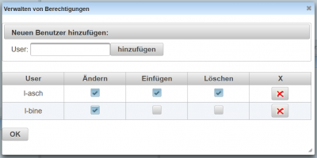

# Berechtigungen verwalten
 
Aufruf des Dialogs über das [Kontext-Menü der Ordnerverwaltung](../Ordnerverwaltung/index.md#kontext-menü).

Um einen neuen Benutzer hinzuzufügen, tragen Sie den Benutzernamen in das Feld User ein. Sie müssen den Benutzernamen kennen und ausschreiben, im Moment gibt es keine Eingabeunterstützung.

Durch Drücken des Buttons **hinzufügen** wird der Lehrer in die Liste der berechtigen User aufgenommen und Sie können dürch Auswahl der entsprechenden Checkboxen die Rechte 
* **Ändern**: Die Fragen in dem Ordner können geändert werden
* **Einfügen**: Neue Fragen können hier erstellt werden
* **Löschen**: Bestehende Fragen können gelöscht werden
vergeben.

Bestehende Kategorien können nicht geändert werden, neue Ordner könenn aber eingefügt werden, wenn das Racht Einfügen gegeben wurde.

Kategorie:Dialoge

