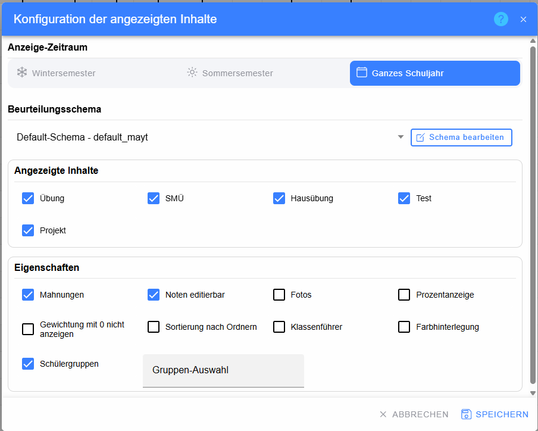
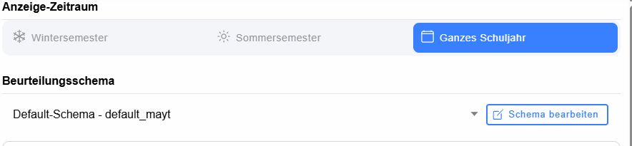
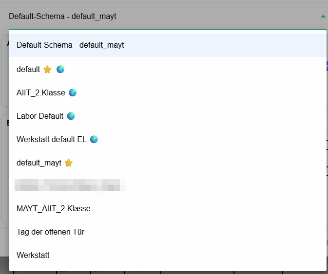
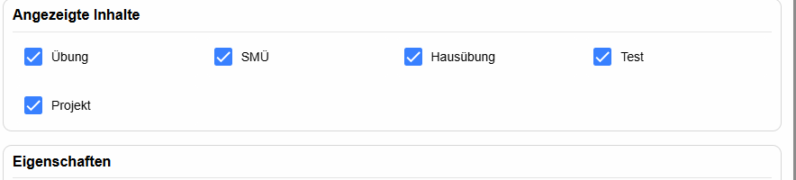
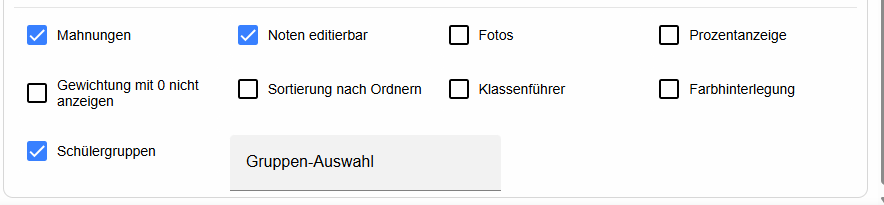

# Dialog „Konfiguration der angezeigten Inhalte“

Dieser Dialog steuert, **welche Informationen im Beurteilungskatalog sichtbar sind** und für welchen Zeitraum bzw. mit welchem Beurteilungsschema gearbeitet wird. Bereits gespeicherte Schülerleistungen werden durch das Ausblenden nicht gelöscht.

## Anzeige-Zeitraum

Das Segment enthält – abhängig von der Klasse – die möglichen Zeiträume:

* **Wintersemester** – zeigt den Katalog des Wintersemesters.
* **Sommersemester** – zeigt den Katalog des Sommersemesters.
* **Ganzes Schuljahr** – zeigt die schuljahresweite Ansicht.

Es kann immer nur ein Zeitraum aktiv sein.

## Beurteilungsschema

Das Dropdown legt fest, welches Schema für Darstellung und Berechnung verwendet wird.

* **Default-Schema – …** – verwendet das für den aktuellen Kontext automatisch ermittelte Default-Schema.
* **⭐** kennzeichnet ein als Default definiertes Schema.
* **🌍** kennzeichnet ein global verfügbares Schema.
* **Schema bearbeiten** – öffnet das ausgewählte Schema. Siehe [Beurteilungsschema](../Beurteilungsschema/index.md).

Die bisherige LeTTo-Dokumentation beschreibt die Priorität der Schemen: Ein fachbezogenes persönliches Schema hat Vorrang vor einem globalen fachbezogenen Schema; danach folgen persönliches Default-Schema und globales Default-Schema.

## Angezeigte Inhalte

Die Checkboxen werden aus den vorhandenen bzw. konfigurierten Test-/Beurteilungsarten aufgebaut. Im Beispiel sind dies **Übung, SMÜ, Hausübung, Test und Projekt**.

* **Checkbox aktiviert** – die entsprechende Art wird im Katalog angezeigt.
* **Checkbox deaktiviert** – die Art wird in der Katalogansicht ausgeblendet; vorhandene Daten bleiben gespeichert.

Die konkrete Liste kann daher von Gegenstand zu Gegenstand unterschiedlich sein.

## Eigenschaften

### Mahnungen

Blendet die Mahnungs-Checkboxen für die Semester ein. Im gemeinsamen Katalog sind diese nicht direkt änderbar.

### Noten editierbar

Erlaubt die direkte Bearbeitung von Semester-/Jahresnoten im Katalog. Ohne diese Option werden die Werte nur angezeigt.

### Fotos

Blendet – sofern vorhanden – Schülerfotos ein. Die Katalogansicht unterstützt zusätzlich eine vergrößerte Vorschau beim längeren Darüberfahren.

### Prozentanzeige

Zeigt geeignete Beurteilungen als Prozentwerte, sofern die jeweilige Beurteilungsart diese Darstellung unterstützt.

### Gewichtung mit 0 nicht anzeigen

Blendet Beurteilungen bzw. Tests mit Gewichtung `0` in der entsprechenden Katalogdarstellung aus. Gewicht `0` bedeutet fachlich, dass diese Leistung nicht in die Berechnung eingeht.

### Sortierung nach Ordnern

Ordnet Online-Aktivitäten nach ihrer Ordnerstruktur, statt ausschließlich nach Beurteilungsart bzw. normaler Reihenfolge.

### Klassenführer

Aktiviert die für Klassenführer vorgesehene Zusatzdarstellung. Welche zusätzlichen Informationen sichtbar werden, hängt von den verfügbaren Klassendaten und Berechtigungen ab.

### Farbhinterlegung

Aktiviert eine zusätzliche farbliche Hinterlegung von Ergebnissen abhängig vom Prozentwert bzw. fachlichen Zustand. Diese Hintergrundfarbe ist von der **Lehrerfarbe im gemeinsamen Katalog** zu unterscheiden.

### Schülergruppen

Blendet die Spalte **Gruppe** im Katalog ein und erlaubt die Zuordnung von Schülern zu Gruppen.

Die Gruppen werden auch für die Funktion **Für Gruppe übernehmen** genutzt: Teilbeurteilungen, die im Schema mit `#` als Gruppenbeurteilung markiert sind, können beim klassenweisen Bewerten auf alle Schüler derselben Gruppe übertragen werden. Siehe [Für Gruppe übernehmen](../KlassenbeurteilungBewerten/index.md#für-gruppe-übernehmen).

### Gruppen-Auswahl

Das Eingabefeld erscheint bei aktivierten Schülergruppen. Es dient zur kurzen Gruppen-Auswahl bzw. Filterangabe und wird gemeinsam mit der Anzeigekonfiguration gespeichert.

## Fußleiste

* **Abbrechen** – schließt den Dialog ohne Übernahme der Änderungen.
* **Speichern** – übernimmt Zeitraum, Schema, sichtbare Inhalte und Eigenschaften. Während gespeichert wird, ist der Button deaktiviert.
