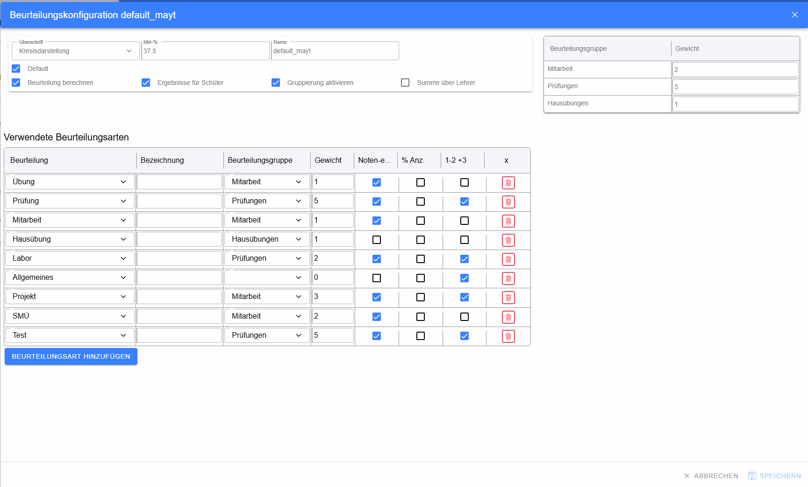
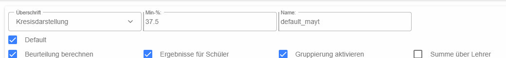
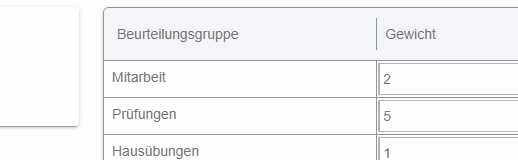
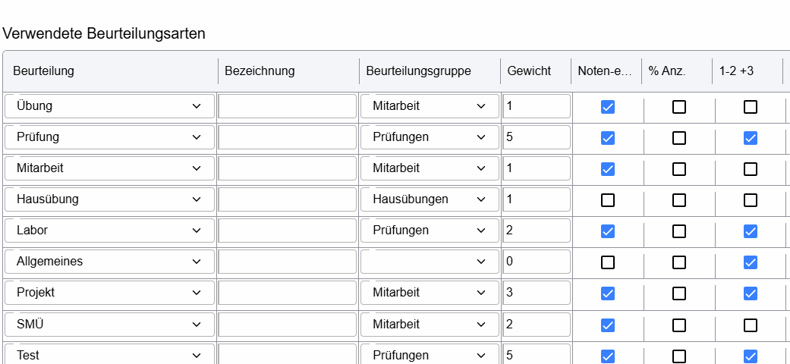
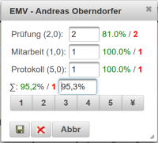

# Dialog „Beurteilungskonfiguration“ / Beurteilungsschema

Das Beurteilungsschema legt fest, **welche Beurteilungsarten verwendet werden**, wie sie gewichtet werden, welche Symbole und Prozentwerte gelten und wie der Katalog dargestellt bzw. berechnet wird.

Viele der fachlichen Regeln entsprechen weiterhin der bisherigen LeTTo-Dokumentation zur Beurteilungskonfiguration. Diese Seite fasst die aktuelle Oberfläche zusammen und ergänzt die dort beschriebenen Regeln.

## Grunddaten

### Überschrift

Dropdown für die Darstellung klassenweiser Beurteilungen im Katalog:

* **Kreisdarstellung** – die Spaltenüberschrift wird kompakt als Kreis bzw. `o` dargestellt. Der vollständige Titel bleibt über den Tooltip verfügbar.
* **Abkürzung** – zeigt eine verkürzte Bezeichnung.
* **Voller Titel** – zeigt die Bezeichnung möglichst vollständig.

### Min-%

Definiert den minimalen Prozentwert, der bei entsprechend konfigurierten negativen Leistungen für die Gesamtberechnung verwendet wird. Damit kann verhindert werden, dass extrem niedrige Roh-Prozentwerte eine Notenmittelung überproportional verschieben.

Ein Beispiel aus der bisherigen Dokumentation: Wenn die Notenabstände jeweils 12,5 Prozentpunkte betragen, kann ein Min-%-Wert von 37,5 % sinnvoll sein, damit ein „Nicht genügend“ rechnerisch nicht schlechter gewichtet wird als die Notenskala vorsieht.

### Name

Name des Schemas. Ein sprechender Name erleichtert die spätere Auswahl im Dropdown der [Anzeigekonfiguration](../Anzeigekonfiguration/index.md).

### Default

Kennzeichnet dieses Schema als persönliches Default-Schema. Es wird verwendet, wenn für den konkreten Gegenstand keine höher priorisierte Zuordnung existiert.

### Beurteilung berechnen

Aktiviert die Berechnung des Gesamt-Prozentwerts und damit die Summenauswertung im Katalog.

### Ergebnisse für Schüler

Steuert, ob die Beurteilungsergebnisse für Schüler freigegeben werden können.

### Gruppierung aktivieren

Erlaubt Schülergruppen im Katalog. Erst damit kann die Gruppenspalte sinnvoll verwendet werden. Die Gruppen sind unter anderem Voraussetzung für die Funktion **Für Gruppe übernehmen**.

### Summe über Lehrer

Legt fest, wie ein [gemeinsamer Katalog](../../index.md#gemeinsamer-katalog) mehrerer Lehrer zusammengefasst wird. Ist die Option aktiviert, werden die Ergebnisse pro Lehrer zunächst zusammengefasst und anschließend zur gemeinsamen Beurteilung verrechnet.

## Beurteilungsgruppen

Beurteilungsgruppen fassen mehrere Beurteilungsarten zu gemeinsamen Auswertungsbereichen zusammen, zum Beispiel **Mitarbeit**, **Prüfungen** oder **Hausübungen**.

* **Beurteilungsgruppe** – Name der Gruppe.
* **Gewicht** – Gewicht der gesamten Gruppe in der Gesamtberechnung.

Eine Gruppe mit Gewicht `5` geht fünfmal so stark in die Gesamtberechnung ein wie eine Gruppe mit Gewicht `1`, sofern die übrigen Bedingungen gleich sind.

## Verwendete Beurteilungsarten

Jede Tabellenzeile definiert eine im Schema verwendete Beurteilungsart.

### Beurteilung

Dropdown zur Auswahl einer global verfügbaren Beurteilungsart, z. B. **Übung, Prüfung, Mitarbeit, Hausübung, Labor, Allgemeines, Projekt, SMÜ oder Test**.

### Bezeichnung

Optionale eigene Bezeichnung. Damit kann dieselbe Grundart mehrfach unter verschiedenen fachlichen Namen verwendet werden.

### Beurteilungsgruppe

Ordnet die Beurteilungsart einer der oben beschriebenen Gruppen zu.

### Gewicht

Relative Gewichtung dieser Beurteilungsart **innerhalb ihrer Beurteilungsgruppe**.

### Note-e.

Checkbox **Noteneingabe**. Sie legt fest, ob Note, Symbol bzw. unterstützte Prozent-/Noteneingaben für diese Beurteilungsart erfasst werden können.

### % Anz.

Checkbox **Prozentanzeige**. Ist sie aktiviert, kann das Ergebnis dieser Beurteilungsart im Katalog als Prozentwert dargestellt werden.

### 1-2 +3

Erlaubt Zwischennoten wie `1-2` oder `+3`. Der dazugehörige Prozentwert wird zwischen den definierten Bewertungsstufen ermittelt.

### Papierkorb / X

Entfernt die betreffende Beurteilungsart aus diesem Schema.

### Beurteilungsart hinzufügen

Fügt eine weitere Beurteilungsart hinzu.

## Zusammengesetzte Beurteilungen / Teilbeurteilungen

Manche Beurteilungsarten bestehen aus mehreren Teilbereichen, z. B. eine Laborübung aus **Prüfung**, **Mitarbeit** und **Protokoll**. In der Definition der Teilbeurteilungen werden die Namen durch Beistrich bzw. die in der Oberfläche vorgesehene Trennung angegeben.

Eine Zahl am Ende einer Teilbeurteilung definiert deren Gewichtung. Beispiel:

`Prüfung 2, Mitarbeit 1, Protokoll 5`

Damit geht das Protokoll fünfmal so stark wie die Mitarbeit und 2,5-mal so stark wie die Prüfung in die zusammengesetzte Beurteilung ein.

### Sonderzeichen in der Definition

Die aktuelle Beurteilungslogik wertet folgende Zeichen aus:

* **`!` – verpflichtend**: Die Teilbeurteilung muss vorhanden sein, damit die Beurteilung vollständig ist. Fehlt sie, kann die Note im Katalog auffällig markiert werden.
* **`*` – Online-Test erlaubt**: Für diese Teilbeurteilung ist eine Online-Aktivität vorgesehen bzw. zulässig.
* **`#` – Gruppenbeurteilung**: Für diese Teilbeurteilung wird beim klassenweisen Bewerten die Funktion **Für Gruppe übernehmen** angeboten.

### `#` – Für Gruppe übernehmen

Beispiel:

`Prüfung 1, Mitarbeit 1, #Protokoll 1`

Das `#` wird bei der Verarbeitung aus dem sichtbaren Namen entfernt. Fachlich bleibt jedoch gespeichert, dass **Protokoll** eine Gruppenbeurteilung ist.

Beim Bewerten einer klassenweisen Beurteilung erscheint dann neben dieser Teilbeurteilung das Personengruppen-Symbol:

Nach Eingabe einer Note kann damit genau diese Teilbeurteilung für **alle Schüler mit derselben Gruppenbezeichnung** übernommen werden. Die anderen Teilbeurteilungen der betroffenen Schüler bleiben unverändert. Details siehe [Klassenbeurteilung bewerten – Für Gruppe übernehmen](../KlassenbeurteilungBewerten/index.md#für-gruppe-übernehmen).

## Bewertungen und Prozentwerte

Für jede Beurteilungsart können Bewertungssymbole mit Prozentwerten hinterlegt sein, z. B. `1`, `2`, `3`, `4`, `5`, `+`, `-` oder andere Symbole.

Dabei gilt grundsätzlich:

* **Symbol** – sichtbare Bewertung.
* **Prozentwert** – interner Wert, der für Berechnung und Summen verwendet werden kann.
* **Mindest-Prozentwert einer Bewertungsstufe** – legt fest, ab welchem Prozentwert ein Symbol gilt.
* **Negative Prozentdefinitionen** können – je nach Konfiguration – für reine Informationswerte verwendet werden, die nicht in die Gesamtbeurteilung einfließen.

Die bisherige Wiki-Dokumentation enthält dazu ausführliche Beispiele unter [Beurteilungskonfiguration](../../../../Beurteilungskonfiguration/index.md).

## Speichern und Abbrechen

* **Abbrechen** – schließt den Dialog ohne Übernahme der noch nicht gespeicherten Änderungen.
* **Speichern** – speichert das Schema und seine geänderten Gewichtungen/Eigenschaften.
