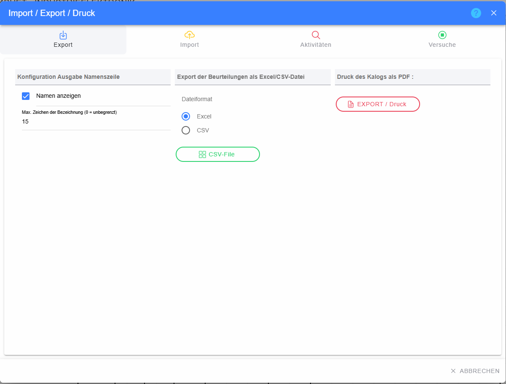
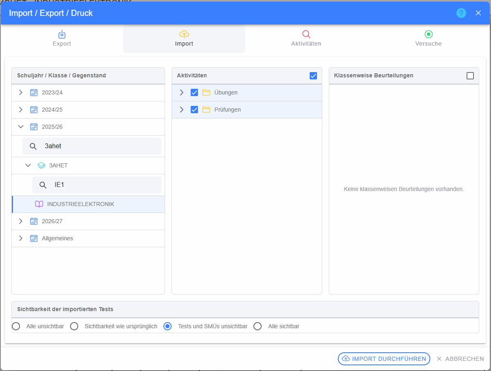
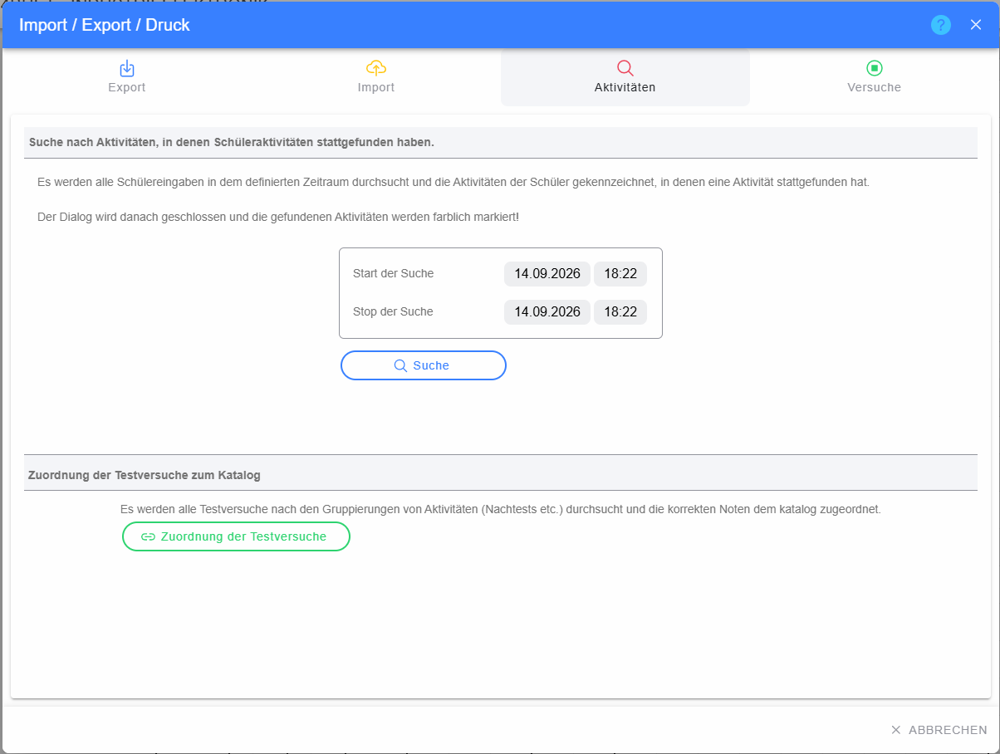
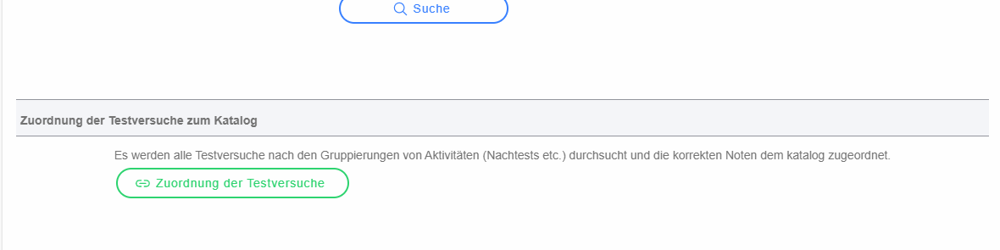
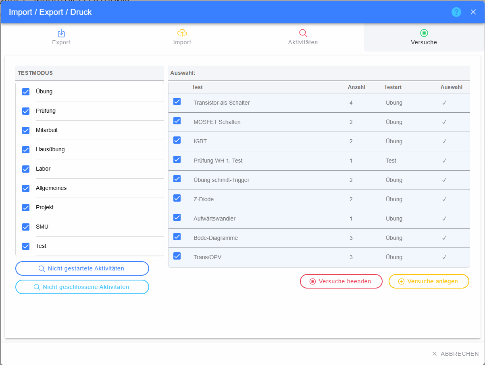
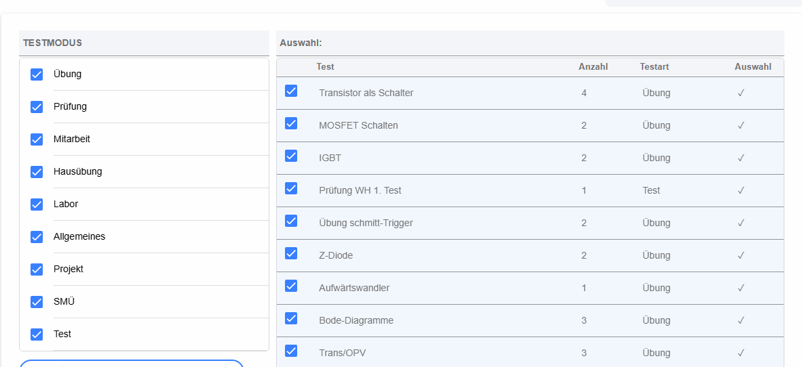

# Dialog „Import / Export / Druck“

Der Dialog fasst vier Funktionsbereiche zusammen: **Export**, **Import**, **Aktivitäten** und **Versuche**.

## Allgemeine Bedienelemente

* **Export** – Ausgabe des Katalogs als Datei bzw. Druck/PDF.
* **Import** – übernimmt Aktivitäten und klassenweise Beurteilungen aus anderen Katalogen.
* **Aktivitäten** – sucht nach Schüleraktivität/Testversuchen in einem Zeitraum und bietet die Neuzuordnung von Testversuchen zum Katalog an.
* **Versuche** – sucht nicht gestartete bzw. nicht geschlossene Versuche und erlaubt Korrekturaktionen.
* **Hilfe (?)** – öffnet die Hilfe.
* **Schließen (X) / Abbrechen** – beendet den Dialog.

## Register „Export“

### Konfiguration Ausgabe Namenszeile

* **Namen anzeigen** – legt fest, ob Schülernamen in der Ausgabe enthalten sind.
* **Max. Zeichen der Bezeichnung (0 = unbegrenzt)** – begrenzt die Länge von Bezeichnungen; `0` bedeutet keine Begrenzung.

### Export als Excel/CSV

* **Excel** – wählt das Excel-Format.
* **CSV** – wählt das CSV-Format.
* **CSV-Datei / Export** – startet die Dateierstellung im gewählten Format.

### Druck des Katalogs als PDF

* **EXPORT / Druck** – erzeugt die druckbare Katalogausgabe bzw. PDF-Ausgabe. Während der Erstellung kann ein Spinner angezeigt werden.

## Register „Import“

### Schuljahr / Klasse / Gegenstand

Die linke Baumstruktur legt fest, aus welchem Katalog importiert wird.

* **Pfeil vor Schuljahr** – klappt das Schuljahr auf oder zu.
* **Pfeil vor Klasse** – klappt die Klasse auf oder zu.
* **Suchfeld bei vielen Klassen** – filtert die Klassen im Schuljahr.
* **Suchfeld bei vielen Gegenständen** – filtert Gegenstände/Lehrerklassen der Klasse.
* **Gegenstand** – wählt die konkrete Lehrer-Klasse als Quelle.

### Aktivitäten

* **Checkbox in der Überschrift** – wählt alle verfügbaren Aktivitäten aus bzw. ab; bei teilweiser Auswahl wird ein Zwischenzustand angezeigt.
* **Pfeil an Ordnern** – öffnet/schließt Unterordner.
* **Checkbox je Aktivität** – nimmt die einzelne Aktivität in den Import auf.
* **Ordner-/Dokumentsymbol** – zeigt, ob es sich um einen Container oder eine einzelne Aktivität handelt.

### Klassenweise Beurteilungen

* **Checkbox in der Überschrift** – wählt alle Klassenbeurteilungen aus bzw. ab.
* **Checkbox je Beurteilung** – wählt die konkrete Klassenbeurteilung.

### Sichtbarkeit importierter Tests

Die Radiobuttons legen fest, wie importierte Tests für Schüler sichtbar werden:

* **Alle unsichtbar**
* **Sichtbarkeit wie ursprünglich/exportiert**
* **Tests und SMÜs unsichtbar**
* **Alle sichtbar**

### Import durchführen

**IMPORT DURCHFÜHREN** übernimmt die gewählten Elemente in den aktuellen Katalog. Der Button ist erst verfügbar, wenn eine gültige Auswahl vorhanden ist.

## Register „Aktivitäten“

### Suche nach Testversuchen/Schüleraktivität

* **Start der Suche** – Datum und Uhrzeit für den Beginn.
* **Stop der Suche** – Datum und Uhrzeit für das Ende.
* **Suche** – durchsucht die Testversuche des aktuellen Katalogs im angegebenen Zeitraum.

Wichtig: Wenn passende Testversuche gefunden werden, wird der Dialog geschlossen und die zugehörigen Testversuch-IDs an den Katalog zurückgegeben. Die betreffenden **Noten werden anschließend im Katalog farblich hervorgehoben und zusätzlich größer/fett dargestellt**. Dadurch können die gefundenen Leistungen direkt in der großen Katalogtabelle wiedergefunden werden.

Die Hervorhebung bleibt eine reine Anzeigehilfe; beim normalen Neuladen des Katalogs wird die Markierung zurückgesetzt.

### Zuordnung der Testversuche zum Katalog

**Zuordnung der Testversuche** startet eine serverseitige Neuzuordnung der Testversuche zu den Katalogen. Dabei werden die vorhandenen Aktivitäts-/Gruppierungsinformationen herangezogen, damit passende Noten und Ergebnisse wieder dem richtigen Katalog zugeordnet werden können.

Diese Funktion ist insbesondere hilfreich, wenn Testversuche vorhanden sind, aber die Zuordnung zum Beurteilungskatalog nach Änderungen an Aktivitäten oder Gruppierungen nicht mehr vollständig stimmt.

Nach dem Start wird eine Informationsmeldung angezeigt und der Dialog geschlossen. Die eigentliche Neuzuordnung läuft serverseitig an.

> **Unterschied zur Suche:** Die **Suche** dient dazu, vorhandene Testversuche in einem Zeitraum im aktuellen Katalog **sichtbar zu markieren**. **Zuordnung der Testversuche** stößt dagegen die fachliche Neuzuordnung der Testversuche zu den Katalogen an.

## Register „Versuche“

### Testmodus / Beurteilungsarten

Links werden die für die Suche relevanten Test-/Beurteilungsarten angezeigt.

* **Checkbox je Testmodus** – nimmt die Art in die Suche/Aktion auf oder entfernt sie.
* Mehrere Arten können gleichzeitig ausgewählt werden.

### Nicht gestartete Aktivitäten

**Nicht gestartete Aktivitäten** sucht Tests/Aktivitäten, für die die erwarteten Versuche noch nicht angelegt wurden.

### Nicht geschlossene Aktivitäten

**Nicht geschlossene Aktivitäten** sucht Versuche, die noch offen bzw. nicht ordnungsgemäß abgeschlossen sind.

### Auswahltabelle

* **Checkbox je Test** – legt fest, ob der Test in die Korrekturaktion einbezogen wird.
* **Test** – Name der Aktivität.
* **Anzahl** – Anzahl der betroffenen Fälle/Versuche.
* **Testart** – zugehörige Beurteilungs-/Testart.
* **Auswahlstatus** – zeigt, welche Einträge für die Aktion gewählt wurden.

### Versuche beenden

**Versuche beenden** schließt die ausgewählten offenen Testversuche. Diese Aktion verändert bestehende Versuche und sollte bewusst nur für die markierten Tests ausgeführt werden.

### Versuche anlegen

**Versuche anlegen** erzeugt für die ausgewählten, noch nicht gestarteten Aktivitäten die erforderlichen Versuche.
