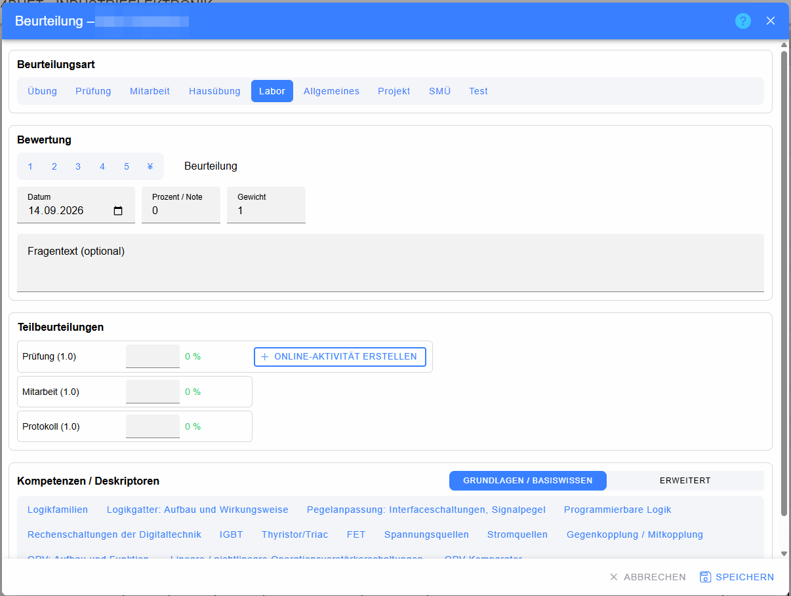
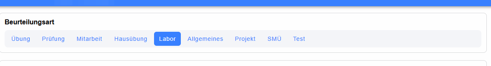
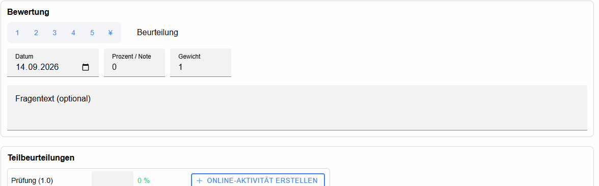
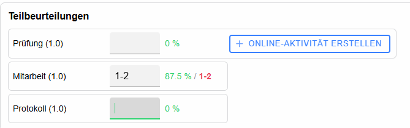
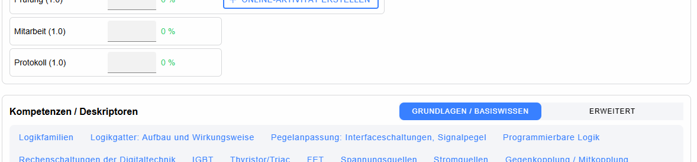

# Dialog „Beurteilung“ – Individualbeurteilung

Eine **Individualbeurteilung** wird für genau **einen Schüler** angelegt. Sie eignet sich für Leistungen oder Beobachtungen, die nicht die gesamte Klasse betreffen, z. B. eine einzelne mündliche Prüfung, eine Mitarbeitsaufzeichnung, eine individuelle Nachprüfung oder eine besondere fachliche Beobachtung.

Der Name des Schülers wird im Fenstertitel angezeigt; personenbezogene Namen sind in den Dokumentationsbildern verpixelt.

## Unterschied zur klassenweisen Beurteilung

Bei einer [Klassenbeurteilung](../Klassenbeurteilung/index.md) werden Bezeichnung, Datum, Aufgabenstellung und Beurteilungsart **einmal für die ganze Klasse** definiert. Anschließend wird die Leistung pro Schüler in derselben Katalogspalte bewertet.

Bei einer Individualbeurteilung gehört dagegen bereits die **gesamte Beurteilung** nur zu einem Schüler. Deshalb erscheint sie nicht als gemeinsame Klassenspalte, sondern im Bereich **Beurteilungen** des betreffenden Schülers.

Kurz gesagt:

* **Individualbeurteilung** → „Diese Leistung betrifft nur diesen Schüler.“
* **Klassenweise Beurteilung** → „Diese Leistungsfeststellung ist für die Klasse gemeinsam definiert; die Ergebnisse unterscheiden sich je Schüler.“

## Kopfzeile

* **Hilfe (?)** – öffnet die kontextspezifische Hilfe.
* **Schließen (X)** – schließt den Dialog ohne Speichern noch nicht übernommener Änderungen.

## Beurteilungsart und Bewertung

### Beurteilungsart

Die Schaltflächen **Übung, Prüfung, Mitarbeit, Hausübung, Labor, Allgemeines, Projekt, SMÜ, Test** usw. werden aus dem aktuell verwendeten Beurteilungsschema erzeugt. Nur die dort freigegebenen Arten werden angeboten.

Die Auswahl beeinflusst unter anderem:

* die verfügbaren Bewertungssymbole,
* die Prozent-/Noteneingabe,
* vorhandene Teilbeurteilungen,
* Gewichtungen,
* verpflichtende Teilbeurteilungen,
* Online-Test-Funktionen,
* Fragentext und Kompetenzzuordnung.

Ist eine bei einer bestehenden Beurteilung gespeicherte Art im aktuellen Schema nicht mehr verfügbar, zeigt LeTTo eine Warnung.

### Bewertungssymbole

Die Buttons mit **1, 2, 3, 4, 5, +, −, ¥** oder anderen Symbolen stammen ebenfalls aus dem Schema. Ein Klick übernimmt das Symbol und den dazu hinterlegten Prozentwert.

Das aktuell gewählte Ergebnis wird neben **Beurteilung** angezeigt.

## Eingabefelder

### Datum

Pflichtfeld für das Datum der Individualbeurteilung.

### Prozent / Note

Wird nur angezeigt bzw. editierbar, wenn die gewählte Beurteilungsart diese Form der Eingabe erlaubt. LeTTo interpretiert die Eingabe anhand der im Schema definierten Bewertungsstufen.

### Zwischennoten

Zwischennoten können direkt im Feld **Prozent / Note** sowie – bei zusammengesetzten Beurteilungen – in den Eingabefeldern der Teilbeurteilungen verwendet werden. Voraussetzung ist, dass für die gewählte Beurteilungsart im Beurteilungsschema die Checkbox **`1-2 +3`** aktiviert ist.

Je nach Schema sind beispielsweise Eingaben wie `1-2`, `2-3`, `+2` oder `2-` möglich. LeTTo interpretiert die Zwischenstufe und ordnet ihr den entsprechenden Prozentwert zwischen den konfigurierten Bewertungsstufen zu. Dadurch fließt die Zwischennote korrekt in die Berechnung ein.

Ist **`1-2 +3`** für die Beurteilungsart nicht aktiviert, sind diese Zwischenformen nicht vorgesehen. Details zur Freigabe finden sich unter [Beurteilungskonfiguration – 1-2 +3](../Beurteilungsschema/index.md#1-2-3).

### Gewicht

Legt fest, wie stark diese konkrete Individualbeurteilung innerhalb der vorgesehenen Berechnung wirkt. Ein Gewicht von `0` kann verwendet werden, wenn die Leistung dokumentiert, aber nicht in die Berechnung einbezogen werden soll.

### Fragentext (optional)

Das mehrzeilige Feld dokumentiert Aufgabenstellung, Thema oder Bemerkung. Es erscheint nur bei Beurteilungsarten, bei denen die Anzeige/Eingabe eines Fragentextes vorgesehen ist.

## Teilbeurteilungen

Eine zusammengesetzte Beurteilung kann aus mehreren Teilbereichen bestehen, z. B. **Prüfung**, **Mitarbeit** und **Protokoll**.

Jede Zeile enthält:

* **Name** der Teilbeurteilung,
* **Gewichtung** in Klammern,
* **Eingabefeld** für Note/Symbol/Prozent,
* berechneten **Prozentwert**,
* daraus resultierende **Note/Bewertung**.

Beim Verlassen des Felds wird neu berechnet; mit **Tab** kann zur nächsten Teilbeurteilung gewechselt werden.

### Online-Aktivität in einer Teilbeurteilung

Wenn die Teilbeurteilung im Schema als online-fähig definiert wurde, kann sie eine eigene Aktivität besitzen:

* **ONLINE-AKTIVITÄT ERSTELLEN** – legt eine Aktivität für genau diesen Teilbereich an.
* **Ergebnisse** – öffnet die Testergebnisse.
* **Sichtbarkeit** – schaltet die Sichtbarkeit für Schüler.
* **Bearbeiten** – öffnet die Test-/Aktivitätseinstellungen.
* **Aktivitätsname** – öffnet ebenfalls die Bearbeitung.
* **Löschen** – entfernt die verknüpfte Aktivität.

Bei einer Teilbeurteilung mit Online-Aktivität wird das Ergebnis grundsätzlich aus der Aktivität übernommen; die direkte Eingabe kann deshalb gesperrt sein.

## Online-Aktivität für die gesamte Individualbeurteilung

Wenn keine Teilbeurteilungen vorhanden sind und die Beurteilungsart Online-Tests erlaubt, kann **ONLINE-AKTIVITÄT ERSTELLEN** direkt für die gesamte Beurteilung angeboten werden.

Ist bereits eine Aktivität vorhanden, stehen analog **Ergebnisse**, **Sichtbarkeit**, **Bearbeiten** und **Löschen** zur Verfügung.

## Kompetenzen / Deskriptoren

Wenn für den Gegenstand Kompetenzen vorhanden sind, kann die Individualbeurteilung fachlich zugeordnet werden.

* **Grundlagen / Basiswissen** – grundlegende Kompetenzstufe.
* **Erweitert / Erweiterungswissen** – höhere/erweiterte Kompetenzstufe.
* **Kompetenz-Buttons** – wählen die konkrete Kompetenz; die aktive Auswahl ist hervorgehoben.
* Wenn keine Kompetenzen verfügbar sind, wird ein entsprechender Hinweis angezeigt.

Diese Zuordnung ermöglicht später eine kompetenzorientierte [Leistungsübersicht](../Leistungsuebersicht/index.md).

## Fußleiste

* **Löschen** – nur bei bereits gespeicherten Individualbeurteilungen; entfernt den Eintrag nach Bestätigung.
* **Abbrechen** – schließt den Dialog ohne Speichern.
* **Speichern** – speichert die Beurteilung; der Button ist deaktiviert, solange Pflichtfelder fehlen oder ein Speichervorgang läuft.
