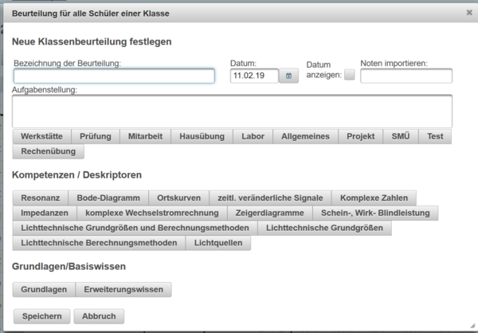
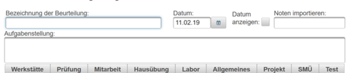
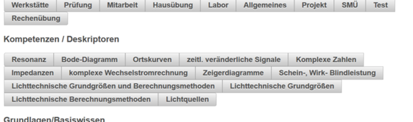

# Dialog „Klassenbeurteilung“ – anlegen und bearbeiten

Eine **klassenweise Beurteilung** wird einmal für die gesamte Klasse definiert. Danach erscheint sie als eigene Spalte im Beurteilungskatalog und kann für jeden Schüler einzeln bewertet werden. Typische Beispiele sind Tests, Laborübungen, Projektarbeiten, Hausübungen oder gemeinsame Prüfungen.

Die folgende Abbildung stammt aus der bestehenden Wiki-Dokumentation und zeigt den Aufbau des Dialogs sehr kompakt. Die aktuelle Oberfläche ist optisch moderner, die fachlichen Felder und ihre Bedeutung entsprechen jedoch weiterhin diesem Prinzip.

## Unterschied zur Individualbeurteilung

Bei einer [Individualbeurteilung](../Individualbeurteilung/index.md) wird der Eintrag **für genau einen Schüler** angelegt. Bei einer klassenweisen Beurteilung werden die gemeinsamen Eigenschaften – Bezeichnung, Datum, Aufgabenstellung, Beurteilungsart und Kompetenzzuordnung – **nur einmal** definiert. Anschließend erhält jeder Schüler in derselben Katalogspalte sein eigenes Ergebnis.

Dadurch eignet sich die klassenweise Beurteilung besonders für Leistungen, die grundsätzlich die ganze Klasse betreffen.

## Kopfzeile

Der Titel lautet je nach Zustand **Neue Klassenbeurteilung** oder **Klassenbeurteilung bearbeiten**. Sobald eine Bezeichnung eingegeben wurde, erscheint sie zusätzlich im Titel.

* **Hilfe (?)** – öffnet die kontextspezifische Hilfe.
* **Schließen (X)** – schließt den Dialog ohne Speichern der noch nicht übernommenen Änderungen.

## Allgemeine Daten

### Bezeichnung

Pflichtfeld für den Namen der Klassenbeurteilung. Der Name dient mehreren Zwecken:

* Er identifiziert die Beurteilung beim Bearbeiten.
* Er erscheint – abhängig von der Einstellung **Überschrift** im Beurteilungsschema – vollständig, abgekürzt oder als Tooltip im Katalog.
* Er erleichtert die Zuordnung bei Import und Export.

### Datum

Das Datum legt den Zeitpunkt der Leistungsfeststellung fest. Klassenweise Beurteilungen werden im Katalog unter anderem anhand dieses Datums eingeordnet bzw. sortiert.

### Datum anzeigen

Checkbox zur Steuerung, ob das Datum bei der Beurteilung im Katalog bzw. bei den dazugehörigen Schülerbewertungen angezeigt werden soll.

### Noten

Das Feld **Noten / importNoten** dient für vom System unterstützte Notenimport- bzw. Vorbelegungsfunktionen. Es wird gemeinsam mit der Klassenbeurteilung gespeichert.

### Aufgabenstellung

Mehrzeiliges Textfeld für Aufgabenstellung, Thema oder Beschreibung. Bei längeren Projekt-, Labor- oder Prüfungsaufgaben kann hier dokumentiert werden, worauf sich die Beurteilung bezieht.

## Beurteilungsart

Die Buttons zeigen alle im aktiven Beurteilungsschema verfügbaren Beurteilungsarten, z. B. **Übung, Prüfung, Mitarbeit, Hausübung, Labor, Allgemeines, Projekt, SMÜ, Test**.

Die gewählte Beurteilungsart bestimmt unter anderem:

* welche Bewertungssymbole bzw. Noten verwendet werden können,
* ob Prozentwerte verwendet werden,
* ob Teilbeurteilungen vorhanden sind,
* wie Teilbeurteilungen gewichtet werden,
* ob Teilbeurteilungen verpflichtend sind,
* ob eine Teilbeurteilung als Gruppenbeurteilung verwendet werden kann,
* ob Online-Aktivitäten für Teilbeurteilungen zulässig sind,
* ob ein Fragentext vorgesehen ist.

Ist die ursprünglich gespeicherte Beurteilungsart im aktuellen Schema nicht mehr vorhanden, zeigt LeTTo eine Warnung. Für eine neue Klassenbeurteilung muss eine gültige Beurteilungsart gewählt werden.

## Teilbeurteilungen

Eine Beurteilungsart kann aus mehreren Teilbeurteilungen bestehen. Ein Labor kann beispielsweise aus **Prüfung**, **Mitarbeit** und **Protokoll** zusammengesetzt sein. Gewichtungen werden im Beurteilungsschema definiert.

Die eigentlichen Schülerwerte werden später im Dialog [Klassenbeurteilung bewerten](../KlassenbeurteilungBewerten/index.md) eingegeben.

### Online-fähige Teilbeurteilungen

Wenn eine Teilbeurteilung einen Online-Test erlaubt, stehen – abhängig davon, ob bereits eine Aktivität existiert – folgende Aktionen zur Verfügung:

* **Test anlegen** – erstellt eine Online-Aktivität für genau diese Teilbeurteilung.
* **Ergebnisse** – öffnet die Testergebnisse des bereits angelegten Tests.
* **Sichtbarkeit (Auge)** – schaltet die Sichtbarkeit für Schüler um. Ein durchgestrichenes Auge kennzeichnet eine unsichtbare Aktivität.
* **Bearbeiten (Stift)** – öffnet die Eigenschaften der Online-Aktivität.
* **Löschen (Papierkorb)** – entfernt die zugeordnete Aktivität.
* **Aktivitätsname** – zeigt die aktuell verknüpfte Aktivität; unsichtbare Aktivitäten werden optisch gekennzeichnet.

## Kompetenzen / Deskriptoren

Wenn für den Gegenstand Kompetenzen hinterlegt sind, kann die Klassenbeurteilung einer Kompetenz zugeordnet werden.

* **Grundlagen / Basiswissen** – ordnet die Leistung der grundlegenden Kompetenzstufe zu.
* **Erweitert / Erweiterungswissen** – ordnet sie der erweiterten Kompetenzstufe zu.
* **Kompetenz-Buttons** – wählen die konkrete Kompetenz.
* **Keine Auswahl** – entfernt eine bestehende Kompetenzzuordnung.

Diese Zuordnung wird später unter anderem in der [Leistungsübersicht](../Leistungsuebersicht/index.md) verwendet.

## Speichern, Abbrechen und Löschen

* **Speichern** – speichert die Definition. Pflichtfelder müssen gültig sein; während eines laufenden Speichervorgangs ist der Button deaktiviert.
* **Abbrechen** – verwirft die noch nicht gespeicherten Änderungen und schließt den Dialog.
* **Löschen** – ist bei einer bereits bestehenden Klassenbeurteilung verfügbar und entfernt sie nach der vorgesehenen Sicherheitsabfrage.

## Danach: Schüler bewerten

Nach dem Speichern erscheint die Klassenbeurteilung als eigene Spalte im Katalog. Durch Anklicken einer Schülerzelle in dieser Spalte öffnet sich [Klassenbeurteilung bewerten](../KlassenbeurteilungBewerten/index.md). Dort werden Note, Symbol, Prozentwert oder Teilbeurteilungen des einzelnen Schülers erfasst.
