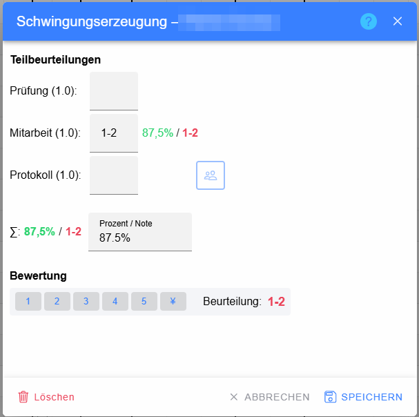
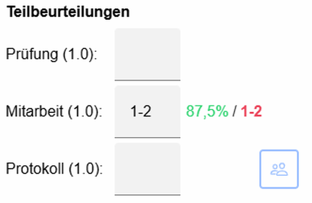
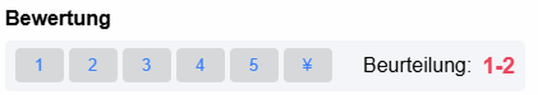

# Dialog „Klassenbeurteilung bewerten“

Dieser Dialog erfasst das Ergebnis **eines einzelnen Schülers** zu einer bereits definierten klassenweisen Beurteilung. Die gemeinsamen Eigenschaften der Leistungsfeststellung wurden zuvor im Dialog [Klassenbeurteilung anlegen oder bearbeiten](../Klassenbeurteilung/index.md) festgelegt.

## Kopfzeile

Der Titel enthält die Bezeichnung der Klassenbeurteilung und den Namen des Schülers. Personenbezogene Namen sind in der Dokumentation verpixelt.

* **Hilfe (?)** – öffnet die kontextspezifische Hilfe.
* **Schließen (X)** – beendet den Dialog ohne weitere Speicherung.

## Teilbeurteilungen

Bei zusammengesetzten Beurteilungsarten wird für jede Teilbeurteilung eine eigene Zeile angezeigt.

### Normale Teilbeurteilung

Das Eingabefeld nimmt – abhängig von der Konfiguration – eine Note, ein Bewertungssymbol oder einen Prozentwert auf.

* Beim **Verlassen des Felds** wird die Eingabe interpretiert und neu berechnet.
* **Enter** übernimmt die Eingabe und kann die gesamte Bewertung speichern.
* **Tab** springt zur nächsten editierbaren Teilbeurteilung.
* Rechts werden der daraus berechnete **Prozentwert** und die **Note/das Symbol** angezeigt.

Die in Klammern angezeigte Zahl, z. B. `Prüfung (1.0)`, ist die Gewichtung dieser Teilbeurteilung innerhalb der Gesamtbeurteilung.

## Zwischennoten

Zwischennoten können direkt in die Eingabefelder der Haupt- oder Teilbeurteilungen eingegeben werden, **wenn für die verwendete Beurteilungsart im Beurteilungsschema die Option `1-2 +3` aktiviert ist**.

Mögliche Eingaben sind – abhängig vom verwendeten Schema – beispielsweise:

* `1-2` oder `2-3` für eine Zwischenstufe zwischen zwei Noten,
* `+2` für eine positive Tendenz zur Note 2,
* `2-` für eine negative Tendenz zur Note 2.

LeTTo interpretiert die Eingabe und berechnet daraus den zugehörigen Prozentwert. Dadurch können Zwischennoten genauso wie normale Noten in die Gesamtberechnung der Klassenbeurteilung einfließen. Ist **`1-2 +3`** für die betreffende Beurteilungsart nicht aktiviert, sind diese Zwischenformen nicht vorgesehen.

Die Freigabe erfolgt in der [Beurteilungskonfiguration](../Beurteilungsschema/index.md#1-2-3).

### Teilbeurteilung mit Online-Aktivität

Ist eine Teilbeurteilung mit einer Online-Aktivität verknüpft, kommt das Ergebnis grundsätzlich aus dieser Aktivität. Je nach Zustand stehen zusätzliche Funktionen zur Verfügung, beispielsweise:

* **Ergebnisse** – öffnet die Ergebnisse der Online-Aktivität.
* **Überschreiben** – erlaubt, wenn vorgesehen, eine manuelle Übersteuerung des automatisch übernommenen Ergebnisses.

## Für Gruppe übernehmen

 Die Schaltfläche mit dem **Personengruppen-Symbol** erscheint nur bei Teilbeurteilungen, die in der Beurteilungskonfiguration als **Gruppenbeurteilung** markiert wurden.

Die Funktion ist besonders für Labor-, Projekt- oder Gruppenarbeiten gedacht, bei denen mehrere Schüler dieselbe Teilnote erhalten sollen.

### Voraussetzung in der Beurteilungskonfiguration: `#`

In der Definition der Teilbeurteilungen kennzeichnet das Zeichen **`#`** eine Teilbeurteilung als Gruppenbeurteilung. Beispiel:

`Prüfung 1, Mitarbeit 1, #Protokoll 1`

Damit wird **Protokoll** als Gruppenbeurteilung erkannt. Beim Bewerten erscheint in dieser Zeile die Schaltfläche **Für Gruppe übernehmen**.

Weitere Sonderzeichen der Teilbeurteilungsdefinition sind:

* **`#`** – Gruppenbeurteilung; Ergebnis kann auf Schüler derselben Gruppe übertragen werden.
* **`!`** – verpflichtende Teilbeurteilung; fehlt sie, gilt die Gesamtbeurteilung noch als unvollständig und kann im Katalog entsprechend markiert werden.
* **`*`** – kennzeichnet eine Teilbeurteilung, für die eine Online-Aktivität/Testfunktion vorgesehen ist.
* **Zahl am Ende** – Gewichtung der Teilbeurteilung, z. B. `Protokoll 5`.

### Was passiert beim Klick?

Der Button wird erst aktiv, wenn in dieser Teilbeurteilung ein Ergebnis vorhanden ist. Nach dem Klick zeigt LeTTo eine Bestätigung mit:

* der zu übernehmenden Note,
* der Bezeichnung der Teilbeurteilung,
* dem Gruppennamen,
* der Anzahl der Schüler in dieser Gruppe.

Mit **Übernehmen** wird **nur die ausgewählte Teilbeurteilung** – Eingabe, Note und Prozentwert – auf alle Schüler mit exakt derselben Gruppenbezeichnung übertragen. Andere bereits vorhandene Haupt- oder Teilbeurteilungen dieser Schüler bleiben erhalten.

Anschließend wird für jeden betroffenen Schüler die Gesamtbeurteilung neu berechnet. Auch verpflichtende Teilbeurteilungen und Kompetenzzuordnungen werden dabei weiterhin berücksichtigt.

## Gesamtergebnis

Der Bereich **∑** zeigt den aus den Teilbeurteilungen berechneten Gesamt-Prozentwert und die daraus resultierende Note bzw. Bewertung.

Wenn eine direkte Gesamteingabe erlaubt ist, kann im Feld **Prozent / Note** auch ein Gesamtwert eingegeben werden. Ungültige Eingaben werden direkt im Dialog gemeldet.

## Bewertungssymbole

Die angebotenen Buttons stammen aus dem verwendeten Beurteilungsschema. Ein Klick auf ein Symbol übernimmt die dazugehörige Note und den hinterlegten Prozentwert. Die aktuelle Bewertung wird rechts nochmals deutlich angezeigt.

## Fragentext

Das Feld **Fragentext** wird nur bei Beurteilungsarten eingeblendet, bei denen diese Funktion im Schema aktiviert wurde. Es kann eine individuelle Aufgabenstellung, Bemerkung oder nähere Beschreibung enthalten.

## Fußleiste

* **Löschen** – entfernt die bereits gespeicherte Schülerbeurteilung.
* **Abbrechen** – schließt den Dialog ohne Übernahme weiterer Änderungen.
* **Speichern** – speichert die Bewertung des Schülers.
