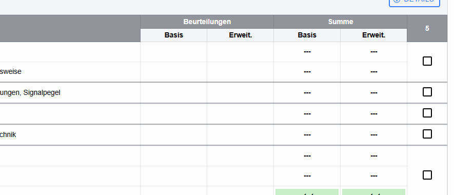

# Dialog „Details zur Beurteilung“ – Kompetenzdetails

Dieser Dialog wird aus einer Ergebniszelle der Leistungsübersicht geöffnet und zeigt, aus welchen konkreten Aufgabenstellungen bzw. Fragen ein Kompetenzresultat entstanden ist.

Die folgende Detailgrafik zeigt den Ausgangspunkt in der Kompetenzmatrix; ein Klick auf eine Ergebniszelle öffnet die Kompetenzdetails.

## Kopfzeile

* **Details zur Beurteilung** – Fenstertitel.
* **Hilfe (?)** – öffnet die Hilfe.
* **Schließen (X)** – schließt den Dialog.

## Kontext

Oben stehen:

* **Aufgabenstellungen zu …** – Name der ausgewählten Kompetenz.
* **Level** – die gewählte Kompetenzstufe, beispielsweise Grundlagen oder Erweiterungswissen.

Während Daten geladen werden, erscheint ein Spinner. Sind keine Aufgaben vorhanden, wird **Keine Aufgabenstellungen vorhanden.** angezeigt.

## Detailtabelle

* **Frage** – Name der Frage; bei Unterfragen wird zusätzlich deren Name angehängt.
* **Test** – Name des Tests, aus dem die Frage stammt.
* **Pkt.** – für die Frage relevante Punktedarstellung.
* **siehe / Lupe** – öffnet die Detailansicht zur Frage bzw. zum zugehörigen Testdetail. Auch ein Klick auf die gesamte Zeile führt zur Detailansicht.

## Abbrechen

Der Button **Abbrechen** schließt den Dialog. Es werden in diesem Dialog keine Bewertungen verändert.
