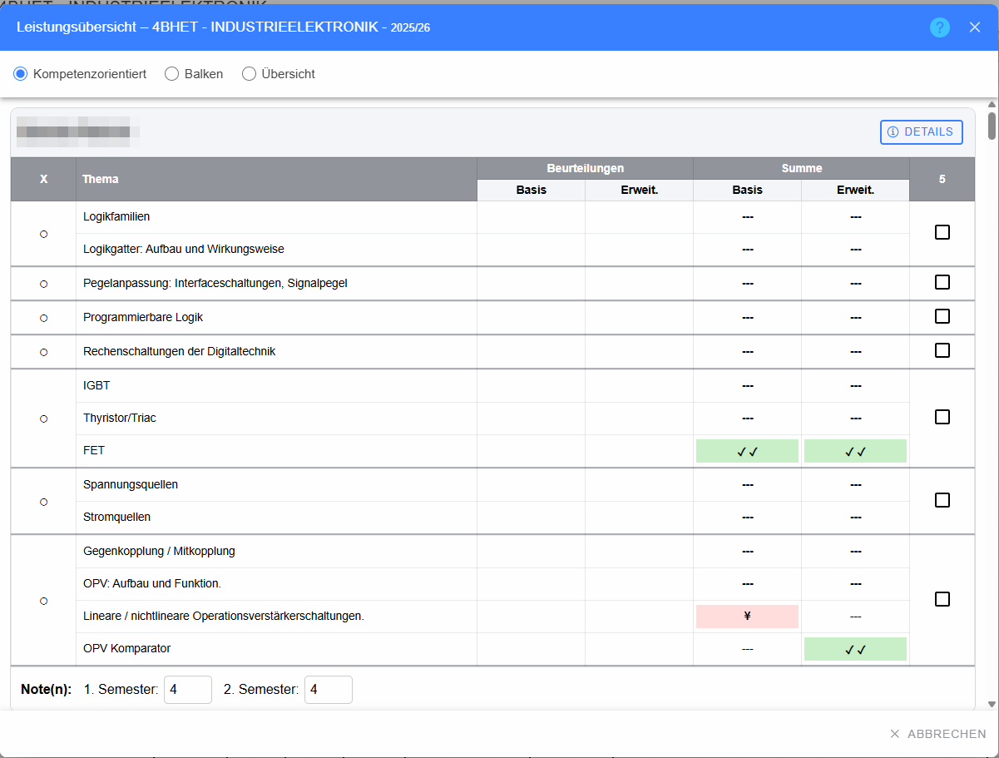
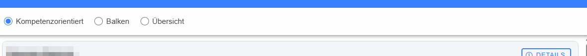
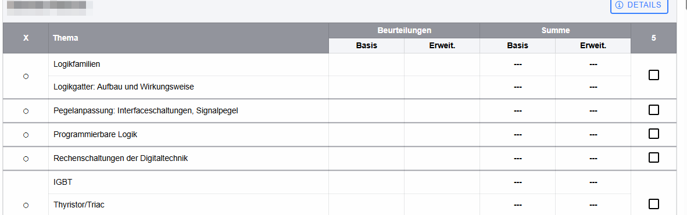

# Dialog „Leistungsübersicht“

Die Leistungsübersicht stellt die Leistungen der Klasse kompetenzorientiert dar und erlaubt außerdem die Pflege negativer Kompetenzkennzeichnungen sowie der Semesternoten.

## Kopfzeile

Der Titel enthält Klasse, Gegenstand und Schuljahr.

* **Hilfe (?)** – öffnet die Hilfe.
* **Schließen (X)** – schließt den Dialog.

## Darstellungsart

Drei Radiobuttons wechseln die Darstellung:

* **Kompetenzorientiert** – Ergebnisse werden als Kompetenzsymbole dargestellt.
* **Balken** – Ergebnisse werden als Prozentbalken dargestellt.
* **Übersicht** – blendet die detaillierte Kompetenzmatrix aus und reduziert die Ansicht auf die übersichtlichen Schüler-/Noteninformationen.

Die Umschaltung verändert nur die Darstellung, nicht die gespeicherten Bewertungen.

## Schülerbereich

Für jeden Schüler wird ein eigener Abschnitt angezeigt.

* **Schülername** – in den Dokumentationsbildern aus Datenschutzgründen verpixelt.
* **Details** – öffnet die detaillierte [Schüler-Ergebnisübersicht](../SchuelerErgebnisse/index.md).

## Kompetenzmatrix

### X / negative Kennzeichnung

Ein Deskriptor kann über die Checkbox neben der Deskriptorüberschrift als negativ gekennzeichnet werden. Der Tooltip weist ausdrücklich darauf hin, die Markierung nur bei negativer Beurteilung zu verwenden.

Auch einzelne Lehrinhalte besitzen rechts eine Checkbox für **negative Beurteilung**. Eine aktivierte Markierung hebt den betreffenden Bereich entsprechend hervor.

### Thema

Zeigt die Kompetenz bzw. den Kompetenznamen innerhalb des jeweiligen Deskriptors und Lehrinhalts.

### Beurteilungen – Basis / Erweitert

Hier werden Individualbeurteilungen der jeweiligen Kompetenzstufe als Bewertungschips angezeigt. Ein Tooltip zeigt – sofern vorhanden – Fragentext oder Beurteilungsart.

### Beurteilungsarten – Basis / Erweitert

Für jede verwendete Beurteilungsart werden getrennte Spalten für Grundlagen und Erweiterungswissen erzeugt. Ein Klick auf eine Ergebniszelle öffnet den Dialog [Details zu einer Kompetenzbeurteilung](../Kompetenzdetails/index.md).

Je nach ausgewählter Darstellungsart erscheint dort ein Kompetenzsymbol oder ein Prozentbalken. `---` bedeutet, dass für diese Kombination kein Ergebnis vorhanden ist.

### Spalte „5“

Die rechte Markierungsspalte enthält die Checkbox für die negative Lehrinhaltsbeurteilung. Die Überschrift entspricht der aktuellen fachlichen Kennzeichnung der Oberfläche.

## Semesternoten

Am Ende des Schülerabschnitts können – je nach angezeigtem Zeitraum – die Felder **1. Semester** und/oder **2. Semester** bearbeitet werden. Die Eingaben werden bei Änderung gespeichert. Das Feld erlaubt bis zu zwei Zeichen und kann damit auch die vom System unterstützten erweiterten Notenschreibweisen aufnehmen.

## Abbrechen

Der Button **Abbrechen** schließt die Übersicht. Änderungen an Checkboxen oder Semesternoten werden bereits bei der jeweiligen Bedienaktion gespeichert und nicht erst beim Schließen gesammelt übertragen.
