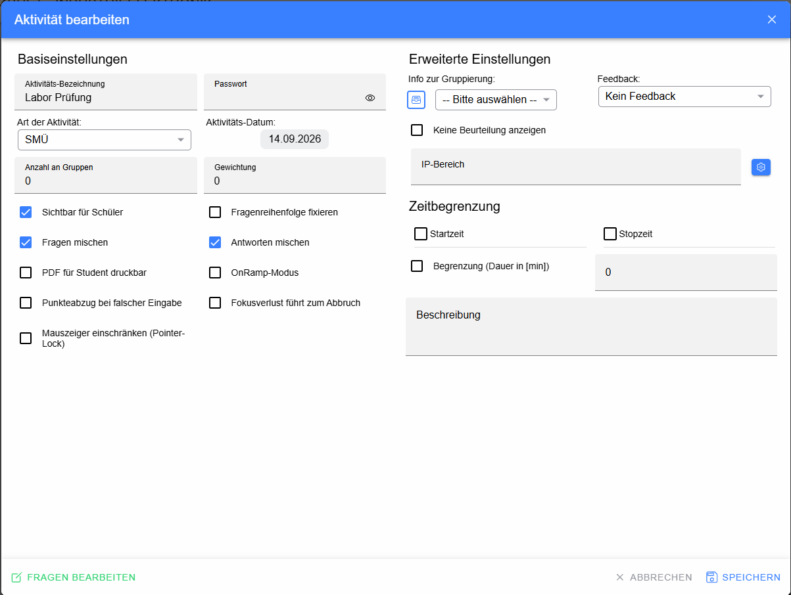
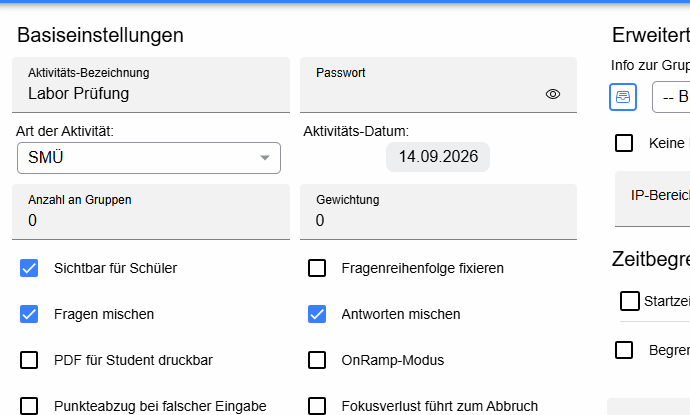
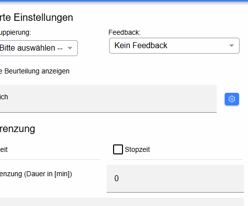
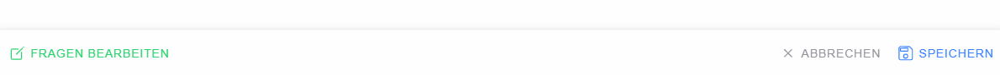

# Dialog „Aktivität bearbeiten“

Dieser Dialog wird beim Erstellen oder Bearbeiten einer mit einer Beurteilung verknüpften Online-Aktivität geöffnet.

> Die konkrete Activity-/Test-Komponente liegt nicht im gelieferten `beurt`-Sourceordner. Die folgende Beschreibung dokumentiert deshalb die in der bereitgestellten aktuellen Oberfläche sichtbaren Felder und ihre fachlich eindeutige Funktion.

## Basiseinstellungen

### Aktivitäts-Bezeichnung

Name der Online-Aktivität. Dieser Name erscheint später im Katalog und bei den zugeordneten Beurteilungen.

### Passwort

Optionales Passwort für den Zugriff auf die Aktivität. Das Augen-Symbol blendet die Eingabe sichtbar bzw. verborgen ein.

### Art der Aktivität

Dropdown für den Aktivitäts-/Testmodus, im Beispiel **SMÜ**. Die Auswahl beeinflusst die Testart und damit unter anderem Zuordnung und Darstellung in der Beurteilung.

### Aktivitäts-Datum

Datum der Aktivität.

### Anzahl an Gruppen

Legt die Zahl der für die Aktivität verwendeten Gruppen fest. `0` bedeutet, dass keine besondere Gruppeneinteilung über dieses Feld vorgegeben wird.

### Gewichtung

Gewichtung der Aktivität innerhalb der Beurteilungsberechnung.

### Sichtbar für Schüler

Ist die Checkbox aktiviert, ist die Aktivität für die Schüler sichtbar. Bei deaktivierter Checkbox bleibt sie verborgen.

### Fragenreihenfolge fixieren

Verhindert eine zufällige/abweichende Reihenfolge der Fragen und hält die vorgegebene Reihenfolge fest.

### Fragen mischen

Mischt die Reihenfolge der Fragen für die Durchführung.

### Antworten mischen

Mischt die angebotenen Antworten innerhalb der Fragen, soweit der jeweilige Fragentyp dies unterstützt.

### PDF für Student druckbar

Erlaubt die für Schüler vorgesehene PDF-/Druckausgabe des Tests.

### OnRamp-Modus

Aktiviert den OnRamp-Betriebsmodus der Aktivität.

### Punkteabzug bei falscher Eingabe

Aktiviert den vorgesehenen Punkteabzug für falsche Antworten/Eingaben.

### Fokusverlust führt zum Abbruch

Bricht bzw. beendet die Aktivität gemäß Testlogik, wenn der Browser-/Fensterfokus verloren geht. Diese Option sollte nur verwendet werden, wenn der Prüfungsablauf eine entsprechende Fokusüberwachung erfordert.

### Mauszeiger einschränken (Pointer-Lock)

Beschränkt den Mauszeiger während der Aktivität auf den vorgesehenen Interaktionsmodus.

## Erweiterte Einstellungen

### Info zur Gruppierung

Öffnet bzw. zeigt Informationen zur Gruppierung. Das danebenliegende Dropdown wählt die gewünschte Gruppierungsdefinition aus.

### Feedback

Dropdown zur Auswahl der Feedbackart. **Kein Feedback** bedeutet, dass Schüler keine automatisierte Ergebnisrückmeldung über die gewählte Feedbackfunktion erhalten.

### Keine Beurteilung anzeigen

Unterdrückt die Anzeige der Beurteilung im dafür vorgesehenen Schüler-/Testergebnisbereich.

### IP-Bereich

Beschränkt die Aktivität auf den eingetragenen IP-Bereich. Der Einstellungsbutton rechts dient zur Konfiguration des Bereichs.

## Zeitbegrenzung

### Startzeit

Checkbox aktiviert eine feste Startzeit. Ohne Aktivierung wird die entsprechende Zeitbeschränkung nicht verwendet.

### Stopzeit

Checkbox aktiviert eine feste End-/Stopzeit.

### Begrenzung (Dauer in [min])

Checkbox aktiviert eine maximale Bearbeitungsdauer; das zugehörige Zahlenfeld legt die Dauer in Minuten fest. `0` steht in der sichtbaren Konfiguration für keine positive Zeitvorgabe.

## Beschreibung

Mehrzeiliges Feld für eine Beschreibung bzw. Hinweise zur Aktivität.

## Fußleiste

* **Fragen bearbeiten** – öffnet die Fragen-/Testbearbeitung der Aktivität.
* **Abbrechen** – verwirft nicht gespeicherte Änderungen und schließt den Dialog.
* **Speichern** – speichert die Aktivitätseinstellungen.
