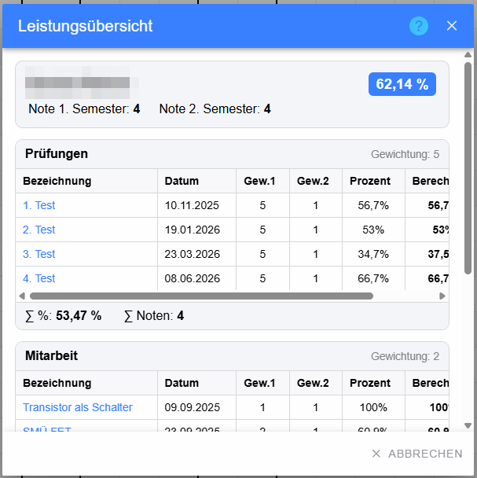
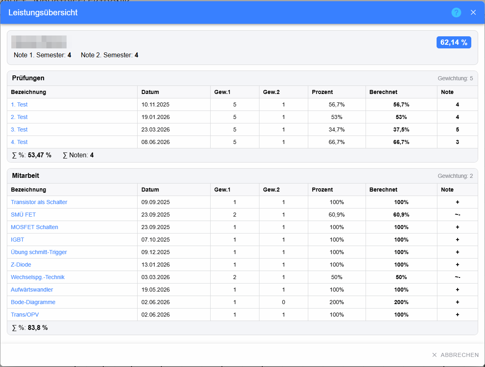
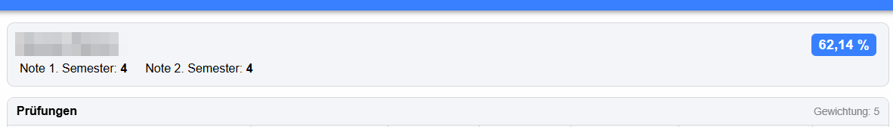
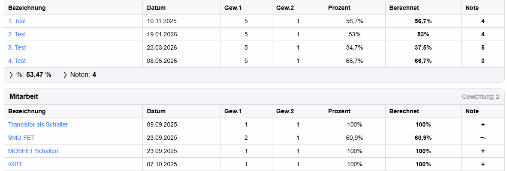

# Dialog „Leistungsübersicht“ – Schüler-Ergebnisse

Dieser Dialog zeigt die vollständige Ergebniszusammenfassung eines einzelnen Schülers. Er wird unter anderem über den Gesamt-Prozentwert im Katalog geöffnet.

## Kopfbereich

* **Schülername** – Name des ausgewählten Schülers; in den Screenshots verpixelt.
* **Gesamt-Prozentwert** – aktuelle Gesamtleistung des Schülers.
* **Note 1. Semester** – gespeicherte Semesternote.
* **Note 2. Semester** – gespeicherte Semesternote.
* **Hilfe (?)** – öffnet die Hilfe.
* **Schließen (X)** – schließt den Dialog.

Im gemeinsamen Katalog kann zusätzlich für jeden beteiligten Lehrer ein eigener Block mit Lehrername, Prozentwert und Lehrergewichtung erscheinen.

## Ergebnisgruppen

Die Leistungen werden nach Beurteilungsgruppen wie **Prüfungen** oder **Mitarbeit** zusammengefasst. Rechts in der Gruppenüberschrift steht die Gewichtung der Gruppe.

### Spalten

* **Bezeichnung** – Name der Beurteilung bzw. Aktivität. Ist der Eintrag ein Testversuch, ist die Bezeichnung anklickbar und öffnet das Testergebnis.
* **Datum** – Datum der Beurteilung.
* **Gew.1** – Gewichtung der Beurteilungsart/Gruppe.
* **Gew.2** – Gewichtung der konkreten Beurteilung.
* **Prozent** – tatsächlich gespeicherter Prozentwert.
* **Berechnet** – für die Gesamtauswertung verwendeter Prozentwert. Dieser kann z. B. durch Mindestprozentregeln von **Prozent** abweichen.
* **Note** – Bewertungssymbol bzw. Note.

In einer Schüleransicht kann statt **Berechnet** die Spalte **Teilbeurteilungen** gezeigt werden; dort werden die Teilresultate lesbar zusammengefasst.

## Gruppensumme

Unter jeder Gruppe werden zusammengefasste Werte angezeigt:

* **∑ %** – gewichteter Prozentwert der Gruppe.
* **∑ Noten** – soweit verfügbar die zusammengefasste Notenbewertung.

## Abbrechen

Der Button **Abbrechen** bzw. **X** schließt die Ansicht. Der Dialog verändert selbst keine Beurteilungen.
