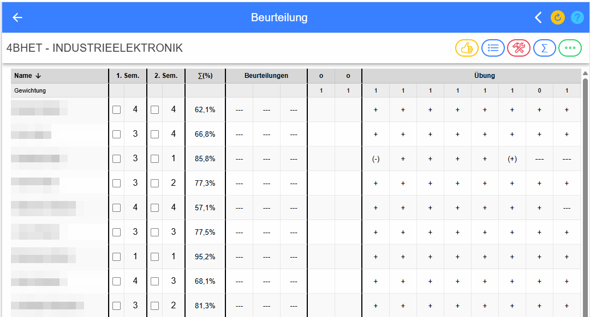
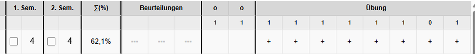
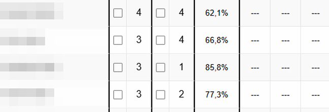
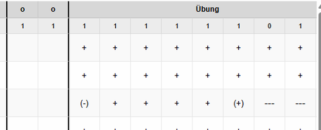
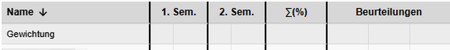
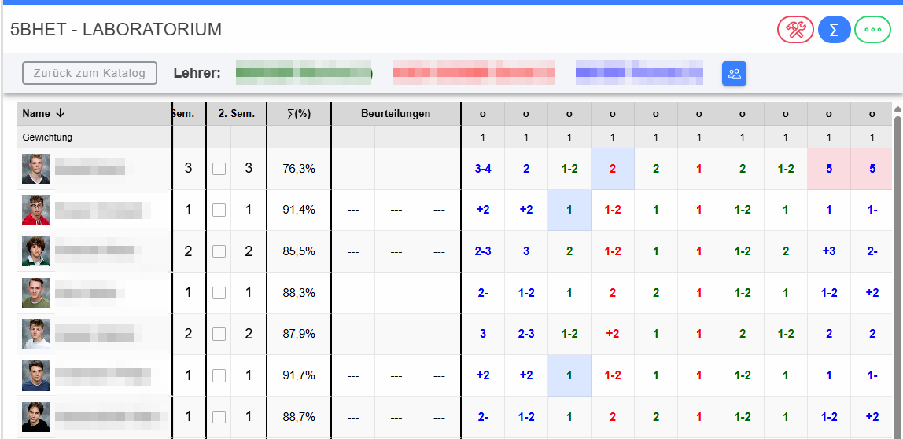
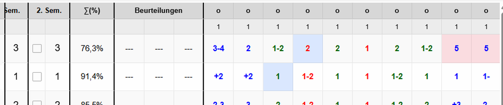
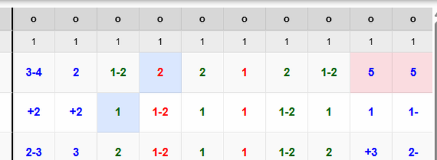

# Beurteilungskatalog

Unter **Beurteilungskatalog** versteht LeTTo die gemeinsame Übersicht über die Leistungen aller Schüler einer Klasse in einem Gegenstand. Der Katalog verbindet Semester- bzw. Jahresnoten, Individualbeurteilungen, klassenweise Beurteilungen und Ergebnisse aus Online-Tests in einer Tabelle.

Je nach Schulform und Konfiguration wird ein Katalog für ein Semester oder für das gesamte Schuljahr geführt. Welche Beurteilungsarten verwendet werden, wie stark sie gewichtet werden und wie sie im Katalog dargestellt werden, legt das verwendete [Beurteilungsschema](Beurteilungsschema/index.md) fest.

## Übersicht und Aktionsbuttons

Rechts oben befinden sich die wichtigsten Aktionen für den Katalog. Die Symbole sind absichtlich direkt bei den Beschreibungen abgebildet, damit sie in der Anwendung leicht wiedergefunden werden können.

*  **[Klassenbeurteilung anlegen](Klassenbeurteilung/index.md)** – legt eine neue Beurteilung an, die grundsätzlich für die gesamte Klasse vorgesehen ist. Die Definition enthält z. B. Bezeichnung, Datum, Beurteilungsart, Aufgabenstellung und Kompetenzen. Danach wird das Ergebnis für die einzelnen Schüler in der entsprechenden Katalogspalte eingetragen.
*  **[Leistungsübersicht](Leistungsuebersicht/index.md)** – zeigt eine zusammenfassende bzw. kompetenzorientierte Auswertung der Leistungen.
*  **[Konfiguration der angezeigten Inhalte](Anzeigekonfiguration/index.md)** – legt Zeitraum, Schema, sichtbare Beurteilungsarten und zusätzliche Anzeigeoptionen fest.
*  **Gemeinsamer Katalog (∑)** – wechselt in die lehrerübergreifende Ansicht, wenn mehrere Lehrkräfte denselben Gegenstand gemeinsam unterrichten. Details siehe [Gemeinsamer Katalog](#gemeinsamer-katalog).
*  **[Import / Export / Druck](ImportExportDruck/index.md)** – öffnet Export, Import, Aktivitätssuche, Zuordnung von Testversuchen und die Verwaltung von Testversuchen.

## Aufbau der Katalogtabelle

Die Tabelle ist horizontal und – bei vielen Schülern – vertikal scrollbar. Die erste Zeile enthält die Spaltenüberschriften, die zweite Zeile die **Gewichtung** der einzelnen klassenweisen Beurteilungen bzw. Tests.

### Name

Die Spalte **Name** enthält die Schüler. Ein Klick auf die Überschrift sortiert alphabetisch; der Pfeil zeigt die aktuelle Sortierrichtung.

In der normalen Desktopansicht wird durch Anklicken eines Schülers eine neue [Individualbeurteilung](Individualbeurteilung/index.md) angelegt. Auf kleinen Bildschirmen werden dafür eigene Aktionsflächen verwendet.

### Gruppe

Die Spalte **Gruppe** erscheint nur, wenn **Schülergruppen** in der [Anzeigekonfiguration](Anzeigekonfiguration/index.md) aktiviert sind. Hier kann für jeden Schüler eine Gruppenbezeichnung eingetragen werden. Ein Klick auf die Spaltenüberschrift sortiert nach den Gruppen.

Die Gruppenbezeichnung wird auch von der Funktion **Für Gruppe übernehmen** verwendet: Eine dafür konfigurierte Teilbeurteilung kann mit einem Klick für alle Schüler derselben Gruppe übernommen werden. Siehe [Klassenbeurteilung bewerten – Für Gruppe übernehmen](KlassenbeurteilungBewerten/index.md#für-gruppe-übernehmen).

### 1. Semester und 2. Semester

Abhängig von der Anzeigekonfiguration enthält jedes Semester:

* **Mahnung** – Checkbox zur Dokumentation einer Mahnung. Sie wird nur angezeigt, wenn die Option **Mahnungen** aktiviert ist.
* **Note** – Semester- bzw. Jahresnote. Ist **Noten editierbar** aktiviert, kann sie direkt im Katalog geändert werden. Im gemeinsamen Katalog sind diese Felder nicht direkt editierbar.

### ∑(%) – Gesamtergebnis

Die Spalte **∑(%)** zeigt den berechneten Gesamt-Prozentwert des Schülers. Die Berechnung erfolgt über die im Beurteilungsschema definierten Beurteilungsgruppen, Beurteilungsarten und Gewichtungen.

Ein Klick auf den Prozentwert öffnet die ausführliche [Schüler-Ergebnisübersicht](SchuelerErgebnisse/index.md). Dort kann nachvollzogen werden, welche einzelnen Leistungen in das Ergebnis eingehen.

### Individualbeurteilungen

Der Bereich **Beurteilungen** enthält Leistungen, die nur für einen einzelnen Schüler erfasst wurden, z. B. eine mündliche Prüfung, eine einzelne Mitarbeitsaufzeichnung oder eine besondere Beobachtung.

Ein Klick auf einen vorhandenen Eintrag öffnet den Dialog [Individualbeurteilung](Individualbeurteilung/index.md). Je nach Beurteilungsart wird die Leistung als Note/Symbol oder als Prozentwert dargestellt.

### Klassenweise Beurteilungen

Eine klassenweise Beurteilung wird als eigene Spalte geführt. Typische Beispiele sind Tests, Laborübungen, Projektarbeiten, Hausübungen oder gemeinsame Leistungsfeststellungen.

Die Spaltenüberschrift kann laut Beurteilungsschema unterschiedlich dargestellt werden:

* **Kreisdarstellung** – kompakte Anzeige als `o`; der vollständige Titel steht im Tooltip.
* **Abkürzung** – zeigt die ersten Zeichen des Namens.
* **Voller Titel** – zeigt die vollständige Bezeichnung und gegebenenfalls weitere Informationen.

Ein Klick auf die **Spaltenüberschrift** öffnet die Definition der Klassenbeurteilung. Ein Klick auf eine **Schülerzelle** öffnet die [Bewertung der Klassenbeurteilung](KlassenbeurteilungBewerten/index.md) für genau diesen Schüler.

### Gewichtung

Alle klassenweisen Beurteilungen und Online-Tests besitzen eine Gewichtung. Standardmäßig ist dies häufig `1`. Durch unterschiedliche Gewichte können Leistungen verschieden stark in die Berechnung eingehen; `0` kann verwendet werden, um eine Leistung nicht in die Berechnung einzubeziehen.

Im Katalog kann die Gewichtung in der Zeile **Gewichtung** direkt angeklickt und geändert werden. **Enter** bzw. das Verlassen des Eingabefelds übernimmt den Wert; **Esc** beendet die Bearbeitung ohne Übernahme des neu eingegebenen Werts.

### Online-Tests

Online-Tests erscheinen – abhängig von der Anzeigekonfiguration – nach Art oder nach der Ordnerstruktur. Ein Klick auf das Ergebnis öffnet die Testergebnisse des betreffenden Versuchs. Auch die Gewichtung eines Tests kann direkt in der Gewichtungszeile geändert werden.

Über **… → Aktivitäten** können Testversuche für einen Zeitraum gesucht werden. Die dabei gefundenen Testnoten werden nach dem Schließen des Dialogs **im Katalog farblich hervorgehoben sowie größer/fett dargestellt**, damit die Treffer unmittelbar in der Tabelle auffallen. Details siehe [Aktivitäten und Zuordnung der Testversuche](ImportExportDruck/index.md#register-aktivitäten).

## Individualbeurteilung oder klassenweise Beurteilung?

Die beiden Formen unterscheiden sich vor allem darin, **für wen die Beurteilung angelegt wird** und wie sie im Katalog organisiert ist.

| | Individualbeurteilung | Klassenweise Beurteilung |
|---|---|---|
| **Einsatzbereich** | Leistung betrifft einen einzelnen Schüler | dieselbe Aufgabenstellung/Leistungsfeststellung betrifft grundsätzlich die ganze Klasse |
| **Beispiele** | einzelne Mitarbeit, mündliche Prüfung, Gespräch, besondere Beobachtung | Test, Laborübung, Projekt, Hausübung, gemeinsame Prüfung |
| **Anlegen** | direkt beim betreffenden Schüler | einmal über den Button **Klassenbeurteilung anlegen** |
| **Darstellung** | im Bereich **Beurteilungen** des jeweiligen Schülers | eigene Spalte im Katalog |
| **Gemeinsame Daten** | Daten gehören nur zu diesem einen Eintrag | Bezeichnung, Aufgabenstellung, Beurteilungsart, Datum und Kompetenzzuordnung werden einmal für die ganze Klasse definiert |
| **Bewertung** | direkt im Individualdialog | anschließend pro Schüler in der gemeinsamen Spalte |
| **Teilbeurteilungen** | möglich | möglich; zusätzlich kann eine Teilbeurteilung für eine Schülergruppe übernommen werden |
| **Online-Aktivität** | kann – je nach Beurteilungsart – für die Beurteilung oder eine Teilbeurteilung angelegt werden | kann – je nach Beurteilungsart – an Teilbeurteilungen gekoppelt werden |

Eine **Individualbeurteilung** ist daher die richtige Wahl, wenn nicht alle Schüler dieselbe Leistung erbringen. Eine **klassenweise Beurteilung** ist übersichtlicher, wenn dieselbe Leistungsfeststellung für viele oder alle Schüler gilt, weil sie nur einmal definiert wird und anschließend eine gemeinsame Katalogspalte bildet.

## Gemeinsamer Katalog

Wenn mehrere Lehrer denselben Gegenstand gemeinsam unterrichten, kann mit dem **∑-Button** in den gemeinsamen Katalog gewechselt werden.

### Farbzuordnung pro Lehrer

Jeder beteiligte Lehrer erhält eine eigene Farbe. Dieselbe Farbe wird für die zu diesem Lehrer gehörenden Beurteilungen verwendet. Dadurch ist auch bei vielen Leistungen sofort erkennbar, von welchem Lehrer eine Note stammt.

Die farbige Lehrerzeile oberhalb des Katalogs dient dabei als Legende. Im Beispiel sind drei Lehrer beteiligt; deren Leistungen werden in drei unterschiedlichen Schriftfarben dargestellt.

### Gewichtung der Lehrer

Neben jedem Lehrer steht seine Gewichtung in Klammern. Ein Klick auf den **farbig dargestellten Lehrernamen bzw. dessen Gewichtung** schaltet die Anzeige in ein Eingabefeld um.

* **Enter** oder Verlassen des Felds – speichert die neue Gewichtung.
* **Esc** – verwirft die laufende Änderung.
* Die Gewichtung beeinflusst, wie stark der Ergebnisanteil dieses Lehrers in die gemeinsame Berechnung eingeht.

### Detailansicht und Summenansicht

Im gemeinsamen Katalog können die Detailbeurteilungen aller Lehrer gemeinsam angezeigt werden. Zusätzlich steht die **Summenansicht** zur Verfügung:

 **Summenansicht** – fasst die Leistungen je Lehrer zusammen und bildet daraus die gemeinsame Gesamtbewertung. Ob diese Summierung standardmäßig bzw. zwingend verwendet wird, wird mit **Summe über Lehrer** im Beurteilungsschema festgelegt.

Die bisherige Wiki-Dokumentation beschreibt denselben Grundsatz: In der Detailansicht werden alle Einzelnoten gemeinsam angezeigt; in der Summenansicht wird pro Lehrer zunächst ein zusammengefasstes Ergebnis ermittelt und daraus das gemeinsame Ergebnis gebildet.

### Besondere farbliche Hintergründe

Neben der Lehrerfarbe können Zellen zusätzlich einen farbigen **Hintergrund** erhalten:

* **rötlicher Hintergrund** – negative Teilbeurteilung bzw. Ergebnis unter 50 %.
* **bläulicher Hintergrund** – bei einer zusammengesetzten Beurteilung fehlt noch eine verpflichtende Teilbeurteilung.

Die Lehrerfarbe kennzeichnet also **von wem** eine Leistung stammt; der Zellhintergrund kennzeichnet einen **fachlichen Zustand** der Leistung.

### Bearbeiten im gemeinsamen Katalog

Beurteilungen des eigenen Lehrer-Katalogs können in der gemeinsamen Ansicht weiterhin geöffnet werden. Fremde Beurteilungen dienen der gemeinsamen Übersicht und werden nicht als eigene Eingaben behandelt.

Mit **Zurück zum Katalog** wird der gemeinsame Modus verlassen.

## Farben und besondere Zustände

Zusätzlich zu den Lehrerfarben können – abhängig von Schema und Anzeigekonfiguration – weitere Hervorhebungen vorkommen:

* **Farbhinterlegung nach Prozentwert** – wird durch die Option **Farbhinterlegung** gesteuert.
* **Fehlende verpflichtende Teilbeurteilung** – wird auffällig markiert, bis die zwingend erforderliche Teilbeurteilung vorhanden ist.
* **Befreiung von einer verpflichtenden Teilbeurteilung** – kann durch die dafür vorgesehene Eingabe dokumentiert werden; die Darstellung unterscheidet sich von einer fehlenden Leistung.
* **Gefundene Testversuche** – nach einer Suche unter **… → Aktivitäten** werden die zugehörigen Testnoten im Katalog farblich hervorgehoben sowie größer und fett dargestellt.

## Bedienung auf kleinen Bildschirmen

Auf schmalen Geräten wird die Matrix in eine kompaktere, kartenartige Darstellung umgebaut. Die fachlichen Funktionen bleiben erhalten: Sortierung, Gruppen, Individualbeurteilungen, Schülerdetails, Semesterwerte und Beurteilungen können weiterhin verwendet werden.

## Aktualisieren

Die Seite unterstützt Pull-to-Refresh. Während Daten neu geladen werden, erscheint ein Fortschrittsbalken.
