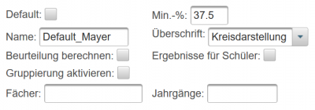
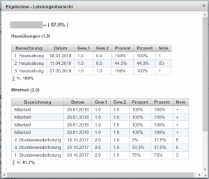
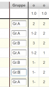
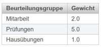
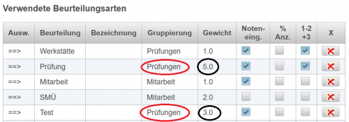
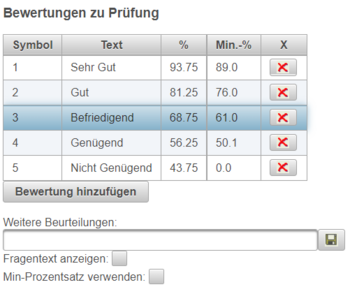
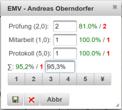

# Beurteilungskonfiguration
 
### Einführung

Die Konfiguration des Beurteilungssystems erfolgt über sogennante Beurteilungskonfigurationen (Beurteilungsschemen): 
Eine Beurteilungskonfiguration definert,
* welche Arten von Beurteilungen es geben soll,
* welche Gewichtung die einelnen Beurteilungen für die Gesamtnote haben sollen,
* ob Noten / Ergebnisse auch für Schüler sichtbar sein sollen
* welche Noten oder Symbole es für eine gewisse Beurteilungsart (Mitarbeit, Hausübung, ....) geben soll,
* welche Prozentwerte dafür vergeben werden sollen,
* ....

Jeder Benutzer kann seine eigenen Definitionen eingeben und auch gewissen Gegenständen zuordnen. Dafür wird ein hierarchisches Konzept verwendet:
* Im System gibt es eine globale Definition, auf die zurückgegriffen wird, wenn sonst nichts gefunden wird.
* Jeder Benutzer kann ein default-Schema für sich erstellen, das das globale Definitionsschema ersetzt.
* Systemweit können für gewisse Gegenstände und Jahrgänge Default-Schemen hinterlegt werden, um zB. einheitliche Beurteilungsstandards in gewissen Fächern zu ermöglichen.
* Genauso können für einzelne Fächer vom Benutzer Beurteilungs-Schemen erstellt werden.

#### Hierarchie von Beurteilungsschemen
Für die Auswahl des anzuwendenden Beurteiungsschemas gibt es nun folgende Regeln:
* **Privates gegenstandsbezogenes Schema** hat höchste Priorität (zB. Userdefinition für Mathematik wird in allen Mathematik-Klassen des Lehrers verwendet).
* Sollte kein **Privates gegenstandsbezogenes Schema** gefunden werden, wird nach einem **Globalen gegenstandsbezogenen Schema** gesucht, das vom Administrator für dieses Fach definiert wurde.
* Wenn keine gegenstandsbezogene Konfiguration definiert ist, wird nach einem privaten (userdefinierten) Default-Schema gesucht.
* Wurde bisher nichts gefunden, dann wird das **Globale Default-Schema** verwendet.

**Globale Beurteilungskonfigurationen** sind für den Lehrer nicht änderbar, nur vom Administrator können Änderungen vorgenommen werden.

#### Konkrete Beispiele für Hierarchien von Beurteilungsschemen
##### Bp 1.
Es gibt ein **globales Beurteilungsschema** für alle Gegenstände, ein **globales Schema für Mathematik** und ein vom Benutzer erstelltes **privates Default-Schema** für seine Fächer. 
Der Lehrer unterrichtet Mathematik und Physik. Damit kommt in Mathematik die Beurteilungskonfiguration des globalen Schemas für Mathematik zur Anwendug, während in Physik das private User-Default-Schema verwendet wird.

##### Bp 2.
Es gibt ein **globales Beurteilungsschema** für alle Gegenstände und ein vom Benutzer erstelltes **privates Default-Schema** für seine Eingaben sowie ein **privates Schema für Mathematik**.
Der Lehrer unterrichtet Mathematik und Physik. Damit kommt in Mathematik die Beurteilungskonfiguration des privaten Schemas für Mathematik zur Anwendung, während in Physik das private User-Default-Schema verwendet wird.

##### Bp 3.
Es gibt ein **globales Beurteilungsschema** für alle Gegenstände und ein **privates Schema für Mathematik**.
Der Lehrer unterrichtet Mathematik und Physik. Damit kommt in Mathematik die Beurteilungskonfiguration des privaten Schemas für Mathematik zur Anwendug, während in Physik das globale Default-Schema verwendet wird.

### Erstellen von Beurteilungskonfigurationen (Beurteilungsschemen)

Am einfachsten werden Beurteiungskonfigurationen (Beurteilungsschemen) durch Kopie von einem Default-Schema erstellt und dann an die entsprechenden Bedürfnisse angepasst.

 

Dazu wählen Sie in der obersten Zeile der Eingabemaske für Beurteilungskonfigurationen das gewünsche Schema aus, von dem kopiert werden soll und drücken dann den Button **Kopieren**.

Über den Button **Löschen** können Sie ein Schema auch jederzeit wieder löschen.

Nach dem Kopieren wurde ein neues Schema ertellt, wobei der Titel um den Teil **_Kopie** erweitert wurde. Bitte ändern Sie den Namen auf einen sprechenden Titel um, um dieses Schema auch später wiederfinden zu können.

#### Basiskonfigurationen
 
##### Default:
Mit dieser Checkbox können Sie definieren, ob dieses Schema ihr privates **Default-Schema** sein soll, das dann verwendet wird, wenn kein fachbezogenes Schema gefunden wird. Dieses private Default-Schema ersetzt die Informationen des **Globalen Beurteilungsschemas**. Nur ein Schema von Ihnen kann ein Default-Schema sein. Ein bisher gesetztes privates Default-Schema verliert seine Gültigkeit. 

##### Min-%:
Negative Noten können normalerweise Prozentwerte zwischen 0% und 50% annehmen. Sehr kleine Prozentwerte können aber bei einer Mittelung zu einer starken Verfälschung von Ergebnissen kommen. Eine typische Notendefinition für Prüfungen könnte so aussehen: &lt;50% Negativ und Nicht Genügend, 50%-62.5%: Genügend, 62.5%-75%: Befriedigend, 75%-87.5%: Gut, &gt;87.5%: Sehr Gut.

Lt. Österreichischer Leistungsbeurteilung gibt es aber keine Noten schlechter als Nicht Genügend. Ein Sehr Gut mit 100% und ein Nicht Genügend mit 0% würden also eine Note zwischen Genügend und Nicht Genügend ergeben und kein Befriedigend. Der **Min-%-Wert** definiert nun, dass negative Beurteilungen von [Online-Tests](../Online-Tests/index.md) in der prozentuellen Gesamt-Auswertung aller Leistungen mit schlechtestenfalls diesem Wert in die Berechnung eingehen.

Die Abstufung zwischen zwei Noten beträgt bei obigem Beispiel also 12.5%. Als Min-%-Wert wird somit 37.5 vorgeschlagen (Fortsetzung der Notenskala in den negativen Bereich).

##### Name:
Name, unter dem dieses Beurteilungsschema gespeichert wird. Der Name sollte möglichst sprechend sein. Nach einer Namensänderung wird auch das Auswahlmenü für die Beurteilungskonfigurationen angepasst.

##### Überschrift
Die Auswahlbox dient der Einstellung der Anzeige der Überschriften von [Klassenweisen Beurteilungen#klassenweise-beurteilungen-](../Katalog#klassenweise-beurteilungen-/index.md#klassenweise-beurteilungen-) im [Katalog](../Katalog/index.md). Folgende Optionen stehen dort zur Verfügung:
* Kreisdarstellung: Die Überschriften der [Klassenweisen Beurteilungen#klassenweise-beurteilungen-](../Katalog#klassenweise-beurteilungen-/index.md#klassenweise-beurteilungen-) werden in der tabellarischen Übersicht durch Kreise dargestellt. Diese Kreis-Symbole sind mit Tooltips hinterlegt, die die genaue Bezeichnung und Eigenschaften der klassenweise Beurteilung anzeigen.
* Abkürzung: Die Überschriften sind die ersten Zeichen des Namens der [Klassenweisen Beurteilungen#klassenweise-beurteilungen-](../Katalog#klassenweise-beurteilungen-/index.md#klassenweise-beurteilungen-).
* Voller Titel: Es werden die vollen Namen der [Klassenweisen Beurteilungen#klassenweise-beurteilungen-](../Katalog#klassenweise-beurteilungen-/index.md#klassenweise-beurteilungen-) angezeigt.

##### Beurteilung berechnen
Ist die Checkbox **Beurteilung berechnen** ausgewählt, dann werden in zugeordneten Katalogen Gesamt-Prozentwerte für alle Schülerleistungen berechnet und am rechten Rand des Katalogs angezeigt.

##### Ergebnisse für Schüler
 
Mit Auswahl dieser Checkbox werden in allen Katalogen, die diesem Schema zugeordnet werden, alle Beurteiungen auch für den Schüler freigegeben und sichtbar werden. Im [Klassenzimmer](../Klassenzimmer/index.md) sind unter den Gegenstandsnamen Links mit der Bezeichnung **Beurteilungen** zu finden. 
Es öffnet sich dann ein Dialog mit allen Leistungen für diesen Schüler.
 

 
##### Gruppierung aktivieren
Wenn **Gruppierung aktivieren** ausgewählt wird, dann können in [Katalogen](../Katalog/index.md), die dieses Beurteilungsschema als Grundlage haben, die Schüler im Katalog gruppiert werden. Verwendbar zum Beispiel im Labor zur Gruppendefinition. Der Katalog kann dann nach den Gruppennamen sortiert werden.
##### Summe über Lehrer
Bei der Summenbildung über alle Lehrer eines Gegenstandes kann zwischen einer 
* [Darstellung mit allen Detailnoten](/notimplemented/index.md) von allen Lehrern (Checkbox nicht gesetzt) oder
* einer [Darstellung mit den Summen-Prozentergebnissen](/notimplemented/index.md) aller Lehrer (Checkbox gesetzt) 
gewählt werden.

##### Fächer und Jahrgänge
Diese Eingebefelder sind nur dann aktiviert, wenn die Checkbox **Default-Profil** nicht angewählt wurde. Mit **Fächer** können Sie festlegen, welchen Gegenständen dieses Profil zugeordnet werden soll. Die Eingabe erfolgt über die Fach-Kurzbezeichnungen und können für mehrere Gegenstände durch einen Beistrich getrennt werden. Über **Jahrgänge** kann die Zuordnung auf bestimmte Jahrgänge, die durch Beispriche getrennt sein können, eingeschränkt werden.

Bp.: Fächer: AM, D    Jahrgänge: 1,2

führt zu einer Schema-Zuordnung für Mathematik und Deutsch in der 1. und 2. Klasse.

### Prozentuelle Berechnung von Notendurchschnitten
Für jede Beurteilung wird intern ein Prozentwert gespeichert. Diese Prozentwerte können über Beurteilungsgruppierungen und Beurteiungsarten unterschiedlich stark für die Beurteilung gewichtet werden.

 
#### Beurteilungsgruppierungen 
Für die Auswertung der Schülerergebnisse werden die Ergebnisse von alle Beurteilungen (Individualbeurteiungen, Klassenweise Beurteilungen, alle Formen von Online-Tests) zu Gruppen zusammengefasst, die jeweils getrennt prozentuell ausgewertet werden. 

Die Beurteilungsgruppierungen können nur vom Administrator definiert werden, um die Anzahl an Beurteilungsgruppierungen möglichst klein zu halten. Benutzer können in der Tabelle der **Beurteilungsgruppe** nur die Gesamt-Gewichtung ändern. In der nebenstehenden Tabelle definierte der Benutzer, dass Prüfungen fünfmal stärker und die Mitarbeit zweimal stärker als die Hausübungen in die Beurteilung einbezogen werden.

 

Alle Beurteilungsarten können nun zu diesen Beurteilungsgruppen zugeordnet werden und damit innerhalb einer Gruppe nochmals unterschiedlich gewichtet werden. Dazu in der Tabelle **Verwendete Beurteilungsarten** einfach in den Spalten **Gewicht** und **Gruppierung** die gewünschten Werte eintragen bzw auswählen.
Im Beispiel auf der rechten Seite wurden Prüfungen und Test der Beurteilungs-Gruppe Prüfungen zugeordnet: Prüfungen gehen mit dem Faktor 5 in die Berechnung des Prozentwertes innerhalb der Gruppe Prüfungen ein und Tests nur mit dem Faktor 3.

### Definition der Beurteilungsarten
In der Tabelle **Verwendete Beurteilungsarten** legen Sie fest, welche Formen von Beurteilungen in dem bearbeiteten Beurteilungsschema zur Verfügung stehen. Alle in dieser Tabelle definierten Beurteilungsarten stehen dann bei [Individualbeurteilungen#individualbeurteilungen-](../Katalog#individualbeurteilungen-/index.md#individualbeurteilungen-) und [Klassenweisen Beurteilungen#klassenweise-beurteilungen-](../Katalog#klassenweise-beurteilungen-/index.md#klassenweise-beurteilungen-) zur Verfügung. Die verwendbaren Beurteilungsarten sind vom Administrator festgelgt. Sie können hier nur die Eigenschaften der jeweiligen Beurteilungsart definieren und ändern.

Beschreibung der Spalten in der Tabelle **Verwendete Beurteilungsarten** :
* Ausw. ==&gt; : Diese Spalte dient zur Auswahl einer Beurteilungsart, die bearbeitet werden soll. Beim Klick auf die jeweilige Spalte wird die die Beurteilungsart ausgewählt und alle zur Beurteilungsart gehörenden Symbole, Noten und Prozentwerte werden rechts davon angezeigt und können auch in dieser Tabelle **Bewertungen zu ...**  definiert und geändert werden.
* Beurteilung: Art der Beurteilung, Auswahl aus einer vom Administrator vordefinierten Liste.
* Bezeichnung: Der Name dieser Beurteilungsart kann vom Benutzer vergeben werden. Damit ist die gleiche Beurteilungsart unter unterschiedlichem Namen mehrfach verwendbar. Bleibt dieses Feld leer, dann wird die Default-Bezeichnung verwendet. Anwendungsbeispiel: Beurteilungsart Werkstätte mit der Definition von unterschiedlichen Werkstättenarten: Blechbiegen, SPS, Installationstechnik,... 
* Gruppierung: Zugeordnete Beurteilungsgruppierung, siehe [#Beurteilungsgruppierungen](#Beurteilungsgruppierungen)
* Gewicht: Gewichtung innerhalb der Beurteilungsgruppierung, siehe [#Beurteilungsgruppierungen](#Beurteilungsgruppierungen)
* Noteneingabe: Eine Noten- oder Prozenteingabe ist bei dieser Beurteilungsart möglich. Anwendungsbeispiel: Prüfung kann auch als Prozentwert definiert werden, bei einem Mitarbeitsplus macht ein Prozentwert bei der Eingabe wenig Sinn.
* %-Anz.: Prozentanzeige: Im Katalog kann für diese Beurteilungsart das Ergebnis der Beurteilung auch als Prozentwert angezeigt werden. Sinnvoll zB. bei Prüfungen, weniger sinnvoll bei Mitarbeitskontrollen. 
* 1-2, +3: Zwischennoten zulässig: Ist diese Checkbox ausgewählt, dann ist die Noteneingabe auch mit Zwischennoten möglich. Eingaben wie 1-2 oder +2 sind damit möglich. Der Prozentwert für diese Beurteilung wird linear approximiert.
* X: Löschen der jeweiligen Beurteilungsart mit zugehörenden Bewertungs-Symbolen

Mit dem Button **Beurteilungsart hinzufügen** wird eine neue Beurteilungsart angelegt, wobei dann keine zugehörigen Bewertungen definiert sind. Diese müssen dann manuell hinzugefügt werden.

Einfacher ist das Erstellen einer neuen Beurteilungsart über den Button **Beurteilungsart duplizieren**. Dabei wird eine Beurteilungsart mit allen zugeordneten Bewertungen (Noten, Symbole, ...) kopiert, die dann an die neuen Erfordernisse angepasst werden können.

### Bewertungen definieren
 

Die Tabelle **Bewertungen zu ...** definiert, welche Symbole oder Noten in einer Beurteilungsart verwendet werden können:
* Symbol: Symbol, das für eine Beurteilung verwendet wird. zB. 1, +, ...
* Text: Text der Beurteilung. zB.: Sehr Gut, Gut,...
* %: Dieser Wert legt fest, welcher Prozentwert für die Beurteilung vergeben wird, wenn Sie das definierte Symbol verwenden. Wenn Sie also lt. nebenstehender Abbildung die Note 2 (Gut) in einer Beurteilung verwenden, dann werden für diese Prüfung das Symbol **2** und der Prozentwert von 80% gespeichert.
* Min.-%: Dieser Prozentwert legt die unter Grenze für diese Note fest. Beurteilungen können bei Beurteilungsarten, bei denen **Noteneingabe** gesetzt ist, auch in Prozentwerten eingegeben werden. Das zu verwendende Symbol wird dabei mit Hilfe dieses **Min.-%**-Wertes bestimmt. Für diese Bestimmung des Notensymbols ist ausschlaggebend, ob in der Beuteilungsart Zwischennoten erlaubt sind. Bp: Zwischennoten sind erlaubt, nach der nebenstehenden Tabelle ergibt eine Beurteilung von 76% das Symbol 2-3. Sind Zwischennoten nicht erlaubt, dann wird die Note mit 2 bestimmt.
* **X**: Mit den Buttons in dieser Spalte kann ein Bewertungssymbol gelöscht werden. Die ganze Zeile verschwindet.

Mit dem Button **Bewertung hinzufügen** können Sie eine weiter Zeile in der Bewertungs-Tabelle einfügen.

#### Bewertungen mit negativen Prozentzahlen
Wenn in der %-Spalte der Tabelle **Bewertungen** negative Werte vorkommen, dann werden diese Beurteilungen bei der Auswertung für die Gesamtnote nicht berücksichtigt. Solche Angaben können für Informationen im [Katalog](../Katalog/index.md) verwendet werden, wie Sie in der Beurteilungsart **Allgemeines** im Default-Schema vorgegeben sind. 
 
Informationen wie Krankheit, Telefonat mit den Eltern etc. dienen der Dokumentation im Katalog, sollen aber keinen Einfluss auf die Notengebung haben.

Beispiel: Unterschied zwichen zwei Bewertungs-Einträgen bei Projekt und Laborübung:
In der Beurteilungsart **Projekt** gibt es eine Beurteilungsart **¥** mit '0 Prozent', im Labor eine Beurteilungsart **¥** mit '-1 Prozent'. Wo liegt der Unterschied: Die 0-Prozent im Projekt gehen extrem stark in die Beurteilung ein, weil der Schüler nichts abgegeben hat. Die -1-Prozent im Labor werden bei der Notengebung komplett vernachlässigt, da zB. durch einen Krankheitsfall keine Leistung möglich war.

### Weitere Beurteilungen
Für manche Arten einer Beurteilung ist es notwendig, dass sich eine Note aus mehreren Teilnoten zusammensetzt. Ein Beispiel dafür ist eine Projektarbeit, wo die Mitarbeit und die Dokumentation in die Note eingehen. Oder eine Laborübung, wo sich die Note aus einer Prüfung, der Mitarbeit und dem Protokoll zusammensetzt. 

Mit einer Eingabe im Eingabefeld **Weitere Beurteilungen** können Sie nun definieren, aus welchen Teilbereichen sich die Note zusammensetzen soll. Eingabe einfach über die Namen der Teilbereiche, getrennt durch Beistriche.

Bp.: Mitarbeit, Dokumentation

Sollen die Teilnoten auch noch unterschiedlich stark in die Beurteilung eingehen, dann können sie unterschiedlich stark gewichtet werden. Das Gewicht jeder Teilnote kann dabei an den Namen, getrennt durch einen Zwischenraum angehängt werden.

Bp.: Prüfung 2, Mitarbeit 1, Protokoll 5: Mit dieser Definition geht die Note für das Protokoll fünfmal stärker als die Mitarebitsnote in die Gesamtnote für die Laborübung ein.

Im [Katalog#zusammengesetzte-beurteilungen-](../Katalog#zusammengesetzte-beurteilungen-/index.md#zusammengesetzte-beurteilungen-) ändert sich mit obiger Definiton der Dialog zur Eingabe einer Note folgendermaßen:
 

Bei zusammengesetzen Noten werden die Leistungen der Schüler zu unterschiedlichen Zeiten erfolgen. Um im [Katalog](../Katalog/index.md) nun zu sehen, wann die Beurteilung abgeschlossen wurde, kann man in der Definition der **Weitere Beurteilungen** festlegen, welche Noteneingabe für das Ende der Beurteilung zwingend erforderlich ist. Als Beispiel sei hier das Laborprotokoll erwähnt. Erst wenn das Protokoll abgegeben und die Note eingetragen wurde, ist die Beurteilung dieser Übung abgeschlossen. Diese zwingenden Eingaben können vor oder nach dem Namen durch ein Rufzeichen definiert werden.

Bp.: Prüfung 2, Mitarbeit 1, !Protokoll 5:
Vor dem Protokoll wurde ein Rufzeichen verwendet, daher ist die Beurteilung bis zur Eingabe der Protokollnote nicht vollständig. Im Katalog wird dies durch ein **rotes Notensymbol** dargestellt. Erst nach Eingabe der Protokollnote wird die Beurteilung schwarz (=fertig).

Soll ein Schüler von einer solcherart **erzwungenen Beurteilung** befreit werden, können Sie im erzwungenen Notenfeld einen **Stern** eingeben. Danach erscheint diese Note in blauer Farbe (=Schüler wurde von Teilen der Aufgabenstellung befreit).

### Fragentext anzeigen
Wenn diese Checkbox ausgewählt wird, dann können Sie bei der Noteneingabe die Aufgabenstellung zur Leistungsfeststellung in ein Textfeld eingeben.
### Min-Prozentsatz verwenden
Ist diese Checkbox ausgewählt, dann wird bei der Prozentberechnung als untere Grenze für eine Beurteilung dieser Beurteilungsart der im Beurteilungsschema angegebene Min-Prozentwert herangezogen.

