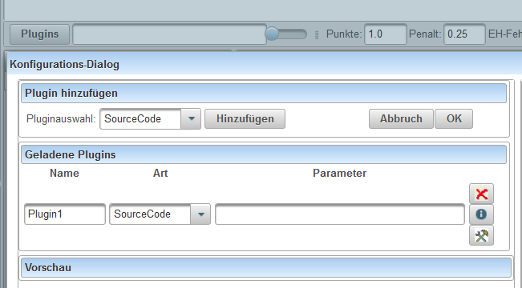
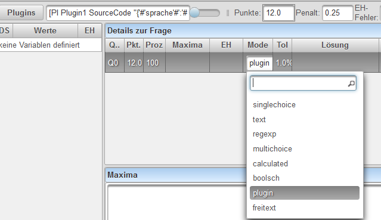
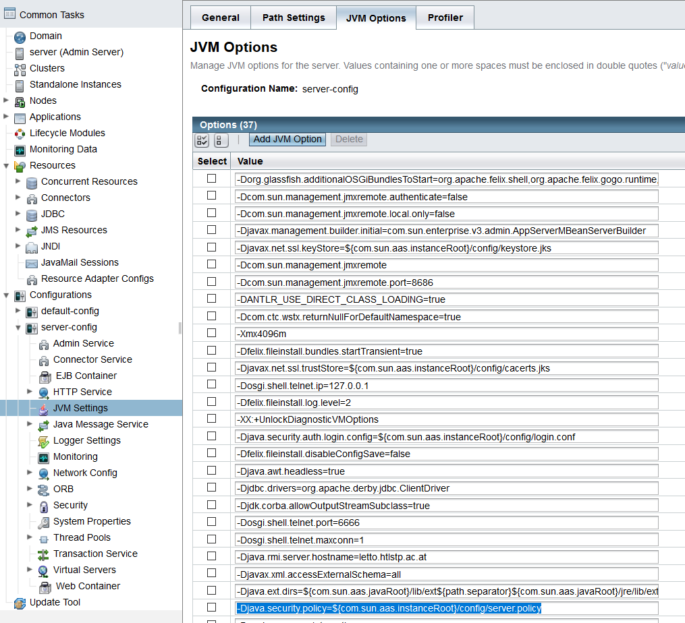

# CodeCheck
##  Allgemeines 
Das [Plugin](../Plugins/index.md) CodeCheck(SourceCode) wird verwendet um Programme von Schülern in verschiedenen Programmiersprachen (aktuell nur Java) automatische korrigieren zu können.
##  Verwendung 
* Das Plugin kann nur in [Mehrfachberechnungsfragen#mehrfachberechnungsfrage-](../Fragetypen#mehrfachberechnungsfrage-/index.md#mehrfachberechnungsfrage-) korrekt verwendet werden
* Definition des Plugins: Im Edit-Modus einer Frage im Plugin-Dialog "SourceCode" hinzufügen 
 

* [Konfiguration](../SourceCodeKonfiguration/index.md) des Plugins mit dem Werkzeug-Button 
 

* Einfügen einer neuen Antwort mit Strg-Q

* Durch einen Klick auf den MODE: Auswahl des Mode **Plugin**
 

##  Konfiguration 

[Konfigurationsdialog](../SourceCodeKonfiguration/index.md)

##  Server Konfiguration für Security-Prüfung 
Um die Security-Prüfung am Server korrekt durchführen zu können muss am Server nach einer Standard-Installation folgende Änderung vorgenommen werden!
####  Glassfish Server 4.1 
In der Glassfish-Admin Konsole (Port 4848) im Punkt _Configurations-server-config-JVM Settings-JVM Options_
* Suche nach -Djava.security.policy=${com.sun.aas.instanceRoot}/config/server.policy
 
* An die oben angegebene Datei (z.B.: /opt/glassfish4/glassfish/domains/domain1/config/server.policy ) hinten anfügen:
<pre>
grant {
  permission java.util.PropertyPermission "java.security.policy", "write"; 
  permission java.lang.RuntimePermission "createSecurityManager";
  permission java.lang.RuntimePermission "setSecurityManager";
  permission java.security.SecurityPermission "getPolicy";
  permission java.security.SecurityPermission "setPolicy";
  permission java.lang.RuntimePermission "accessDeclaredMembers";
  permission java.lang.RuntimePermission "setIO";
  permission java.lang.reflect.ReflectPermission "suppressAccessChecks";
};
</pre>
* Suche in der Datei nach:
<pre>
  permission java.io.FilePermission       "&lt;&lt;ALL FILES&gt;&gt;", "read,write";
</pre>
und ändere auf:
<pre>
  permission java.io.FilePermission "&lt;&lt;ALL FILES&gt;&gt;","read";
</pre>

####  Tomcat v8.5 und Eclipse 
* Suche im Installationspfad vom Tomcat nach der Datei _catalina.policy_ und füge hinten an:
<pre>
grant {
  permission java.util.PropertyPermission "java.security.policy", "write";
  permission java.lang.RuntimePermission "createSecurityManager";
  permission java.lang.RuntimePermission "setSecurityManager";
  permission java.security.SecurityPermission "getPolicy";
  permission java.lang.RuntimePermission "accessDeclaredMembers";
  permission java.io.FilePermission "C:&#92;workspace-oxygen-letto&#92;.metadata&#92;.plugins&#92;org.eclipse.wst.server.core&#92;tmp0&#92;webapps", "read";
  permission java.lang.RuntimePermission "setIO";
  permission java.lang.reflect.ReflectPermission "suppressAccessChecks";
};
</pre>
* In der Eclipse: Run-Run Configurations -&gt; Apache Tomcat - Tomcat v8.5 Server -&gt; Arguments - VM-Arguments: füge hinzu:
<pre>
-Djava.security.policy="C:&#92;workspace-oxygen-letto&#92;Servers&#92;Tomcat v8.5 Server at localhost-config&#92;catalina.policy"
</pre>

####  andere JavaEE-Server 
Haben wir noch nicht getestet.

[Plugins](../Plugins/index.md)

