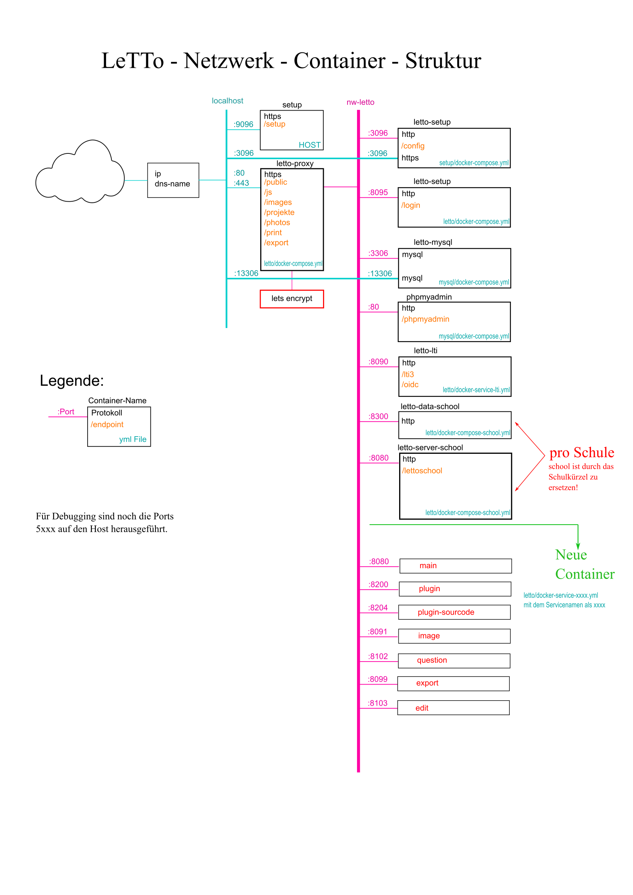

# Container Struktur
##  siehe auch 
* [Administration](../Administration/index.md)

##  Docker-Container Struktur 

####  Netzwerke 
#####  Host 
* Port 80:  http,  nur für interne Verwendung oder wenn ein weiterer Reverse-Proxy für das Zertifikat,etc. verwendet werden soll
* Port 443: https, Standardport für den Serverzugriff
* Port 9096: https, Setup-Service mit einem self-signed-certificate. Funktioniert nur direkt über die Server-IP oder mit einem ssh-Tunnel von Extern
* Port 3096: https, Setup-Service des Setup als Docker-Container. Dient nur als Umgehung falls mal der Reverse-Proxy hängen würde.
* Port 13306: mysql, Direkter Zugriff auf den MySQL-Server. Sollte nicht nach aussen durchgelassen werden.
* Ports 5xxx: Debugging Ports der Container, sind nur reserviert und erst aktiv wenn man debug=true setzt.

#####  nw-letto 
Netzwerk welches alle Container von LeTTo miteinander verbindet

#####  nw-proxy 
Netzwerk an welches nur der letto-proxy angeschlossen ist um andere Container an den Reverse-Proxy binden zu können.

[Administration](../Administration/index.md)

