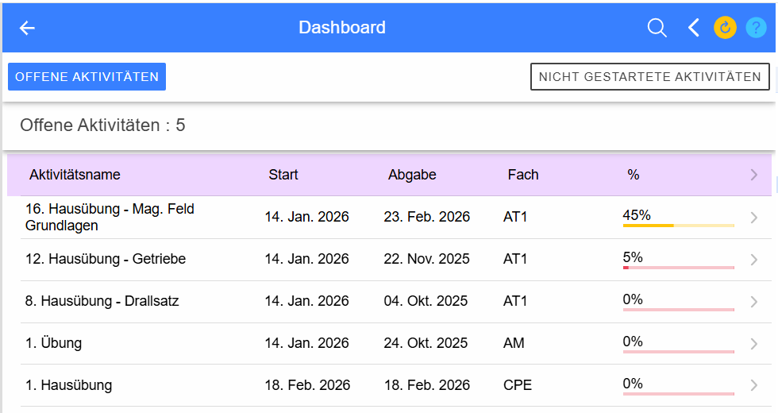
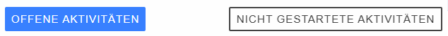
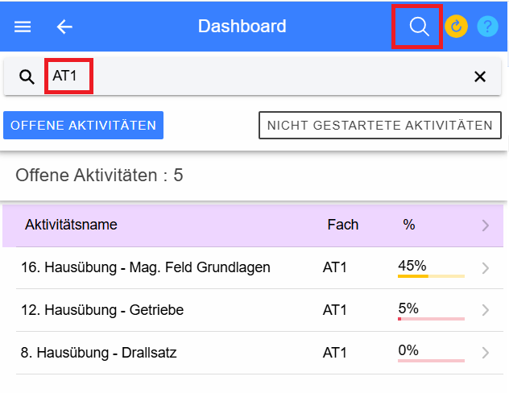

# Dashboard

Das Dashboard sammelt alle Informationen, was der Schüler zu tun hat. 
Von allen Gegenständen des akt. Schuljahres wird nach Aktivitäten gesucht, die zu erledigen sind. 

Oben können Sie auswählen, ob sie die Übersicht über alle schon begonnenen Aktivitäten sehen wollen, 
oder ob Sie eine Liste von allen noch nicht begonnenen Aktivitäten sehen wollen. 
 
Sollten die Listen zu lange und damit unübersichtlich sein, 
dann können Sie über den Such-Button in der Titelzeile die Anzeige des Dashboards einschränken. 
 
Hiermit wurde das Dashboard auf alle Aufgaben im Gegenstand AT1 eingeschänkt.

In der Liste der **offenen Aktivitäten** sehen sie vor allem auch eine Prozentangabe, 
wie weit Sie bei der Erledigung der Aufgabe bereits gekommen sind.

Durch einen Klick auf eine der Aktivitäten im Dashboard werden Sie zu [dieser Aufgabe](../AktivitaetStart/index.md) geleitet 
und können diese beginnen oder fortsetzen.

Über den Refresh-Button  
 
wird der Inhalt des Dashboards neu geladen.

