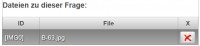

# Dateien zur Frage verwalten
 
Die Fragen-Vorschau kann in der Ansicht [Beispielsammlung Editieren](../BeispielsammlungEditieren/index.md) über den [Toolbar](../Toolbar/index.md) mit dem Button  geöffnet werden.

Alle Bilder, die im Fragentext und in Antwortfeldern bei [Multiple-Choice-Fragen](/notimplemented/index.md) und bei [Zuordnungsfragen](/notimplemented/index.md) verwendet werden, sind als Dateien an die Frage angeschlossen und können mit diesem Dialog bearbeitet werden.

### Liste von Dateien
  
Hier ist eine Liste mit allen an die Frage angeschlossenen Dateien sichtbar. 
Durch Klicken auf eine Datei wird der Inhalt auf der rechten Seite des Dialogs angezeigt, wenn der Inhalt ein Bild beschreibt.

Auch Dateien, die keine Bilder darstellen, können an die Frage angehängt sein. Mit dem Button  können Datein, die nicht mehr gebraucht werden, wieder gelöscht werden. **Achtung:** Wenn Sie ein Bild löschen, das noch mit einem [IMG](IMG)-Tag referenziert wird, kann das Bild dann nicht mehr korrekt dargestellt werden.

###  Hinzufügen von Dateien zur Frage
 
Über den Button _Importieren_ können Sie jede beliebige Datei an die Frage anschliessen: Einfach die gewünschte Datei auswählen und mit OK importieren.

### [Dokumente in der Frage bereitstellen](../DokumenteinderFragebereitstellen/index.md)

###  siehe auch 
[Plot - zeichnen in ein bestehendes Bild#zeichnen-in-ein-vordefiniertes-bild-](../Plot#zeichnen-in-ein-vordefiniertes-bild-/index.md#zeichnen-in-ein-vordefiniertes-bild-)

Kategorie:Dialoge

