# Datenimport
## Login für den Import
Der Import muss in der Rolle "Admin" erfolgen!
 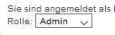

## Sokrates-Schülerdaten-Export
Die Schülerdaten können aus Sokrates exportiert werden. Folgen Sie der Anleitung, um das nötige CSV-File aus Sokrates zu exportieren.
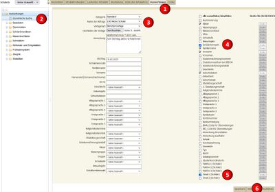
Nach erfolgreicher Anmeldung am Sokrates-System wählen Sie bitte wie in der Grafik: Vorgangsweise für Sokrates-Schülerdaten-Export beschrieben.

**1. Auswertung** 

**2. Dynamische Suche** 

**3. Name der Abfrage:** wählen Sie die Option _100 Aktive Schüler_ an

**4. Schülerkennzahl** wählen Sie zusätzlich die Option Schülerkennzahl an 

**5. Email 1 (Schüler)** wählen Sie zusätzlich die (optionale, aber empfohlene) Option Email an

**6. Ausführen** Klicken Sie auf diese Button um die Auswahl abzuschließen. 

Beachten Sie bitte, dass keine spezielle Klasse selektiert sein darf (Klasse: _- keine Auswahl -_ ) um alle Schülerdaten zu exportieren.

**7. Exportieren(CSV)** Klicken Sie auf diese Button um den Export abzuschließen - siehe Abb. CSV-Export.

Das CSV-File mit den exportierten Schülerdaten wird in den Download-Ordner gespeichert.

## Untis-Export
 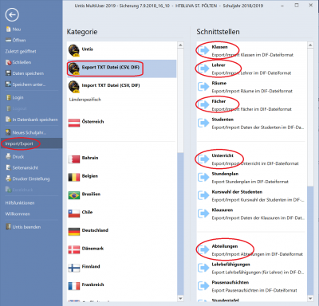
Der Datenimport erfolgt aus einem Export der Untis-Daten für die Lehrer und Lehrfächerverteilungen, die Schülerdaten werden aus Sokrates exportiert und in LeTTo importiert.

Die nebenstehende Abbildung zeigt die Untis-Export-Ansicht: Gehen Sie dazu in Untis auf das Menü **Datei**.

Wählen Sie **Import/Export** und dann **Export TXT Datei (CSV,DIF)**.

Exportieren Sie 
* Klassen (GPU003.TXT)
* Lehrer  (GPU004.TXT)
* Fächer  (GPU006.TXT)
* Unterricht (GPU002.TXT)

Die Abteilungen werden nur beim ersten Aufsetzen der Datenbank benötigt.

**WICHTIG**: Schulen ohne Abteilungsstruktur **müssen** einen Abteilung anlegen - Namen der Abteilung ist willkürlich wählbar. Die Kurzbezeichnung der Abteilung **muss** jedoch leer bleiben.

 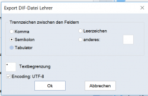
Vor dem Export können Sie die Trennzeichen (Komma, Semikolon, Tabulator) auswählen und die Zeichencodierung festlegen.
Ist vor **Encoding: UTF-8** das Häckchen gesetzt, dann werden die Daten in UTF8, sonst im ISO-Format exportiert.

## Zeichencodierung
 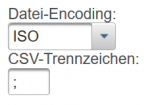
Mit dem Auswahlmenü links oben können Sie für den gerade aktuellen Import die Zeichencodierung festlegen. Folgende Formate werden unterstützt:
* UTF8
* ISO (Windows-Standarformat)
* UTF16

Weiters können Sie das CSV-Trennzeichen ihrer Exportdaten definieren.

## Abteilungen
Die Abteilungen werden nur beim erstmaligen Aufsetzen der Datenbank benötigt und aus Untis eingespielt. Beim jährlichen Einspielen der Daten bleiben die Abteilungen unverändert.

## Gegenstände (Fächer)
Wählen Sie den Button für **Fächer**, dann wird das Import-Feld für die Gegenstände aktiv. Mit **Importieren** wählen Sie die Untis-Export-Datei für die **Fächer** aus und starten Sie den Import mit **Fächer hochladen**.
 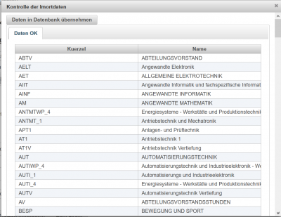
Vor dem tatsächlichen Import erscheint ein Dialog zur Kontrolle der Daten.

Zum Importieren der Fächer klicken Sie den Button **Daten in die Datenbank übernehmen** (links oben).

## Klassen
Wählen Sie den Button für **Klassen**, dann wird das Import-Feld für die Klassen aktiv. 

 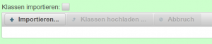

Die Checkbox **Schultyp extrahieren:** bewirkt, dass der Schultyp aud den Klassen extrahiert wird und in der Datenbank gespeichert wird. Sinnvoll nur dann, wennn der Schultyp in Untis gesetzt ist.

Mit **Importieren** wählen Sie die Untis-Export-Datei für die **Klassen** aus und starten Sie den Import mit **Klassen hochladen**.

Vor dem tatsächlichen Import erscheint ein Dialog zur Kontrolle der Daten.
 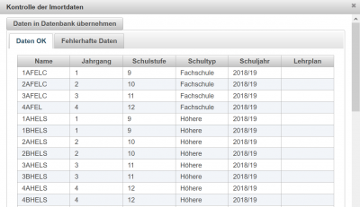

Die Untis-Einträge, die nicht als Klassen interpretiert werden konnten, sind in dem Tabellenblatt **Fehlerhafte Daten** zu finden:
 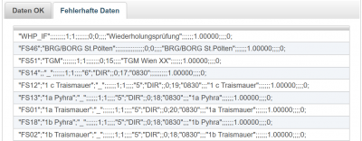

Zum Importieren der Klassen für dieses Schuljahr klicken Sie den Button **Daten in die Datenbank übernehmen** (links oben).

## Lehrer
Import der Lehrer aus UNTIS =&gt; Lehrer.
Optional können die Lehreraccounts mit dem Kürzel l- versehen werden. (Checkbox '''Lehrer mit 'l-' ergänzen:''' bewirkt, dass alle Lehrer-Kürzel aus Untis mit einem vorangestellten l- beginnen. Bp: mayt wird zu l-mayt in letto.

Um im nächsten Schuljahr keinen falschen Import zu machen (falsche Auswahl der l-Checkbox) wird der zuletzt gespeicherte Status in der [Globalen Konfiguration](../GlobaleKonfiguration/index.md) unter dem Parameter **addLehrerKuerzel** für die Schule gespeichert.

Durchführung des Imports wie bei [Klassen](#klassen-)

### Zuordnung der Lehrer-Untis-Kürzel zu Active-Directory oder LDAP-Logins
 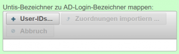

Um einen Zugriff auf das Active-Directory oder auf LDAP mit anderen Login-Bezeichnern als den Untis-Namen zu ermöglichen, können zu jedem Lehrer zusätzlich die Login-Bezeichner im AD/LDAP hochgeladen werden.

#####  Das Import-File muss folgende Struktur haben 
* CSV-File mit folgenden Spalten: **untis**,**ldap**,**mail**.
* Die letzte Spalte mail ist optional.
* Die Erste Zeile muss die Spaltenüberschriften enthalten!
* Als Trennzeichen muss das Semikolon verwendet werden

Beispieldatei:
<pre>untis;ldap;mail
WD;wdamboeck;werner.damboeck@htlstp.ac.at
TM;tmayer;thomas.mayer@htlstp.ac.at
</pre>

## Unterricht
Import der Lehrfächerverteilung für das aktuelle Schuljahr aus Untis =&gt; Unterricht.
Durchführung des Imports wie bei [Klassen](#klassen-)

## Schülerdaten
Export der Schülerdaten aus Sokrates. Bitte wählen Sie beim Export folgende Spalten an:
**Klasse,Schülerkennzahl,Familienname,Vorname**.
Die Spalte **Email 1 (Grunddaten)** kann optional verwendet werden.

 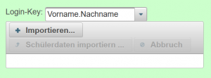
Über Das Auswahl-Menü **Login-Key** kann festgelegt werden, wie die Login-Keys bestimmt werden:
* VORNAME.NACHNAME: Der Login-Key wird aus Vorname.Nachname bestimmt. Bei Namensgleichheit wird der Name um Unterstriche ergänzt.
Die Login-Bezeichner können später über eine eingene Datei, die eine Zuordnung zwischen SokratesID und Loginnamen beinhält, automatisiert korrigiert werden.
* SokratesID: Der Loginname besteht aus den letzten 7 Stellen der Sokrates-ID des Schülers.

## Ändern der Schüler-Logins
 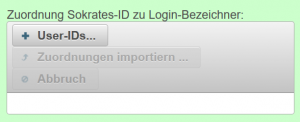
Mit einem CSV-File mit den Spaltenüberschriften
* SokratesID
* Loginname
können die Logindaten der Schüler mit den Sokrates-IDs abgeglichen werden und so zB. für einen LDAP-Zugriff vorbereitet werden.

## Hochladen von Schülerfotos
 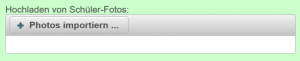
Schülerfotos als JPG-Dateien können über ZIP-Files gesammelt auf den Server geladen werden. Die Namen der Fotos müssen folgenden Aufbau haben:
* Sokrates-ID.jpg
Auch einzelne Fotos mit einem Dateinamen nach obigem Schema können hochgeladen oder nachgeladen werden. Bei wiederholtem Hochladen von Fotos werden diese immer überschrieben bzw. durch die aktuellen Fotos ersetzt. 
Die Fotos werden beim Hochladen automatisch auf eine vernünftige Größe skaliert.

Nach dem Datenimport können die Fotos in den [Katalogen](../Katalog/index.md) eingeblendet werden, wenn die [Fotoanzeige dort aktiviert#konfiguration-der-anzeige-](../Katalog#konfiguration-der-anzeige-/index.md#konfiguration-der-anzeige-) wurde.

[Administration](../Administration/index.md)

##  siehe auch 
* [Hauptseite#administration-](../Hauptseite/index.md#administration-)
* [Datenimport ohne Untis-Daten](../DatenimportohneUntis-Daten/index.md)
* [Anlegen von einzelnen Lehrern mit Gegenständen](../AnlegenvoneinzelnenLehrernmitGegenständen/index.md)

