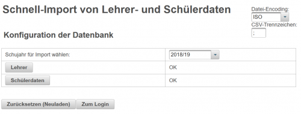
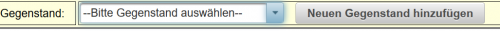
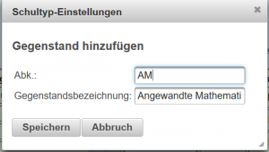

# Datenimport ohne Untis-Daten
 

Für Schulen, von denen keine Untis-Daten vorliegen, können über kleine Importfiles die wesentlichen Datenbankstrukturen aufgebaut werden:

Die Konfiguration der Lehrer kann entweder manuell mit [Benutzer hinzufügen](../Benutzer/index.md) erfolgen oder über ein Importfile automatisch erfolgen.

###  manueller Lehrerimport 

Wenn Lehrer manuell angelegt wurden, dann können sich die Lehrer die Gegenstände selber zuweisen (siehe [Klassenzuordnung](../Klassenzuordnung/index.md)).

Der Parameter in der [Globalen Konfiguration](../GlobaleKonfiguration/index.md) zur Verwendung von allen Gegenständen bei der Klassenzuordnung heißt **alleGegenstaende** und sollte auf **1** gesetzt sein.

 
In diesem Modus können Lehrer auch Gegenstände selber anlegen und definieren, wenn Sie in der Gegenstands-Auswahl noch nicht vorhanden sind. Die neu erstellten Gegenstände werden in der Datenbank abgelegt und an den jeweiligen Schultyp gekoppelt. Wenn ein Benutzer des selben Schultyps diesen Gegenstand verwende möchte, dann scheint der vorher von einem anderen User definierte Gegenstand in der Liste auf.

 
Bei der Definition der neuen Gegenstände werden die Kurzbezeichnungen mit der Datenbank abgeglichen und die Gegenstandsbezeichnung wird ev. mit Daten aus der Datenbank vorausgefüllt.

### Lehrerimport über File
Das CSV-File für die Lehrer muss folgende Spalten enthalten:
* login: eindeutiger Bezeichner für diesen Lehrer
* Nachname 
* Vorname

* Gegenstaende: Diese Spalte ist optional und bewirkt eine sofortige Zuordnung zu Gegenständen und Klassen.

#### Gegenstandsdefinition für den Schnellimport

* Die einzelnen Klassen sind durch einen **Bindestrich** getrennt
* Nach jeder Klassenbezeichnung folgt ein **Doppelpunkt** und anschliessend eine durch **Komma** getrennte Liste von Gegenständen

Beispiel für eine Angabe der Gegenstände: 

1A:D,E,AM-1B:E,SU-2A:E,AM

####  Login und Passwort 
Ist der Parameter "addLehrerKuerzel" in der [Globalen Konfiguration](../GlobaleKonfiguration/index.md) auf "1" gesetzt, so wird vor dem Loginnamen noch ein "l-" angehängt.

Für den ersten Login wird das **Passwort** auf den **Nachnamen** kleingeschrieben gesetzt!

####  Beispieldatei für den Lehrerimport 
<pre>
login;Nachname;Vorname;Gegenstaende
GRUB;Gruber;Manuel;3A:M,D-5B:M,PH
BIN;Binder;Walter;4B:PH,E-6C:D,E
</pre>

### Schülerimport
Der Schülerimport sollte immer über ein CSV-File mit folgenden Spalten erfolgen:
* Klasse: Bezeichnung der Klasse
* Familienname
* Vorname
* Schülerkennzahl (optional)
* Mailadresse: Optionale Angabe
* Loginname: Optinale Angabe

Zum Laden der Daten clicken Sie bitte den Button **Schülerdaten**, mit **+Importieren** wählen Sie bitte das CSV-File mit den Schülerdaten aus und mit **Schülerdaten importieren ...** erfolgt der Upload der Daten.
Mit diesem Import werden automatisch weiters eine Abteilung mit gleichem Namen wie die Schule und alle notwendigen Klassen sowie die Schülerzuteilungen zu den Klassen angelegt.

####  Login und Passwort 
Der Login-Name ist kleingeschrieben "**vorname.familienname**". Ist dieser Name mit einer anderen Schülerkennzahl schon vorhanden, so wird nach dem Vornamen noch eine forlaufende Nummer angehängt (zB. walter1.schuster). Ist keine Schülerkennzahl angegeben und der Name doppelt, so wird der Schüler nicht importiert. 

Die tatsächlichen Benutzernamen können dann in der Benutzerverwaltung eingesehen werden.

Für den ersten Login wird das **Passwort** auf den **Nachnamen** kleingeschrieben gesetzt!

####  Beispieldatei für den Schülerimport 
<pre>
Klasse;Familienname;Vorname;Schülerkennzahl;Mailadresse
3B;Bauer;Werner;34598346029357304;werner.bauer@demo.at
3B;Willinger;Klaus;3425309457203957;
4C;Peters;Claudia;3049520395730495;claudia.peters@schule.at
</pre>

####  Beispieldatei für den Schülerimport mit Loginname 
<pre>
Klasse;Familienname;Vorname;Schülerkennzahl;Mailadresse;Loginname
3B;Bauer;Werner;34598346029357304;werner.bauer@demo.at;bauer.werner
3B;Willinger;Klaus;3425309457203957;willing.klaus
4C;Peters;Claudia;3049520395730495;claudia.peters@schule.at;peters.claudia
</pre>

##  siehe auch 
* [Hauptseite#administration-](../Hauptseite/index.md#administration-)
* [Import von Untis und Sokrates](../Datenimport/index.md)
* [Anlegen von einzelnen Lehrern mit Gegenständen](../AnlegenvoneinzelnenLehrernmitGegenständen/index.md)

