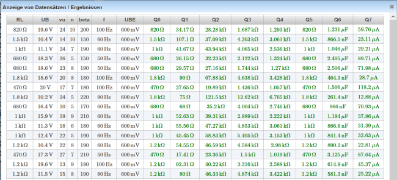

# Datensatz-Dialog
Der Dialog zur Anzeige aller Variablen und aller Ergebnisse kann in der Ansicht [Beispielsammlung Editieren](../BeispielsammlungEditieren/index.md) über den [Toolbar](../Toolbar/index.md) mit dem Button  geöffnet werden.
## Anzeige aller Variablenwerte und Ergebnisse
 

In diesem Dialog sehen sie in schwarzer Farbe die Werte von allen Datensätzen (Variablen) und auf der rechten Seite in grüner Farbe die Ergebnisse von allen Berechnungen.

Dieser Dialog kann dazu verwendet werden, die Plausibilität aller Ergebnisse zu kontrollieren und gegebenenfalls Werte von Variablen zu ändern, um technisch realistische Lösungen zu bekommen.

Bei jeder Änderung von Variablenwerten werden automatisch in dieser Zeile alle Werte für alle Lösungen neu berechnet. Sollten in dieser Frage auch Plugins verwendet werden, deren Grafiken von den Datensätzen abhänge, dann wird die Vorschau neu gezeichnet.

**Achtung:** Verwenden Sie diesen Dialog mit Vorsicht, da am Server die Ergebnisse für 40 Variablenwerte durchgerechnet werden müssen, was zu einer hohen Serverbelastung führen kann.

Kategorie:Dialoge

