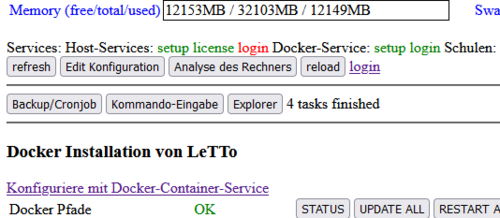
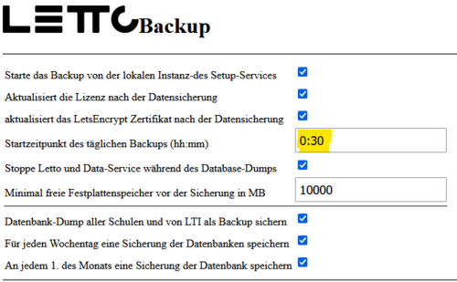

# Datensicherung-Docker
##  siehe auch 
* [Administration](../Administration/index.md)
* [Installation](../Installation/index.md)
* [Restore einer LeTTo-Sicherung](../../howto/admin/backup/letto-restore.md)

##  Datensicherung 
Die Datensicherung einer LeTTo-Installation sollte in 2 Teilen erfolgen. 1. die tägliche Sicherung der Datenbank als SQL-Dump und 2. das Kopieren aller Daten auf einen externes Backup-Laufwerk. Natürlich kann auch das komplette Images eines virtuellen Servers gesichert werden, wobei dann aber keine teilweise Rücksicherung möglich ist.

####  automatische Erstellung des SQL-Dump mit dem [Setup-Service](../Setup-Service/index.md) 

* Button **Backup/Cronjob** führt zum Dialog des Backups
* Alle Datenbank-Backups werden im Verzeichnis /opt/letto/docker/storage/backup gespeichert
* Sobald eine **Backup-Zeit eingetragen** ist, ist das Backup aktiv 

* Gesichert werden immer nur die Datenbank-Dumps

####  Datensicherung auf ein externes Backup-Laufwerk 
* Praktischerweise sollte jeden Tag eine inkrementales Backup des Verzeichnisses /opt/letto und der Serverkonfiguration /etc gemacht werden
* hier ein mögliches Script zur Sicherung in das externe Laufwerk /media/backup . Es sollte deutlich nach dem automatischen Erstellen des SQL-Dumps duchgeführt werden. Hier als /opt/letto/sicherung.sh
  #!/bin/bash
  rsync -varh /opt/letto /media/backup/
  tar -czf /media/backup/backup/etc.tgz /etc
  # nach der Sicherung auf einen anderen Server kann man auch die lokalen Database-Dump-kopien entfernen
  rm /opt/letto/docker/storage/backup/* -rf
* Eine möglicher Eintrag in der crontab-Datei /etc/crontab könnte für eine Sicherung um 3 Uhr Früh so aussehen:
  00 03    * * *   root    /opt/letto/sicherung.sh
  

[Administration](../Administration/index.md)

